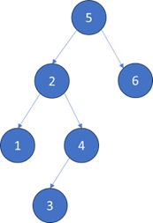

### BFS (Breath First Search)

廣度優先搜索（BFS）是一種圖形搜索算法，用於在圖形或樹中尋找節點之間的**最短路徑或最短距離**。該算法從一個起始節點開始，然後依次探索鄰近的節點，直到找到目標節點或遍歷完整個圖形。

BFS的主要特點是它以鄰近節點的廣度進行擴展，即先遍歷起始節點的所有鄰近節點，然後再遍歷這些鄰近節點的鄰近節點，以此類推。換句話說，BFS先擴展所有距離起始節點為1的節點，然後再擴展距離為2的節點，以此類推，直到找到目標節點或遍歷完整個圖形。

BFS通常使用一個 **佇列 Queue** 來記錄待處理的節點，並使用一個 **標記數組或哈希表** 來記錄已經訪問過的節點，以避免重複訪問。

BFS在許多應用中都有廣泛的應用，例如圖形搜索、迷宮解決、最短路徑問題等。它保證可以找到最短路徑，但在圖形較大或複雜的情況下，可能需要較多的時間和空間複雜度。

### 二元樹的最小值



```
static int minDepth(TreeNode root) {
    if (root == null)
        return 0;

    Queue<TreeNode> q = new LinkedList<>();
    q.offer(root);
    int depth = 1;

    while (!q.isEmpty()) {
        int sz = q.size();
        for (int i = 0; i < sz; i++) {
            TreeNode cur = q.poll();
            if(cur.left == null && cur.right ==null)
                return depth;
            
            if(cur.left !=null)
                q.offer(cur.left);
            
            if(cur.right !=null)
                q.offer(cur.right);
        }
        depth++;
    }

    return depth;
}

public static void main(String[] args) {

    TreeNode root = new TreeNode(5);
    TreeNode _2 = new TreeNode(2);
    TreeNode _1 = new TreeNode(1);
    TreeNode _4 = new TreeNode(4);
    TreeNode _3 = new TreeNode(3);
    TreeNode _6 = new TreeNode(6);
    TreeNode _7 = new TreeNode(7);

    root.left = _2;
    root.right = _6;
    _2.left = _1;
    _2.right = _4;
    _4.left = _3;
    _6.right = _7;
    
    System.out.println(minDepth(root)); // 輸出：2
}
```


### 密碼鎖

```
public static String plusOne(String s, int j) {
    char[] ch = s.toCharArray();
    if (ch[j] == '9') {
        ch[j] = '0';
    } else {
        ch[j] += 1;
    }
    return new String(ch);
}

public static String minusOne(String s, int j) {
    char[] ch = s.toCharArray();
    if (ch[j] == '0') {
        ch[j] = '9';
    } else {
        ch[j] -= 1;
    }
    return new String(ch);
}

public static int openLock(String[] deadends, String target) {

    Set<String> deads = new HashSet<>();
    for (String dead : deadends)
        deads.add(dead);

    Set<String> visited = new HashSet<>();

    Queue<String> q = new LinkedList<>();
    q.offer("0000");
    visited.add("0000");
    int step = 0;

    while (!q.isEmpty()) {
        int size = q.size();
        for (int i = 0; i < size; i++) {

            String cur = q.poll();

            visited.add(cur);

            if (deads.contains(cur))
                continue;

            if (cur.equals(target))
                return step;

            for (int j = 0; j < 4; j++) {

                String up = plusOne(cur, j);
                String down = minusOne(cur, j);

                if (!visited.contains(up))
                    q.offer(up);

                if (!visited.contains(down))
                    q.offer(down);
            }
        }
        step++;
    }

    return -1;
}

public static int minDepth(TreeNode root) {
    if (root == null)
        return 0;

    Queue<TreeNode> q = new LinkedList<>();
    q.offer(root);
    int depth = 1;

    while (!q.isEmpty()) {
        int sz = q.size();
        for (int i = 0; i < sz; i++) {
            TreeNode cur = q.poll();
            if (cur.left == null && cur.right == null)
                return depth;

            if (cur.left != null)
                q.offer(cur.left);

            if (cur.right != null)
                q.offer(cur.right);
        }
        depth++;
    }

    return depth;
}
```