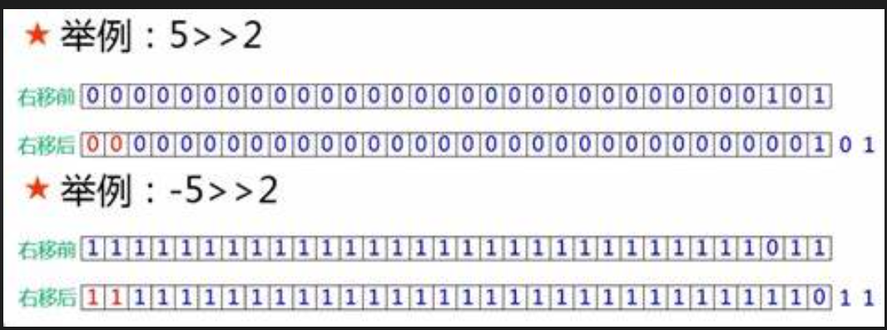

### Binary & Bit Shift

#### Binary(二進位)、Decimal(十進位) 互換

```
String binaryString = Integer.toBinaryString(2);
System.out.println(binaryString);
String formatBinaryString = String.format("%5s", binaryString).replace(' ', '0');
System.out.println(formatBinaryString);
int binary = Integer.parseInt("10", 2);
System.out.println(binary);
---
10
00010
2
```

#### Binary Operator

| 運算子 | 描述 | 範例 |
| --- | --- | --- |
| & | 位元and運算,兩數對應位元要為1 | a & b |
| \| | 位元or運算,兩數對應位元其中為1 | a \| b |
| ^ | 位元xor運算,兩數對應位元互為不同 | a ^ b |
| ~ | 位元補數運算 | ~a |

```
int a = 45;
int b = 25;
System.out.println(a & b);

---
int a = 1; //001
int b = 5; //101
System.out.println(a & b); //001->1
System.out.println(a | b); //101->5
System.out.println(a ^ b); //100->4

---
1
5
4
```

#### Bit Shift Operators 位移運算子

| 運算子 | 描述 | 範例 |
| --- | --- | --- |
| << |左移運算 | a << b (a 向左移 b 個單位) |
| >> |右移運算 | a >> b (a 向右移 b 個單位) |
| >>> |右移運算 | a >>> b |

> 在Java中，整數以32位元表示，最高位元表示正負號，如果最高位元為1，則該數字為負數。

> `>>` 是有符號右移運算符號，它將整數的二進位表示向右移動指定的位數，並在左側用符號位（即最高有效位）填充。這意味著如果原始數字是正數，則右移後左側用0填充，如果原始數字是負數，則右移後左側用1填充。

> `>>>` 是無符號右移運算符號，它將整數的二進位表示向右移動指定的位數，並在左側用零填充。這意味著無論原始數字是正數還是負數，右移後左側都用0填充。
> 

範例
```
int a = -10; // 二進位表示為 11111111111111111111111111110110
int b = 2;

int result1 = a >> b; // 有符號右移兩位
int result2 = a >>> b; // 無符號右移兩位

System.out.println(result1); // 輸出結果為 -3，二進位表示為 11111111111111111111111111111101
System.out.println(result2); // 輸出結果為 1073741821，二進位表示為 00111111111111111111111111111101
```

```
String binary = "11111111111111111111111111111111";
int decimal = Integer.parseUnsignedInt(binary, 2);
System.out.println(decimal);
---
-1
```
### 經典題目：abc 的排列組合

1. **情境**： 假設字串 abc，請輸出 abc 的所有組合: a,b,c,ab,bc,ac,abc。請提供一個函數，參數為一個任意字串，輸出為一集合，該集合包含該字串所有排列可能，排列順序需要按照字串順序。

2. **概念**：

    (1) abc 共有 (8-1) 種可能，即 2 的 3 次方 - 1。

    (2) 將 7 種可能 (數字 1 ~ 7)，轉換為二進位。例如： 1 -> 001、7 -> 111。

    (3) 每一二進位數字，都可以代表 abc 的排列組合。例如：001 -> c、111-> abc。

3. **解答**：

```
public static List<String> permutation(String str) {

    // 2 的 n 次方，n = 字串長度，表示所有排列組合個數。例如：abc排列組合後為 2的3次方 = 8。
    int subs = 1 << str.length();

    // 2 的 n 次方中的每一個數字，雖然只是一個數字，但是換成二進位，就可以代表 a、b、c 的有無。例如：111=abc、101=ac 等。
    for (int i = 1; i < subs; i++) {
        String binaryString = Integer.toBinaryString(i);
        String sub = String.format("%3s", binaryString).replace(' ', '0');
        System.out.println(sub);
    }

    // 因為我們知道二進位與abc的關係，那們我可以做運算，確認每一字元是否存在於該二進位中。如果存在則放進去字串池中，並放在集合中。
    // 關鍵代碼：(i & (1 << j)) > 0 --> 1 << j，表示 1 向左 j 個位元。和 i 做 位元AND運算，如果大於0，就表示 j 是存在於 i 中的。
    List<String> combines = new ArrayList<String>();
    for (int i = 1; i < subs; i++) {
        StringBuilder sb = new StringBuilder();
        for (int j = 0; j < str.length(); j++) {
            if ((i & (1 << j)) > 0) {
                sb.append(str.charAt(j));
            }
        }
        if (!sb.isEmpty())
            combines.add(sb.toString());
    }

    // 排序
    return combines.stream().sorted((o1, o2) -> o1.length() - o2.length()).collect(Collectors.toList());
}

public static void main(String[] args) {
    System.out.println(permutation("abc"));
}
```