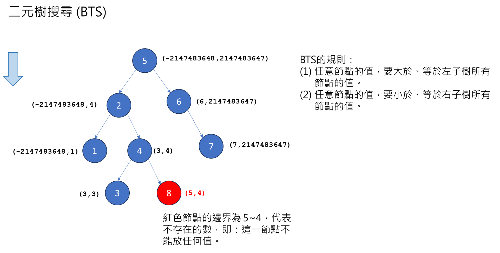
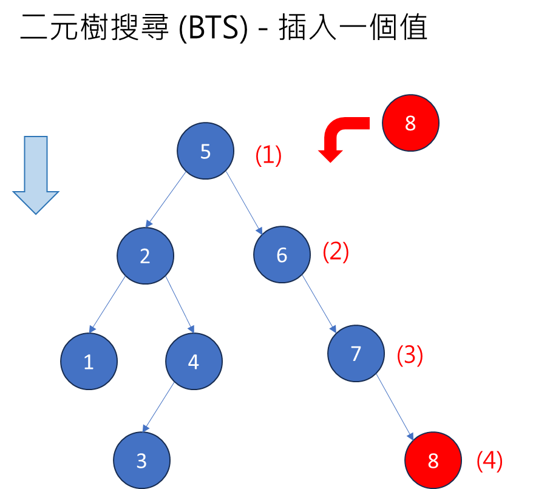

### BTS (Binary Tree Search) 

#### 何謂BTS，以及如何用程式判斷是否為BTS？



```
public static boolean isBST(TreeNode root) {
    return isBST(root, Integer.MIN_VALUE, Integer.MAX_VALUE);
}

private static boolean isBST(TreeNode node, int minValue, int maxValue) {
    
    if (node == null) {
        return true;
    }
    
    System.out.printf("%d(%d,%d)\n", node.val, minValue,maxValue);

    if (node.val < minValue || node.val > maxValue) {
        return false;
    }

    return 
            isBST(node.left, minValue, node.val - 1) && 
            isBST(node.right, node.val + 1, maxValue);
}

public static void main(String[] args) {

    TreeNode root = new TreeNode(5);
    TreeNode _2 = new TreeNode(2);
    TreeNode _1 = new TreeNode(1);
    TreeNode _4 = new TreeNode(4);
    TreeNode _3 = new TreeNode(3);
    TreeNode _6 = new TreeNode(6);
    TreeNode _7 = new TreeNode(7);

    root.left = _2;
    root.right = _6;
    _2.left = _1;
    _2.right = _4;
    _4.left = _3;
    _6.right = _7;

    TreeNode _8 = new TreeNode(8);
    _4.right = _8;
    
    System.out.println(BSTUtils.isBST(root));
}

```

#### 在 BST 插入一個數



```
public static TreeNode insrtIntoBST(TreeNode node, int val) {

    if (node == null)
        return new TreeNode(val);

    if (node.val == val)
        return node;

    if (node.val < val) {
        node.right = insrtIntoBST(node.right, val);
    }
    
    if (node.val > val) {
        node.left = insrtIntoBST(node.left, val);
    }

    return node;
}
```

#### 計算二元樹總數


**普通二元樹**
```
public static int countNodes(TreeNode node) {

    if (node == null)
        return 0;

    return 1 + countNodes(node.left) + countNodes(node.right);
}
```

#### 兩個 BTS 是否相等

```
public static boolean isEqual(TreeNode n1, TreeNode n2) {

    if (n1 != null && n2 == null)
        return false;

    if (n1 == null || n2 == null)
        return false;

    if (n1.val != n2.val)
        return false;

    return isEqual(n1.left, n2.left) && isEqual(n1.right, n2.right);
}
```

#### 序列化與反序列化


序列化

```
public static String serialize(TreeNode node) {
    StringBuilder sb = new StringBuilder();
    serialize(node,sb);
    return sb.toString();
}

public static void serialize(TreeNode node, StringBuilder sb) {

    if (node == null) {
        sb.append("#").append(",");
        return;
    }

    // 前序巡訪
    sb.append(node.val).append(",");

    // 巡訪
    serialize(node.left, sb);
    serialize(node.right, sb);
}
```

反序列化

```
public static TreeNode deserialize(String data) {
    String[] nodes = data.split(",");

    List<String> list = new ArrayList<>();
    for (String node : nodes) {
        list.add(node);
    }

    return deserialize(list);
}

public static TreeNode deserialize(List<String> nodes) {

    if (nodes.isEmpty())
        return null;

    // 前序巡訪
    String first = nodes.remove(0);
    if (first.equals("#"))
        return null;

    TreeNode root = new TreeNode(Integer.parseInt(first));

    // 巡訪
    root.left = deserialize(nodes);
    root.right = deserialize(nodes);

    return root;
}
```

測試

```
public static void main(String[] args) {

    TreeNode root = new TreeNode(5);
    TreeNode _2 = new TreeNode(2);
    TreeNode _1 = new TreeNode(1);
    TreeNode _4 = new TreeNode(4);
    TreeNode _3 = new TreeNode(3);
    TreeNode _6 = new TreeNode(6);
    TreeNode _7 = new TreeNode(7);

    root.left = _2;
    root.right = _6;
    _2.left = _1;
    _2.right = _4;
    _4.left = _3;
    _6.right = _7;

    String data = serialize(root);
    TreeNode root2 = deserialize(data);
    System.out.println(isEqual(root, root2));
}
```