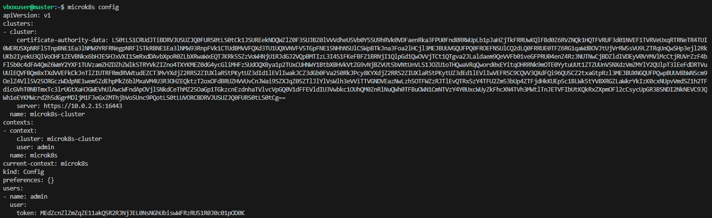
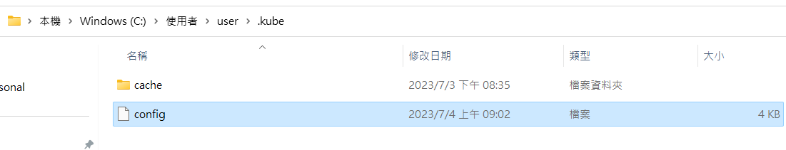
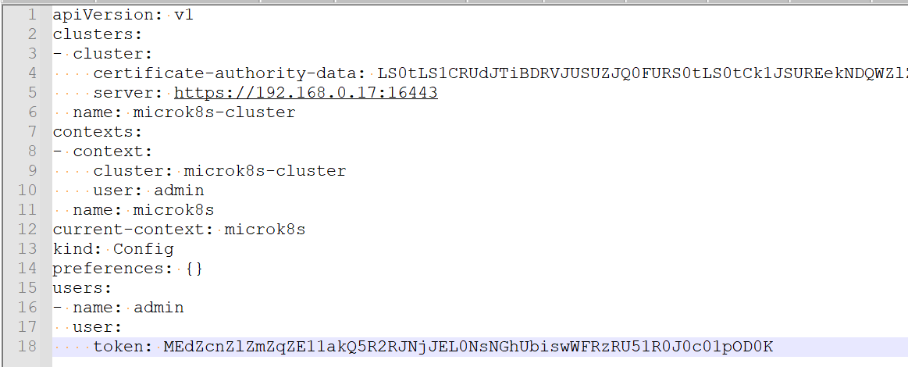
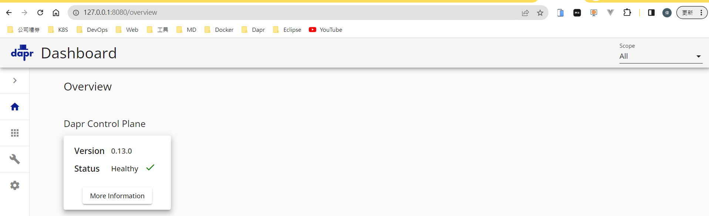

# Dapr

#### 如何在 Ubuntu 安裝 Java 11

    sudo apt-get update
    sudo apt-get install openjdk-11-jdk

#### Deploy Dapr on K8S

參考 <https://docs.dapr.io/operations/hosting/kubernetes/kubernetes-deploy/>

預設 dapr-dashboard 沒有對外開端口，所以要在本機執行 kubectl port-forward

#### 如何在本機使用 kubectl port-forward，以 service/{myservice} 為例

- 確認 C:\Users\user\.kube 檔案的資訊，為 microk8s config 的資訊

- 執行指令：

        kubectl port-forward service/dapr-dashboard  8080:8080 -n dapr-system

- 打開本機瀏覽器 http://localhost:8080

