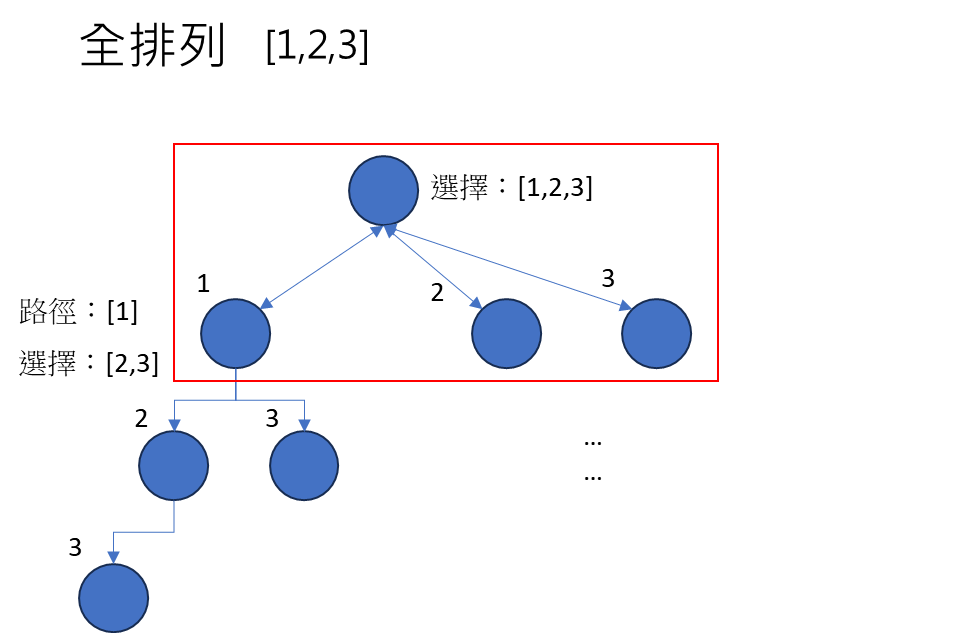
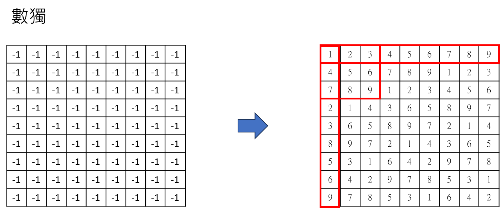
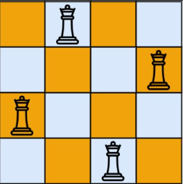

### 回溯演算法

> 回溯演算法是一種用於解決組合問題（如排列組合、子集、圖形問題等）的常用演算法。它通常使用遞迴的方式來探索所有可能的解，並在遇到不符合條件的情況下回溯（backtrack）到前一個狀態，繼續尋找其他解。

> 回溯演算法的基本思想是通過選擇不同的選項來構建解，並在每一步檢查該選項是否符合問題的限制條件。如果符合，則繼續遞迴地選擇下一個選項；如果不符合，則回溯到前一個狀態，選擇其他的選項。這樣不斷地遞迴和回溯，直到找到所有的解或者遍歷完所有的選項。

>  回溯演算法的時間複雜度通常比較高，因為它需要遍歷所有的可能解。然而，回溯演算法通常可以通過一些優化來減少不必要的遞迴調用，以提高效率。

### 排列(permutaion)



```
public class PermuteDemo {

	static List<List<Integer>> tracks = new ArrayList<List<Integer>>();

	public static void permute(int[] nums) {
		List<Integer> track = new ArrayList<>();
		backtrack(nums, track);
	}

	public static void backtrack(int[] nums, List<Integer> track) {

		if(track.size() == nums.length) {
			tracks.add(new ArrayList<>(track));
			return;
		}
		
		for (int num : nums) {
			
			if(track.contains(num))
				continue;
			
			track.add(num); // 路徑添加一個。
			
			backtrack(nums,track); // 遞迴產生下一個組合。

			track.remove(track.size() - 1); // 回溯上一個狀態，讓選擇保持初始狀態。
		}

	}

	public static void main(String[] args) {
		int[] nums = new int[] { 1, 2, 3 };
		permute(nums);
		System.out.println(tracks);
	}
}
```

### 子集(subset)：

> input = [1, 2, 3]
> Output =[ [], [1], [1, 2], [1, 2, 3], [1, 3], [2], [2, 3], [3] ]

```
public static List<List<Integer>> subset(List<Integer> nums) {
    List<List<Integer>> res = new ArrayList<List<Integer>>();
    List<Integer> track = new ArrayList<Integer>();
    backtrack(nums, track, 0, res);
    return res;
}

public static void backtrack(List<Integer> nums, List<Integer> track, int start,List<List<Integer>> res) {

    res.add(new ArrayList<>(track));

    for (int i = start; i < nums.size(); i++) {

        track.add(nums.get(i));

        backtrack(nums, track, i + 1, res);

        track.remove(track.size() - 1);
    }
}
```

> input = [a,b,c]
> Output= [ [], [a], [a, b], [a, b, c], [a, c], [b], [b, c], [c] ]

```
public static List<List<String>> subsetAlphabt(List<String> data) {
    List<List<String>> res = new ArrayList<List<String>>();
    List<String> track = new ArrayList<String>();
    backtrack2(data, track, 0, res);
    return res;
}

public static void backtrack2(List<String> data, List<String> track, int start, List<List<String>> res) {

    res.add(new ArrayList<>(track));

    for (int i = start; i < data.size(); i++) {

        track.add(data.get(i));

        backtrack2(data, track, i + 1, res);

        track.remove(track.size() - 1);

    }
}
```

字串作為參數
```
public static List<String> permutation(String str) {
    List<String> res = new ArrayList<>();
    StringBuilder sb = new StringBuilder();
    backTrack(str, sb, 0, res);
    return res;
}

public static void backTrack(String str, StringBuilder sb, int start, List<String> res) {

    res.add(sb.toString());

    for (int i = start; i < str.length(); i++) {
        
        sb.append(str.charAt(i));
        
        backTrack(str, sb, i+1, res);
        
        sb.deleteCharAt(sb.length() - 1);
        
    }
}
```

### 組合 (combination)

> 輸入兩個數字 n,k，透過演算法輸出 [1..n] 中 k個數字組合。

> 例如：n=4，k=2，代表數字 1~4，任取2個不重複的組合。共有 12,13,14,23,24,34 等 6 種組合。 


```
public static List<List<Integer>> combine(int n, int k) {
    List<List<Integer>> res = new ArrayList<List<Integer>>();
    List<Integer> track = new ArrayList<Integer>();
    combineBackTrack(1, n, k, track, res);
    return res;
}

public static void combineBackTrack(int start, int n, int k, List<Integer> track, List<List<Integer>> res) {

    if (track.size() == k) {
        res.add(new ArrayList<>(track));
        return;
    }

    for (int i = start; i <= n; i++) {

        if (track.contains(i))
            continue;

        track.add(i);

        combineBackTrack(i + 1, n, k, track, res);

        track.remove(track.size() - 1);
    }
}

System.out.println(combine(4, 2)); // C(4,2)，C4取2 = 6
```

### 數獨(suduku)



(1) 先從 (0,0)=1 開始，然後找下一個(0,1)，如果下一個回傳，代表1是正確的。

(2) 如果下一個回傳 false，則回到原本的狀態(回溯) 並且重新給下一個值，即 (0,0) = 2，接著重複第一步的循環。

(3) backtrack 還有 backtrack，又還有 backtrack... 應該怎麼思考？答案是，這是電腦要思考的事情，我們只要確定電腦最終會給我一個最後的結果就好了。 如果要理解過程的話，我們可以用「數獨第一列」理解。


**(0,0) = 1 -> (0,1) = 1 X**
**(0,0) = 1 -> (0,1) = 2** -> (0,2) = 1 X
(0,0) = 1 -> (0,1) = 2 -> (0,2) = 2 X
(0,0) = 1 -> (0,1) = 2 -> (0,2) = 3 -> (0,3) = 1 (X)
(0,0) = 1 -> (0,1) = 2 -> (0,2) = 3 -> (0,3) = 2 (X)
(0,0) = 1 -> (0,1) = 2 -> (0,2) = 3 -> (0,3) = 3 (X)
(0,0) = 1 -> (0,1) = 2 -> (0,2) = 3 -> (0,3) = 4** 
...

PS：
當 (0,1) = 1 X 時，代表此路不通，要回溯並賦值，也就是 (0,1) = 2。

**完整代碼**：

```
public static void solveSudoku(int[][] board) {
    backtrackSudoku(board, 0, 0);
}

public static boolean backtrackSudoku(int[][] board, int i, int j) {

    int m = 9, n = 9;

    if (j == n) {
        return backtrackSudoku(board, i + 1, 0);
    }

    if (i == m)
        return true;

    if (board[i][j] != -1) {
        return backtrackSudoku(board, i, j + 1);
    }

    for (int num = 1; num <= 9; num++) {

        if (!isValid(board, i, j, num))
            continue;

        board[i][j] = num;

        boolean flag = backtrackSudoku(board, i, j + 1);

        if (flag) {
            return true;
        }

        board[i][j] = -1;
    }

    return false;
}

public static boolean isValid(int[][] board, int r, int c, int target) {

    for (int i = 0; i < 9; i++) {

        // 同一列
        if (board[r][i] == target)
            return false;

        // 同一行
        if (board[i][c] == target)
            return false;

        // 九宮格
        if (board[(r / 3) * 3 + i / 3][(c / 3) * 3 + i % 3] == target)
            return false;
    }

    return true;
}

public static void main(String[] args) {
    int[][] board = new int[9][9];
    for (int i = 0; i < board.length; i++) {
        Arrays.fill(board[i], -1);
    }
    solveSudoku(board);
    printSudoku(board);
}

```

### N皇后問題



```
public class NQueenDemo {

	static List<String[][]> res = new ArrayList<>();
	
	public static List<String[][]> solveNQueens(int n) {
		
		String[][] boarded = new String[n][n];
		for (String[] row : boarded)
			Arrays.fill(row, "-");

		backTrack(boarded, 0);
		
		return res;
	}

	public static void backTrack(String[][] boarded, int row) {

		int n = boarded.length;

		if (row == n) {
			String[][] copy = new String[n][n];
			for (int i = 0; i < n; i++) {
			    copy[i] = Arrays.copyOf(boarded[i], n);
			}
			res.add(copy);
			return;
		}

		for (int i = 0; i < n; i++) {

			if (!isValid(boarded, row, i))
				continue;

			boarded[row][i] = "Q";

			backTrack(boarded, row + 1);

			boarded[row][i] = "-";
		}

	}

	public static boolean isValid(String[][] boarded, int row, int col) {

		int n = boarded.length;

		// 同一列
		for (int i = 0; i < row; i++) {
			if (boarded[row][i].equals("Q"))
				return false;
		}

		// 同一行
		for (int i = 0; i < row; i++) {
			if (boarded[i][col].equals("Q"))
				return false;
		}

		// 左上
		for (int i = row - 1, j = col - 1; i >= 0 && j >= 0; i--, j--) {
			if (boarded[i][j].equals("Q"))
				return false;
		}

		// 右上
		for (int i = row - 1, j = col + 1; i >= 0 && j < n; i--, j++) {
			if (boarded[i][j].equals("Q"))
				return false;
		}

		return true;
	}

	private static void print(String[][] boarded) {
		for (String[] r : boarded) {
			for (String col : r) {
				System.out.print(" " + col + "  ");
			}
			System.out.println("");
		}
		System.out.println("----------");
	}

	public static void main(String[] args) {
		List<String[][]> res = solveNQueens(4);
		res.stream().forEach(NQueenDemo::print);
	}

}

輸出：
 -   Q   -   -  
 -   -   -   Q  
 Q   -   -   -  
 -   -   Q   -  
----------
 -   -   Q   -  
 Q   -   -   -  
 -   -   -   Q  
 -   Q   -   -  
----------
```