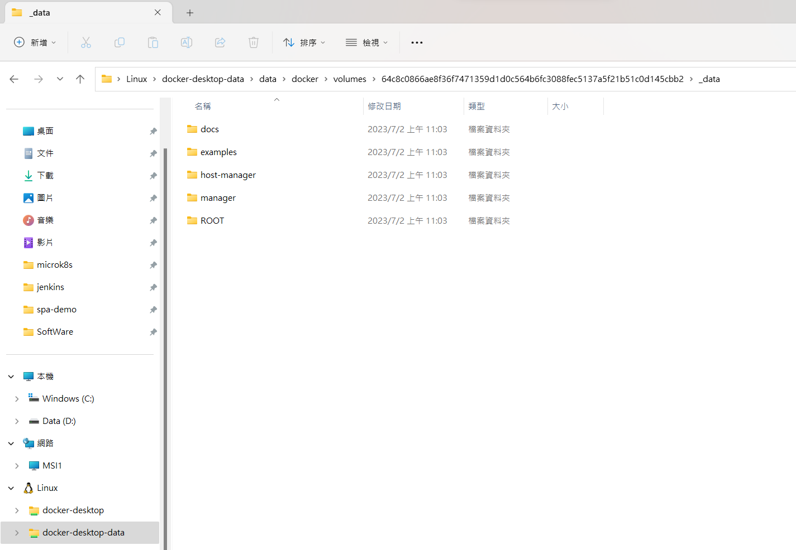
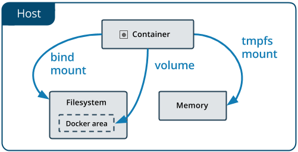

## 使用 Docker 的 Volume 來部署 war 檔

1. Dockerfile

        FROM openjdk:8

        RUN apt-get update && apt-get install -y wget

        RUN cd /

        RUN wget https://dlcdn.apache.org/tomcat/tomcat-10/v10.1.10/bin/apache-tomcat-10.1.10.tar.gz
        RUN tar zxvf apache-tomcat-10.1.10.tar.gz

        VOLUME ["/apache-tomcat-10.1.10/webapps"]

        CMD ["/apache-tomcat-10.1.10/bin/catalina.sh", "run"]

2. 透過 VSCode 執行 docker build

3. 執行

        docker run -d --name tomcat -p 8080:8080 tomcatserver

4. 卷宗有兩種掛載方式，一種卷宗掛載、一種繫結掛載。

        docker inspect -f '{{.Mounts}}' tomcat  

        [{volume 64c8c0866ae8f36f7471359d1d0c564b6fc3088fec5137a5f21b51c0d145cbb2 /var/lib/docker/volumes/64c8c0866ae8f36f7471359d1d0c564b6fc3088fec5137a5f21b51c0d145cbb2/_data /apache-tomcat-10.1.10/webapps local  true }]

- 卷宗掛載：(這次例子適用)

- 繫結掛載：(一般推薦用這種)

- 比較兩者不同：

- Volume 存放在主機檔案系統中由 Docker 管理的地方，在 Linux 作業系統是 /var/lib/docker/volumes/ 此路徑。非 Docker 的行程不應該修改檔案系統中的這一部分。要在 Docker 中留存資料，volumes 是最好的方法。
- Bind mount 可存放在主機檔案系統中的任何地方，非 Docker 行程或 Docker 容器可隨時修改。
- tmpfs mount 只存放在主機的記憶體中，不會寫入主機的檔案系統。

<https://ithelp.ithome.com.tw/articles/10207973>