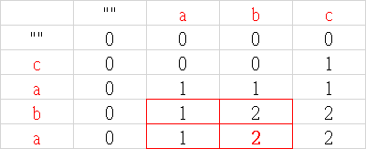
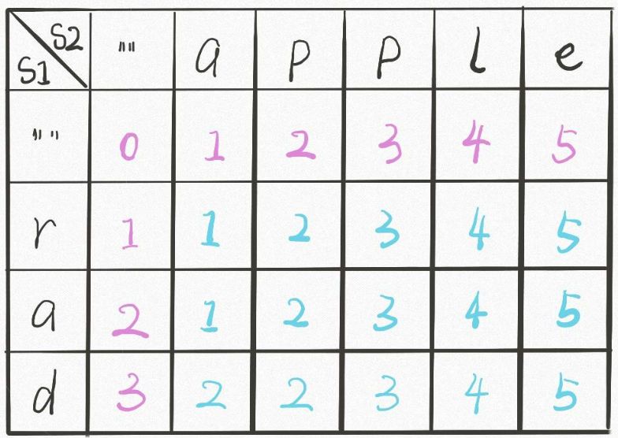
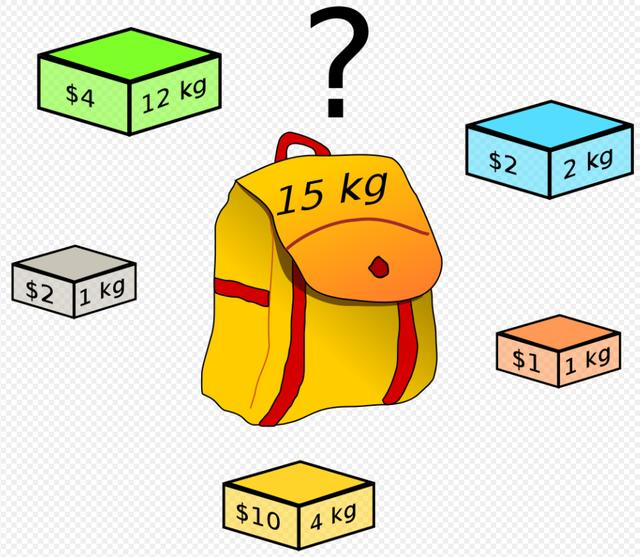
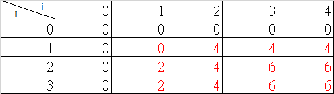

### Algorithm - Dynamic Programming

#### 最長遞增子序列的長度

> nums = [10,9,2,5,3,7,101,18], LTS=[2,3,7,101] , LTS長度=4

畫圖 (一維)


| index | 0 | 1 | 2 | 3 | 4 | 5 | 6 | 7 |
| ----- | - | - | - | - | - | - | - | - |
| nums  | 10 | 9 | 2 | 5 | 3 | 7 | 101 | 18 |
| dp    | 1 | 1 | 1 | 2 | 2 | 3 | 4 | 4 |

**dp[3] = 2** , 索引 0 ~ 3 的數字，最長遞增子序列的長度為 2。


```
public static int lengthOfLIS(int[] nums) {
    int[] dp  = new int[nums.length];
    Arrays.fill(dp, 1);
    for (int i = 0; i < nums.length; i++) {
        for (int j = 0; j < i; j++) {
            if (nums[i] > nums[j]) {
                level = Math.max(dp[i], dp[j] + 1);
            }
        }
    }
    return Arrays.stream(dp).max().orElse(-1);
}
```

#### 最大子陣列的和

畫圖 (一維)

| index | 0 | 1 | 2 | 3 | 4 | 5 | 6 |
| ----- | - | - | - | - | - | - | - |
| nums  | -3 | 1 | 3 | -1 | 2 | -4 | 2 |
| dp    | -3 | 1 | 4 | 3 | 5 | 1 | 2 |


**dp[2] = 4** , 依照陣列順序，以數字3為結尾的，最大和為4。
**初始化**：因為以該數字做結尾的，其實可以就指該數一個，所以初始化可以設定為該數的值。

```
public static int maxSubArray(int[] nums) {

    int[] dp = new int[nums.length];
    for (int i = 0; i < dp.length; i++) {
        dp[i] = nums[i];
    }

    for (int i = 0; i < dp.length; i++) {
        for (int j = i; j > 0; j--) {
            dp[i] = Math.max(dp[i], dp[i - 1] + nums[i]);
        }
    }

    return Arrays.stream(dp).max().orElse(-1);
}
```

#### 最長公用次序列(LCS,Longest Common Subsequence)

畫圖 (二維)



> str1 = abc , str2 = caba, 最長公用次序的長度為 2。

**dp[i][j] = n**, 第一個字串結尾=i，與第二個字串結尾=j的兩個字串，其最長公用次序列數量=n。 例如：dp[3][2] = 2，也就是 cab 和 ab 的最長公用次序列數量 = 2

**最佳子結構**：能夠根據子結構的狀態，推知當前元素的狀態者，稱為最佳子結構。

(1) 如果最後一個字元一樣，我們就可以從上一個子結構 (dp[i-1][j-1]) 的結果 +1 推之。

(2) 如果最後一個字元不一樣，我們一樣可以從上一個字結構 (dp[i][j-1] 與 dp[i-1][j]) 的最大值。

```
public static int LCS(String str1, String str2) {

    int[][] dp = new int[str2.length() + 1][str1.length() + 1];

    for (int i = 0; i < dp.length; i++) {
        Arrays.fill(dp[i], 0);
    }

    int res = 0;
    for (int i = 1; i < dp.length; i++) {
        for (int j = 1; j < dp[i].length; j++) {

            if (str2.charAt(i - 1) == str1.charAt(j - 1)) {
                dp[i][j] = dp[i - 1][j - 1] + 1;
            }

            if (str2.charAt(i - 1) != str1.charAt(j - 1)) {
                dp[i][j] = Math.max(dp[i - 1][j], dp[i][j - 1]);
            }

            if (dp[i][j] > res) {
                res = dp[i][j];
            }
        }
    }

    return res;
}
```
#### 最長回文子序列(按照順序即可，不一定要連續性的字串)

```
public static int longestPalindrome(String s) {

    int[][] dp = new int[s.length()][s.length()];

    for (int i = 0; i < dp.length; i++) {
        Arrays.fill(dp[i], 0);
    }

    for (int i = 0; i < dp.length; i++) {
        dp[i][i] = 1;
    }

    int n = dp.length;

    int res = 0;
    for (int i = (n - 2); i >= 0; i--) {
        for (int j = i + 1; j < n; j++) {
            if (s.charAt(i) == s.charAt(j)) {
                dp[i][j] = dp[i + 1][j - 1] + 2;
            } else {
                dp[i][j] = Math.max(dp[i][j - 1], dp[i + 1][j]);
            }
            
            if(dp[i][j] > res) {
                res = dp[i][j];
            }
        }
    }


    return res;
}
```
#### 最長回文子字串(連續性的字串)

```
public static String longestPalindrome(String s) {
    int n = s.length();
    boolean[][] f = new boolean[n][n];
    for (var g : f) {
        Arrays.fill(g, true);
    }
    int k = 0, mx = 1;
    for (int i = n - 2; i >= 0; --i) {
        for (int j = i + 1; j < n; ++j) {
            f[i][j] = false;
            if (s.charAt(i) == s.charAt(j)) {
                f[i][j] = f[i + 1][j - 1];
                if (f[i][j] && mx < j - i + 1) {
                    mx = j - i + 1;
                    k = i;
                }
            }
        }
    }
    return s.substring(k, k + mx);
}
```
#### 編輯距離 (求最小編輯次數)

> 若將 rad 換成 apple，最少需要編輯 5 次。可以新增、刪除、取代作為編輯的手段。

畫圖(二維)



dp[1][2] = 2, s1 字串 r，與 s2 字串 ap  的最小編輯次數為 2 次。 

  - 先將 r 換成 p。結果 p。
  - 再新增 a。r。結果 ap。

如果str1[i] 與 str[j] 相等，代表最小編輯次數與前一個(dp[i-1][j-1]) 相同。

如果不同，則要去比對鄰邊 (上、左、左上)，取最小的值 + 1。

```
public static int minDistance(String s1, String s2) {

    int m = s1.length() + 1;
    int n = s2.length() + 1;

    int[][] dp = new int[m][n];

    for (int j = 0; j < n; j++) {
        dp[0][j] = j;
    }

    for (int i = 0; i < m; i++) {
        dp[i][0] = i;
    }

    for (int i = 1; i < m; i++) {
        for (int j = 1; j < n; j++) {
            if (s1.charAt(i - 1) == s2.charAt(j - 1)) {
                dp[i][j] = dp[i - 1][j - 1];
            } else {
                dp[i][j] = Math.min(Math.min(dp[i - 1][j - 1] + 1, dp[i - 1][j] + 1), dp[i][j - 1] + 1);
            }
        }
    }

    return dp[m - 1][n - 1];
}
```

#### 編輯距離 (求編輯過程)

```
public class Node {

	int val;
	
	int choice; // 0 不做，1新增，2刪除，3替換
	
	Node(int val,int choice) {
		this.val = val;
		this.choice = choice;
	}
}
```

```
public static int minDistance(String s1, String s2) {

    int m = s1.length() + 1;
    int n = s2.length() + 1;

    Node[][] dp = new Node[m][n];

    for (int i = 0; i < m; i++) {
        dp[i][0] = new Node(i, 2);
    }

    for (int j = 0; j < n; j++) {
        dp[0][j] = new Node(j, 1);
    }

    for (int i = 1; i < m; i++) {
        for (int j = 1; j < n; j++) {
            if (s1.charAt(i - 1) == s2.charAt(j - 1)) {
                Node node = dp[i - 1][j - 1];
                dp[i][j] = new Node(node.val,0);
            } else {
                dp[i][j] = minNode(dp[i - 1][j - 1], dp[i - 1][j], dp[i][j - 1]);
                dp[i][j].val++;
            }
        }
    }

    printResult(dp, s1, s2);

    return dp[m - 1][n - 1].val;
}

static void printResult(Node[][] dp, String s1, String s2) {

    System.out.println(s1 + " to " + s2);
    
    int i = dp.length - 1; // 列

    int j = dp[0].length -1; // 欄

    while (i != 0 && j != 0) {

        char c1 = s1.charAt(i - 1);

        char c2 = s2.charAt(j - 1);

        int choice = dp[i][j].choice;

        switch (choice) {
            case 0:
                System.out.println("skip '" + c1 + "'");
                i--;
                j--;
                break;
            case 1:
                System.out.println("insert '" + c2 + "'");
                j--;
                break;
            case 2:
                System.out.println("delete '" + c1 + "'");
                i--;
                break;
            case 3:
                System.out.println("replace '" + c1 + "' with '" + c2 + "'");
                i--;
                j--;
                break;
            }
    }

    while (i > 0) {
        System.out.print("s1["+(i-1)+"] ");
        System.out.println("delete '"+s1.charAt(i-1) + "'");
        i--;
    }

    while (j > 0) {
        System.out.print("s1[0] ");
        System.out.println("insert '"+s2.charAt(j-1) + "'");
        j--;
    }
}

static Node minNode(Node n1, Node n2, Node n3) { // n1=替換,n2=刪除,n3=新增

    Node res = new Node(n1.val, 3);

    if (res.val > n2.val) {
        res.val = n2.val;
        res.choice = 2;
    }

    if (res.val > n3.val) {
        res.val = n3.val;
        res.choice = 1;
    }

    return res;
}

```

#### 湊零錢問題

(待續)

#### 0-1 背包問題



**每一樣物品只能選擇裝或不裝，背包是有容量限制，每樣物品有重量和價值定義，請問最多能裝的價值是多少？**

> N = 3 (有三項物品), W = 4 (背包可裝載的重量)
  wt = [2, 1, 3]
  val = [4, 2, 3]
  Max Value = 6

定義 dp[i][w]：p 一定是價值。 i=物品，w=背包重量。在前i的物品中，目前的背包重量 w，其裝載的最大價值為dp[i][w]。



```
public static int knapsack(int w, int[] wt, int[] val) {

    int[][] dp = new int[wt.length+1][w+1];

    for (int i = 0; i < dp.length; i++) {
        dp[i][0] = 0;
    }

    for (int j = 1; j < dp[0].length; j++) {
        dp[0][j] = 0;
    }

    int res = 0;
    for (int i = 1; i < dp.length; i++) {
        for (int j = 1; j < dp[i].length; j++) {
            if (j - wt[i - 1] < 0) {
                dp[i][j] = dp[i - 1][j];
            } else {
                dp[i][j] = Math.max(dp[i - 1][j - wt[i - 1]] + val[i - 1], dp[i - 1][j]);
            }
            res = Math.max(res, dp[i][j]);
        }
    }

    return res;
}
```

#### 高樓扔雞蛋問題

(待續)