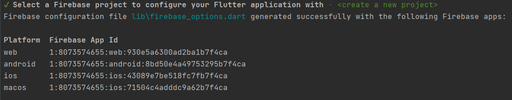
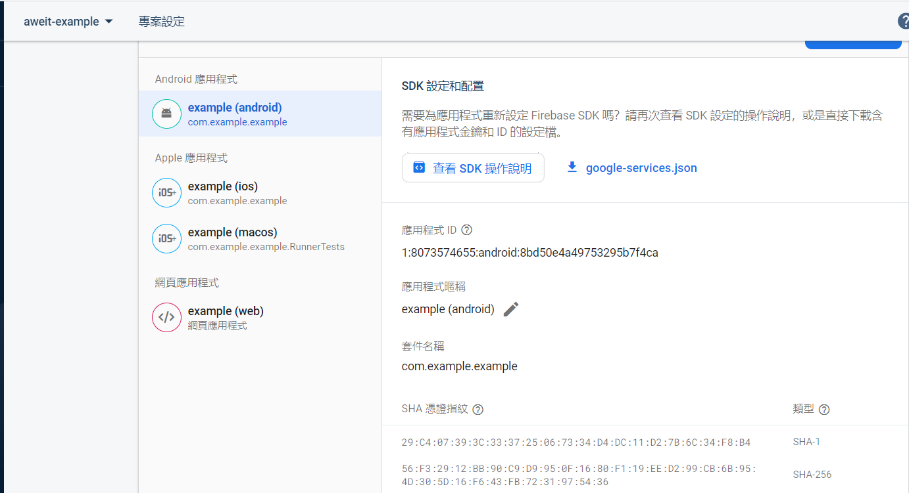
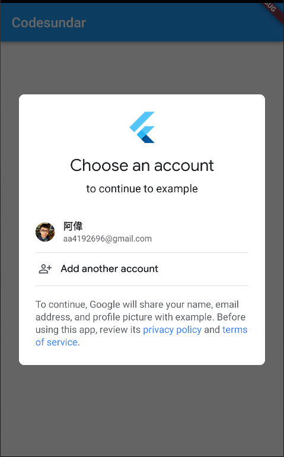

### FlutterFire 


#### Step0. create a new Flutter app

```
 flutter create example
```


#### Step1.  Install the required command line tools

1. install the Firebase CLI `npm install -g firebase-tools`
2. 登入 Firebase. `firebase login`

   如果已登入，會顯示 `Already logged in as aa4192696@gmail.com
`
   如果未登入，則會跳出登入視窗，讓您透過 Google 帳號登入。

   (<https://console.firebase.google.com/>)
3. 安裝 FlutterFire CLI.(全域)  `dart pub global activate flutterfire_cli`

#### Step 2: Configure your apps to use Firebase

1. 進入到 Flutter 專案根目錄，執行以下指令

    ```
    flutterfire configure
    ```

    (1) 這邊以建立新的 firebase 專案為例，名字取：`aweit-example`

    

    (2) 全部就對了，這樣會在 Firebase 專案中，建立四個應用程式。

    

    (3) 都成功後，會顯示以下資訊。

    

#### Step 3: Initialize Firebase in your app

1. 安裝 firebase_core

    ```
    flutter pub add firebase_core
    ```

2. 再次執行 `flutterfire configure`，以確認 Flrebase 設定是最新的。

3. 打開 lib/main.dart，插入以下代碼

    原本
    ```
    import 'package:flutter/material.dart';

    void main() {
        runApp(const MyApp());
    }
    ```
    
    變更為
    ```
    import 'package:flutter/material.dart';
    import 'package:firebase_core/firebase_core.dart';
    import 'firebase_options.dart';

    Future<void> main() async {
        WidgetsFlutterBinding.ensureInitialized();
        await Firebase.initializeApp(
            options: DefaultFirebaseOptions.currentPlatform,
        );
        runApp(const MyApp());
    }
    ```
4. flutter run


5. 相關錯誤訊息處理方式

    (1) 若出現 `If ServicesBinding is a custom binding mixin, there must also be a custom binding class, like WidgetsFlutterBinding, but that mixes in the selected binding, and that is the class that must be constructed before using the "instance" getter`

    要新增一行程式碼在 lib/main.dart 的 main 方法中的第一行。  
    ```
    WidgetsFlutterBinding.ensureInitialized();
    ```

#### Step 4: Add Firebase plugins

> You access Firebase in your Flutter app through the various Firebase Flutter plugins, one for each Firebase product (for example: Cloud Firestore, Authentication, Analytics, etc.).

> Since Flutter is a multi-platform framework, each Firebase plugin is applicable for Apple, Android, and web platforms. So, if you add any Firebase plugin to your Flutter app, it will be used by the Apple, Android, and web versions of your app.

```
flutter pub add {PLUGIN_NAME}
flutterfire configure
flutter run
```


#### Get Started with Firebase Authentication on Flutter

1. Google Enable


2. Android - SHA Key

```
keytool -list -v -alias androiddebugkey -keystore .\.android\debug.keystore

password: android
```
>SHA1: 29:C4:07:39:3C:33:37:25:06:73:34:D4:DC:11:D2:7B:6C:34:F8:B4
SHA256: >56:F3:29:12:BB:90:C9:D9:95:0F:16:80:F1:19:EE:D2:99:CB:6B:95:4D:30:5D:16:F6:43:FB:72:31:97:54:36




3. Flutter Project 相關設定

安裝套件、設定 Firebase
```
flutter pub add firebase_auth
flutter pub add google_sign_in
flutterfire configure
```

修改設定值
android\app\build.gradle
```
defaultConfig {
    multiDexEnabled true
    minSdkVersion 19
}
```


Demo 程式

home.dart

```
import 'package:flutter/material.dart';
import 'package:google_sign_in/google_sign_in.dart';

class HomePage extends StatefulWidget {
  @override
  _HomePageState createState() => _HomePageState();
}

class _HomePageState extends State<HomePage> {
  bool _isLoggedIn = false;
  late GoogleSignInAccount _userObj;
  final GoogleSignIn _googleSignIn = GoogleSignIn();

  @override
  Widget build(BuildContext context) {
    return Scaffold(
      appBar: AppBar(title: Text("Codesundar")),
      body: Container(
        child: _isLoggedIn
            ? Column(
                children: [
                  Image.network(_userObj.photoUrl!),
                  Text(_userObj.displayName!),
                  Text(_userObj.email),
                  TextButton(
                      onPressed: () {
                        _googleSignIn.signOut().then((value) {
                          setState(() {
                            _isLoggedIn = false;
                          });
                        }).catchError((e) {});
                      },
                      child: Text("Logout"))
                ],
              )
            : Center(
                child: ElevatedButton(
                  child: Text("Login with Google"),
                  onPressed: () {
                    _googleSignIn.signIn().then((userData) {
                      setState(() {
                        _isLoggedIn = true;
                        _userObj = userData!;
                      });
                    }).catchError((e) {
                      print(e);
                    });
                  },
                ),
              ),
      ),
    );
  }
}

```

main.dart

```
import 'package:firebase_auth/firebase_auth.dart';
import 'package:firebase_core/firebase_core.dart';
import 'package:flutter/material.dart';
import 'package:google_sign_in/google_sign_in.dart';
import 'firebase_options.dart';
import 'home.dart';

Future<void> main() async {
  WidgetsFlutterBinding.ensureInitialized();
  await Firebase.initializeApp(
    options: DefaultFirebaseOptions.currentPlatform,
  );
  runApp(const MyApp());
}

class MyApp extends StatelessWidget {
  const MyApp({Key? key}) : super(key: key);

  @override
  Widget build(BuildContext context) {
    return MaterialApp(
      title: 'Google Authencation Demo',
      theme: ThemeData(
        primarySwatch: Colors.blue,
      ),
      home: HomePage(),
    );
  }
}
```

4. 畫面





5. 如果用 Web 會無法做出效果，出現以下錯誤訊息：

`ClientID not set. Either set it on a <meta name=\"google-signin-client_id\" content=\"CLIENT_ID\" /> tag, or pass clientId when initializing GoogleSignIn`

(1) 去找 Clitne id : 8073574655-9c9sa7onebk99ju1mf2i5e1kfi5m4hk0.apps.googleusercontent.com


(2) 修改代碼

home.dart
```
原本
final GoogleSignIn _googleSignIn = GoogleSignIn();

後來
final GoogleSignIn _googleSignIn = GoogleSignIn(clientId: '8073574655-saga5315djjgbcgsgag5qfmgusl6tqpu.apps.googleusercontent.com');
```
(3) 出現以下訊息，則直接點選，照著步驟做即可。

> PlatformException(idpiframe_initialization_failed, Not a valid origin for the client: http://localhost:13529 has not been registered for client ID 8073574655-9c9sa7onebk99ju1mf2i5e1kfi5m4hk0.apps.googleusercontent.com. Please go to https://console.developers.google.com/ and register this origin for your project's client ID., https://developers.google.com/identity/sign-in/web/reference#error_codes, null)


已授權的 JavaScript 來源，要把這個Port加上去


(4) Flutter run 時，指定 PORT = 12621 參數。--web-port=12621


(5) 再次打開瀏覽器，並且清除快取和瀏覽資料。就可以了。


#### Try out an example app with Analytics

1. `flutter pub add firebase_analytics`
2. `flutterfire configure`
3. Access the lib directory of the app, then delete the existing main.dart file.
4. 將以下兩個檔案，複製貼上到專案中 lib/

    <https://github.com/firebase/flutterfire/blob/master/packages/firebase_analytics/firebase_analytics/example/lib/main.dart>

    <https://github.com/firebase/flutterfire/blob/master/packages/firebase_analytics/firebase_analytics/example/lib/tabs_page.dart>

5. 執行 flutter run

6. 錯誤訊息

- 錯誤1
  

  

- 錯誤2

  如果出現 `Missing google_app_id. Firebase Analytics disabled` 錯誤訊息

  代表有兩個地方需要修改：

    - android\build.gradle
    
    ```
    classpath 'com.google.gms:google-services:4.3.15'
    ```
    
    
    - android\app\build.gradle

    ```
    apply plugin: 'com.google.gms.google-services'
    ```

    

7. 成果

