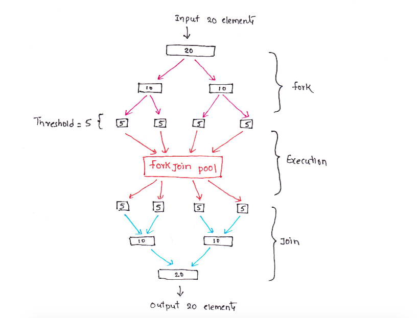
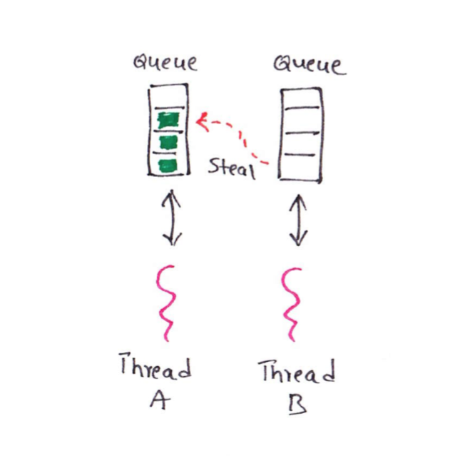

### ForkJoinPool

參考資料：

1. Simple Introduction to ForkJoin Framework  <https://thetechstack.net/simple-introduction-to-forkjoin-framework-part1/>

2. Chat GPT

#### Divide And Conquer (分而治之)

> 分治法是一種問題解決方法，將一個大問題劃分為若干個小問題，遞歸地解決小問題，然後將小問題的解合併起來得到大問題的解。在ForkJoinPool中，我們可以將一個大的任務劃分為多個子任務，每個子任務負責處理一部分數據，然後將子任務的結果合併起來得到最終的結果。這種分治的策略可以提高並行計算的效率，特別是對於大規模的問題。


#### Work Stealing

> 工作窺取是ForkJoinPool中的一種調度策略。當一個線程完成了它自己的任務後，它可以從其他線程的工作隊列中窺取任務並執行。這樣做的好處是可以實現負載均衡，確保所有線程都能夠保持忙碌狀態，充分利用系統資源。如果一個線程的工作隊列為空，它可以從其他線程的工作隊列中窺取任務，從而避免了線程閒置的情況。


#### 比較 ForkJoinPool 與 未使用 ForkJoinPool 的 效能差異

##### 情境

請設計 從 1 加到 1_000_000_000 的程序，一個使用 Stream、一個使用 ForkJoinPool，計算並比較兩種方式的執行時間？

##### 實作

SumDemo.java
```
import java.util.concurrent.ForkJoinPool;
import java.util.stream.IntStream;

public class SumDemo {
	
	private static final int RANGE = 1_000_000_000;

	public static void main(String[] args) {
		
		long startTime;
		long elapsedTime;

		// Without ForkJoinPool
		startTime = System.currentTimeMillis();
		int sumWithoutForkJoin = IntStream.rangeClosed(1, RANGE).sum();
		elapsedTime = System.currentTimeMillis() - startTime;
		System.out.println("Sum without ForkJoinPool: " + sumWithoutForkJoin);
		System.out.println("Time taken without ForkJoinPool: " + elapsedTime + " milliseconds");

		// With ForkJoinPool
		startTime = System.currentTimeMillis();
		ForkJoinPool forkJoinPool = ForkJoinPool.commonPool();
		int sumWithForkJoin = (int) forkJoinPool.invoke(new SumTask(1, RANGE));
		elapsedTime = System.currentTimeMillis() - startTime;
		System.out.println("Sum with ForkJoinPool: " + sumWithForkJoin);
		System.out.println("Time taken with ForkJoinPool: " + elapsedTime + " milliseconds");
	}
}

---
Sum without ForkJoinPool: -243309312
Time taken without ForkJoinPool: 271 milliseconds
Sum with ForkJoinPool: -243309312
Time taken with ForkJoinPool: 51 milliseconds
```

SumTask.java
```
import java.util.concurrent.RecursiveTask;
import java.util.stream.IntStream;

public class SumTask extends RecursiveTask<Integer> {

	private static final long serialVersionUID = 1L;

	private static final int THRESHOLD = 1_000_000;

	private int start;
	private int end;

	public SumTask(int start, int end) {
		this.start = start;
		this.end = end;
	}

	@Override
	protected Integer compute() {
		if (end - start <= THRESHOLD) {
			return IntStream.rangeClosed(start, end).sum();
		} else {
			int mid = (start + end) / 2;
			SumTask leftTask = new SumTask(start, mid);
			SumTask rightTask = new SumTask(mid + 1, end);

			rightTask.fork();
			leftTask.fork();
			
			int rightSum = rightTask.join();
			int leftSum = leftTask.join();

			return leftSum + rightSum;
		}
	}
}
```

#### 小結

通過分治法和工作窺取的策略，ForkJoinPool能夠實現高效的並行計算。它能夠自動地將任務劃分為更小的子任務，並將這些子任務分配給可用的線程執行。同時，工作窺取策略能夠確保所有線程都能夠保持忙碌，避免了線程閒置的情況，提高了系統的吞吐量和響應性能。

確實，從範例中，可以看到 使用 ForkJoinPool 可以比使用 Stream 快速5倍的時間，尤其 Stream 已經是以效能出名。顯見，使用多執行緒，分而治之的概念，會優於 Stream 的方式。