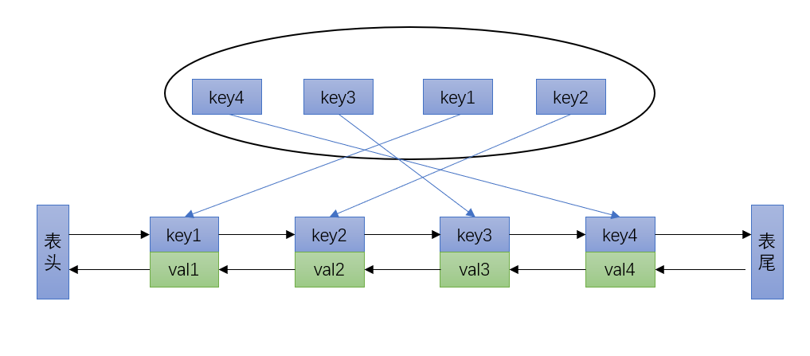
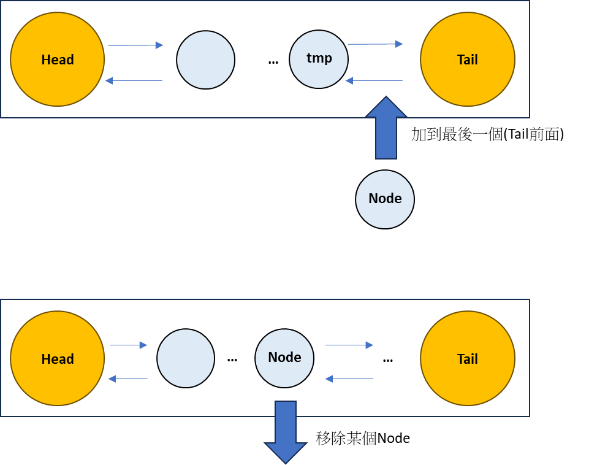
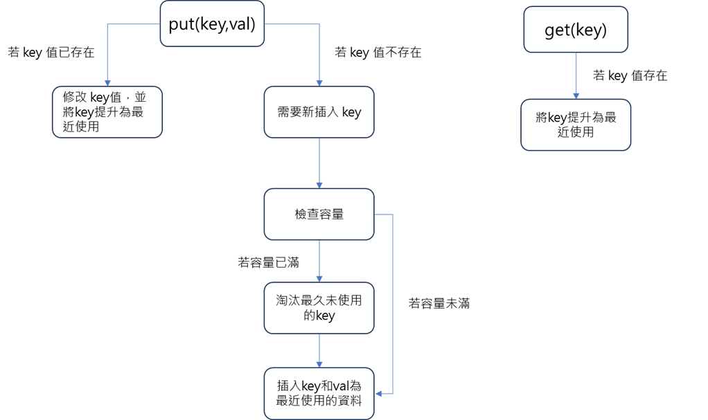

### LRU 演算法

#### 定義

> LRU (Least Recently Used) 快取是一種快取替換算法，用於在有限的快取空間中管理和替換數據。它的基本原則是，當需要替換一個數據時，選擇最近最少使用的數據進行替換。

#### 應用

文件系統快取
> 文件系統快取：操作系統使用LRU 快取來加速文件系統的訪問。當需要訪問一個文件時，如果該文件已經在快取中，則可以迅速從快取中讀取。如果快取已經滿了，則可以替換掉最久未使用的文件。

資料庫查詢結果快取
> 查詢結果快取：當用戶發起一個查詢時，資料庫可以將查詢結果存儲在LRU 快取中。如果同樣的查詢再次發生，則可以直接從快取中返回結果，而不需要重新執行查詢。這樣可以大大減少查詢的執行時間，提高系統的性能。

資料庫索引快取
> 索引快取：索引是資料庫中用於加速查詢的重要結構。資料庫可以使用LRU 快取來存儲最常用的索引頁面。當一個查詢需要使用某個索引時，DBMS可以先檢查快取中是否已經存在對應的索引頁面，如果有則可以快速從快取中讀取，否則需要從磁盤中讀取。通過使用LRU 快取，資料庫可以減少磁盤IO，提高查詢的執行效率。

#### 雜湊鏈結串列(LinkedHashMap)

LinkedHahMap


Node + DoubleList



#### Put 和 Get 的流程圖



####  自己實作 LinkedHashMap
```
import java.util.HashMap;
import java.util.List;
import java.util.stream.Collectors;

class Node {

	public int key, val;

	public Node next, prev;

	public Node(int k, int v) {
		this.key = k;
		this.val = v;
	}
}

class DoubleList {

	private Node head, tail;

	private int size;

	public DoubleList() {
		head = new Node(0, 0);
		tail = new Node(0, 0);
		head.next = tail;
		tail.prev = head;
		size = 0;
	}

	public void addLast(Node node) {
		tail.prev.next = node;
		node.prev = tail.prev;
		node.next = tail;
		tail.prev = node;
		size++;
	}

	public void remove(Node node) {
		node.prev.next = node.next;
		node.next.prev = node.prev;
		size--;
	}

	public Node removeFirst() {
		if (head.next == tail)
			return null;

		Node first = head.next;
		remove(first);
		return first;
	}

	public int size() {
		return size;
	}

}

class LRUCache {

	private int cap;

	private HashMap<Integer, Node> map;

	private DoubleList cache;

	public LRUCache(int capacity) {
		this.cap = capacity;
		map = new HashMap<>();
		cache = new DoubleList();
	}

	public void put(int key, int val) {

		if (map.containsKey(key)) {
			deleteKey(key);
			addRecently(key, val);
			return;
		}

		if (cache.size() == cap) {
			removeLeastRecently();
		}
		addRecently(key, val);
	}

	public int get(int key) {
		if (!map.containsKey(key)) {
			return -1;
		}
		makeRecently(key);
		return map.get(key).val;
	}
	
	public List<Integer> getAll() {
		return map.values().stream().map(node-> Integer.valueOf(node.val)).collect(Collectors.toList());
	}

	private void makeRecently(int key) {
		Node node = map.get(key);
		cache.remove(node);
		cache.addLast(node);
	}

	private void addRecently(int key, int val) {
		Node node = new Node(key, val);
		cache.addLast(node);
		map.put(key, node);
	}

	private void deleteKey(int key) {
		Node node = map.get(key);
		cache.remove(node);
		map.remove(key);
	}

	private void removeLeastRecently() {
		Node node = cache.removeFirst();
		int key = node.key;
		map.remove(key);
	}
}

public class Main {
	
	public static void main(String[] args) {
		
		LRUCache cache = new LRUCache(2);
		
		cache.put(1, 1);
		cache.put(2, 2);
		System.out.println(cache.getAll());
		
		cache.get(1);
		cache.put(3, 3);
		cache.get(2);
		System.out.println(cache.getAll());		
		
		cache.get(1);
		cache.put(4, 4);
		System.out.println(cache.getAll());
	}
}

---
[1, 2]
[1, 3]
[1, 4]
```

#### 利用 Java 原有的 LinkedHashMap

```
class LRUCache {
	
	int cap;
	
	LinkedHashMap<Integer, Integer> cache;
	
	LRUCache2(int capacity) {
		this.cap = capacity;
		this.cache = new LinkedHashMap<>();
	}
	
	public void put(int key, int val) {
		
		if(cache.containsKey(key)) {
			makeRecently(key,val);
			return;
		}
		
		if(cache.size() >= cap) {
			int oldKey = cache.keySet().iterator().next();
			cache.remove(oldKey);
			makeRecently(key,val);
		} else {
			makeRecently(key,val);
		}
	}
	
	public int get(int key) {
		if(!cache.containsKey(key))
			return -1;
		
		makeRecently(key,cache.get(key));
		
		return cache.get(key);
	}
	
	public void makeRecently(int key,int val) {
		cache.remove(key);
		cache.put(key, val);
	}
	
	public List<Integer> getAll(){
		return cache.values().stream().collect(Collectors.toList());
	}
	
}

public class LRUDemo {
	
	public static void main(String[] args) {
		
		LRUCache cache = new LRUCache(2);
		
		cache.put(1, 1);
		cache.put(2, 2);
		System.out.println(cache.getAll());
		
		cache.get(1);
		cache.put(3, 3);
		cache.get(2);
		System.out.println(cache.getAll());		
		
		cache.get(1);
		cache.put(4, 4);
		System.out.println(cache.getAll());
	}
}
---
[1, 2]
[1, 3]
[1, 4]
```

#### 結論

使用自定義的 DoubleList 和 Node 來實現 LRU Cache 是一種更底層的實現方式，它可以讓你更深入地理解和掌握 LRU Cache 的內部機制。這樣的實現方式在某些情況下可能會更靈活和高效，特別是當你對於如何管理鏈表和節點有特定的需求時。

然而，使用 Java 內建的 LinkedHashMap 來實現 LRU Cache 是一種更簡單和方便的方式。LinkedHashMap 提供了內建的 LRU 快取機制，並且已經經過了許多優化和測試。它的使用方式非常直觀，只需創建一個 LinkedHashMap 對象，然後使用 put 和 get 方法即可。這樣的實現方式更適合那些不需要對 LRU Cache 的內部實現細節進行定制的場景。

總結來說，使用自定義的 DoubleList 和 Node 可以讓你更深入地理解和掌握 LRU Cache 的實現細節，並且在某些情況下可能具有更好的靈活性和性能。然而，如果你只是需要一個簡單且方便的 LRU Cache 實現，使用 Java 內建的 LinkedHashMap 是一個更合適的選擇。

