## Use NFS for Persistent Volumes

- https://microk8s.io/docs/nfs

### 1. Setup an NFS server

假設在 192.168.0.16 架設 NFS server

```
sudo apt update
sudo apt-get install nfs-kernel-server
```

Create a directory to be used for NFS:

```
sudo mkdir -p /srv/nfs
sudo chown nobody:nogroup /srv/nfs
sudo chmod 0777 /srv/nfs
```

Edit the /etc/exports file. Make sure that the IP addresses of all your MicroK8s nodes are able to mount this share. For example, to allow all IP addresses in the 10.0.0.0/24 subnet
```
sudo mv /etc/exports /etc/exports.bak
echo '/srv/nfs 192.168.0.0/24(rw,sync,no_subtree_check,no_root_squash)' | sudo tee /etc/exports
```

重啟

```
sudo systemctl restart nfs-kernel-server.service
```

確認 NFS Server是否正常啟動

```
sudo systemctl status nfs-kernel-server.service
```
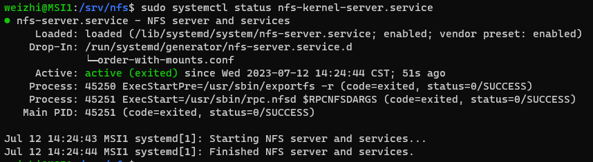

或是可以使用 showmount 命令來檢查 NFS Server 開出來的目錄
`showmount -e 192.168.0.16`

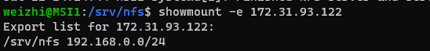

### 1-1. NFS Client (可選，作為測試用)

使用 apt 命令進行安裝 NFS Client
```
sudo apt update
sudo apt install nfs-common
```

使用 showmount 命令檢查 NFS Server 可連線的目錄
```
showmount -e 192.168.0.16
---output---
Export list for 192.168.0.16:
/srv/nfs 192.168.0.0/24
```

如果出現堵塞現象(Stuck)，可能原因為 NFS Server 的防火牆導致，只要關掉防火牆即可(`sudo ufw disable`)。

建立掛載用目錄，並將 NFS Server 的目錄掛載至本機目錄
```
sudo mkdir /srv/nfs
sudo mount 192.168.0.16:/srv/nfs /srv/nfs
```
如果出現 `mount.nfs: access denied by server while mounting 192.168.0.16:/srv/nfs` 問題，可以先透過
`sudo mount -t nfs -vvvv 192.168.0.16:/srv/nfs /srv/nfs` 
查看詳細資訊。
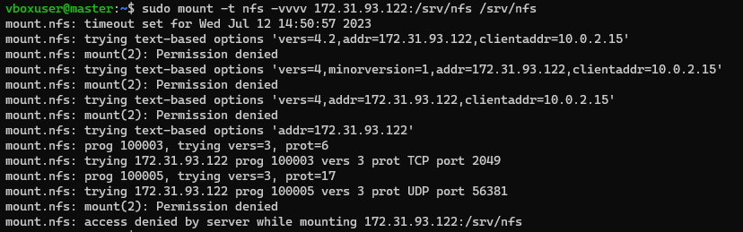

測試：

登入 ssh vboxuser@192.168.17  # NFS Client
登入 ssh vboxuser@192.168.16  # NFS Server
因為 NFS Client 將本機的 /srv/nfs 資料夾，綁定在  NFS Server 的 /srv/nfs 資料夾 資料夾中，所以兩者資料夾會同步。

先在 NFS Client 執行以下命令

```
touch /srv/nfs/123.txt
ls
```
再去 NFS Server 執行以下命令，就會看到 123.txt 檔案了

```
cd /srv/nfs
ls
```

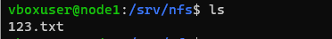


### 2.Install the CSI driver for NFS

### 3.Create a StorageClass for NFS & Create a new PVC

```
# sc-nfs.yaml
---
apiVersion: storage.k8s.io/v1
kind: StorageClass
metadata:
  name: nfs-csi
provisioner: nfs.csi.k8s.io
parameters:
  server: 192.168.0.16
  share: /srv/nfs
reclaimPolicy: Delete
volumeBindingMode: Immediate
mountOptions:
  - hard
  - nfsvers=4.1

microk8s kubectl apply -f - < sc-nfs.yaml
```

```
# pvc-nfs.yaml
---
apiVersion: v1
kind: PersistentVolumeClaim
metadata:
  name: my-pvc
spec:
  storageClassName: nfs-csi
  accessModes: [ReadWriteOnce]
  resources:
    requests:
      storage: 5Gi

microk8s kubectl apply -f - < pvc-nfs.yaml
```

microk8s kubectl describe pvc my-pvc

### 4. 測試 Pod

```
apiVersion: v1
kind: Pod
metadata:
  name: hwchiu
  labels:
    app: hwchiu
spec:
  containers:
  - name: busybox
    image: hwchiu/netutils:latest
    volumeMounts:
      - name: nfs-volume
        mountPath: /nfs
  volumes:
    - name: nfs-volume
      persistentVolumeClaim:
        claimName: my-pvc
```

進入Pod

```
kubectl exec -it hwchiu -n nfs-demo -- /bin/bash
ls  # 看看有沒有剛剛建立的 456.txt
```
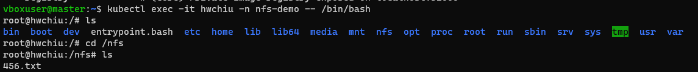

以下是這個 Pod 的 Volume 完整資訊

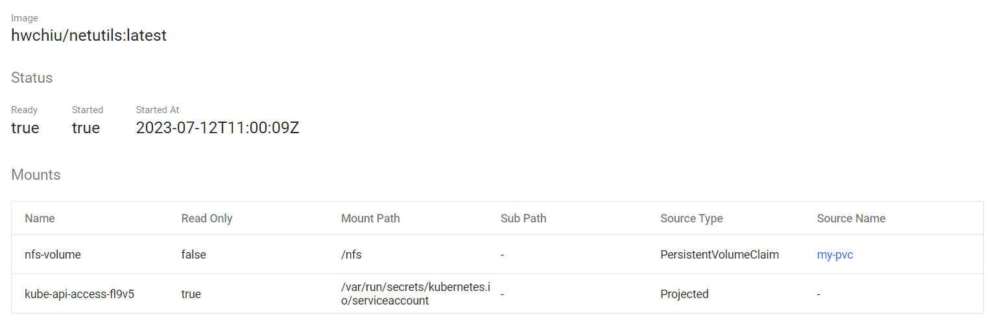

pvc 資訊
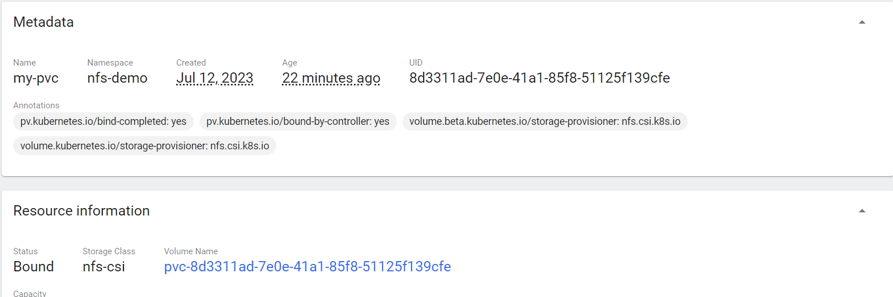

pv 資訊
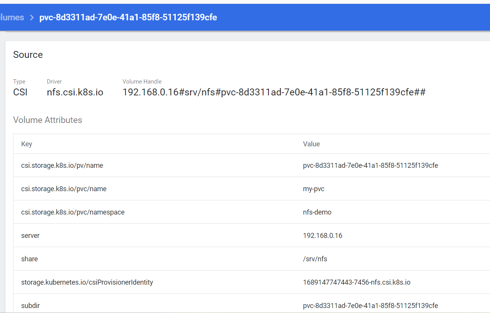

### 5. MySQL + NFS
```
kubectl create namespace kube-demo
kubectl create secret generic mysql-pass --from-literal=password=password321 -n kube-demo
```
PV、PVC
```
apiVersion: v1
kind: PersistentVolume
metadata:
  name: mysql-pv
  labels:
    pv: mysql-pv
spec:
  storageClassName: nfs-csi
  capacity:
    storage: 15Gi
  accessModes:
    - ReadWriteMany
  persistentVolumeReclaimPolicy: Recycle
  nfs:
    path: /srv/nfs/mysql-pv
    server: 192.168.0.16
---
apiVersion: v1
kind: PersistentVolumeClaim
metadata:
  name: mysql-pvc
spec:
  storageClassName: "nfs-csi"
  accessModes:
    - ReadWriteMany
  resources:
    requests:
      storage: 10Gi
  selector:
    matchLabels: 
      pv: mysql-pv
```
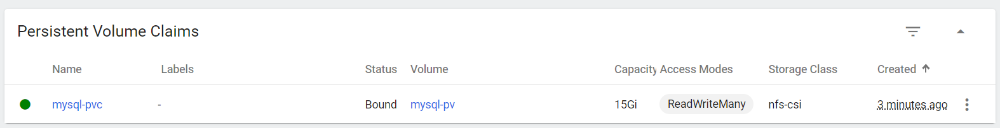
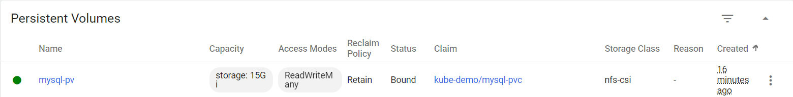

Deployment

```
apiVersion: v1
kind: Service
metadata:
  name: mysql
spec:
  selector:
    app: mysql
  ports:
    - protocol: TCP
      port: 3306
      targetPort: 3306
      nodePort: 31306
  type: NodePort
---
apiVersion: apps/v1
kind: Deployment
metadata:
  name: mysql
  labels:
    app: mysql-test
spec:
  replicas: 1
  selector:
    matchLabels:
      app: mysql
  template:
    metadata:
      labels:
        app: mysql
    spec:
      nodeName: node
      containers:
      - name: mysql-test
        image: mysql:5.7
        env:
          - name: MYSQL_ROOT_PASSWORD
            valueFrom:
              secretKeyRef:
               name: mysql-pass
               key: password
        ports:
        - containerPort: 3306
        volumeMounts:
        - mountPath: "/var/lib/mysql"
          name: mysql-data
      volumes:
      - name: mysql-data
        persistentVolumeClaim:
          claimName: mysql-pvc
```
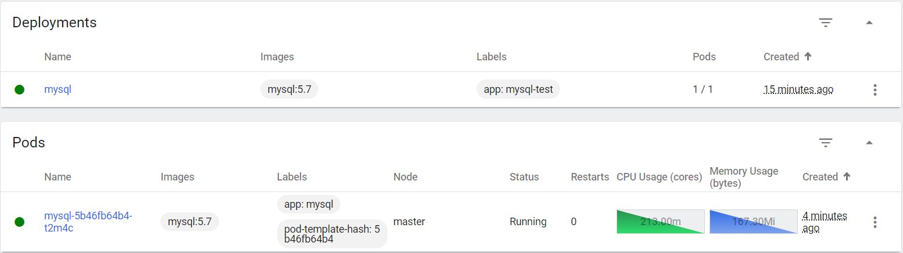

P.S：
如果一直 Pending ，甚至出現 CrashLoopBackOff 的訊息，可以執行
`kubectl logs mysql-848b44f4c5-kgdzc -n kube-demo`
看看哪裡出錯。

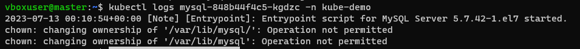

可參考 <https://blog.csdn.net/m0_46090675/article/details/122276216> 解決此問題。


最後就會成功了~~~

首先檢查 NFS Server 的檔案中是否有 mysql 的相關資料

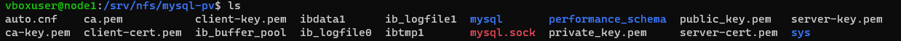

進入 Pod 的命令列中，查看 Mysql 相關資訊

    kubectl exec -it mysql-5b46fb64b4-t2m4c -n kube-demo -- /bin/bash


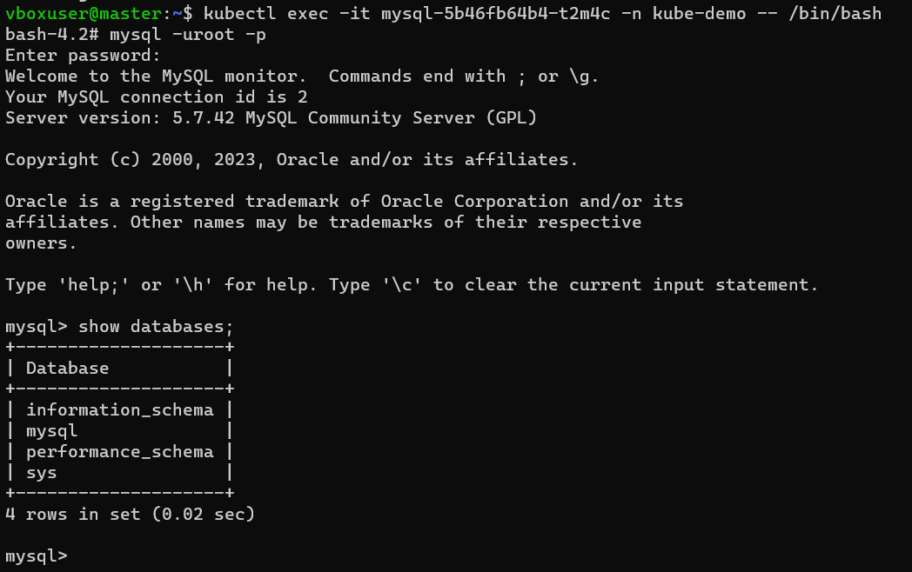