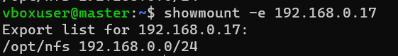
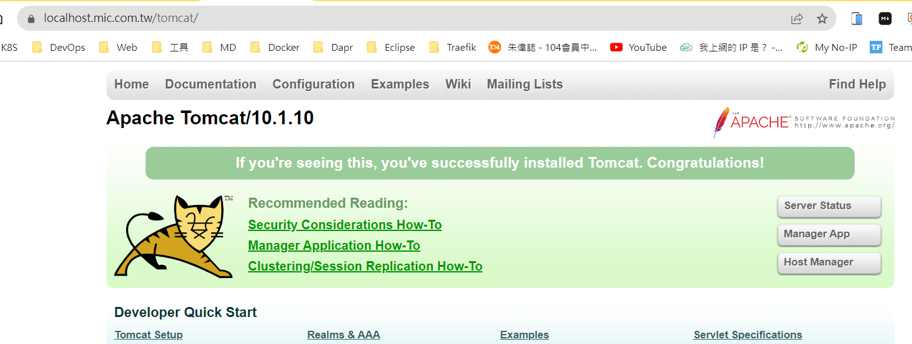

## Kubernetes 補充

### 錯誤

- Failed to allocate IP: No available IPs

  因為當初在開啟 microk8s enable metallb:192.168.0.17-192.168.0.17
  太少了。像是例子為只有開一個。
  此時，可以先關掉 metallb，再重新開啟，並且將IP數字變多。

        microk8s disable metallb

        microk8s enable metallb:192.168.0.17-192.168.0.100

  參考網址：<https://discuss.kubernetes.io/t/addon-metallb/11790>

### 知識

- 透過 MicroK8s 認識 Kubernetes 的 Service Account (服務帳戶)

  參考網址：<https://blog.miniasp.com/post/2022/08/24/Understanding-Service-Account-in-Kubernetes-through-MicroK8s>

- 建立別名：讓 microk8s.kubectl = kubectl

        sudo snap alias microk8s.kubectl kubectl

    

- 如何取得 Pod 的資訊，並以 yaml 呈現。

        kubectl get pod microbot -n dev -o yaml

    

- 進入Pod的console

        kubectl exec microbot -it -n dev -- sh

- RBAC

    k8s 在 1.8 版之後，引用了 Role-Base Access Control (RBAC，基於角色的訪問控制，好像有點繞舌) 做為授權 (Authorization) 的基礎，也就是一種管制訪問 k8s API 的機制。管理者可以透過 rbac.authorization.k8s.io 這個 API 群組來進行動態的管理配置。引用 <https://ithelp.ithome.com.tw/articles/10195944>

      kubectl create namespace dev
      kubectl label namespace dev name=dev
      kubectl run microbot --/assets/image=dontrebootme/microbot:v1 -n dev

      kubectl create serviceaccount monitor -n dev
      kubectl create clusterrole aweit --verb='*' --resource='*'
      kubectl create clusterrolebinding aweit --clusterrole=aweit --serviceaccount='dev:monitor' 

      microk8s kubectl create token monitor

    範例<https://blog.miniasp.com/post/2022/08/24/Understanding-Service-Account-in-Kubernetes-through-MicroK8s>

- Dashboard 與 Kubeconfig

  - 開啟 Dashboard

        microk8s enable dashboard

  - 登入頁面

    

  - 如何產生 .kueconfig

        mircok8s config

     

        在本機建立 .kubeconfig 檔案，將上圖的文字貼上去。

  - 重新上傳 .kubeconfig 檔案即可。

- Token

        microk8s kubectl create token [service account]
        microk8s kubectl create token default

### Volume

- Type： emptyDir、hostPath、local、nfs、persistentVolumeClaim

  ```
  apiVersion: v1
  kind: Pod
  metadata:
    name: test-pd
  spec:
    containers:
    - image: registry.k8s.io/test-webserver
      name: test-container
      volumeMounts:
      - mountPath: /test-pd
        name: test-volume
    volumes:
    - name: test-volume
      hostPath:
        # 宿主上目录位置
        path: /data
        # 此字段为可选
        type: DirectoryOrCreate
  ```

- nfs

  - [Ubuntu NFS 安裝教學] <https://blog.devcloud.com.tw/ubuntu-nfs-install/>

  - 使用說明 <https://www.hwchiu.com/kubernetes-storage-ii.html>

  NFS Server
  IP： 192.168.0.17
  
      showmount -e 192.168.0.17

  

  如果要新增掛載目錄

      # 建立共享資料夾
      sudo mkdir /opt/nfsshare
      
      # 編輯 NFS Server 的 Expose 設定
      sudo nano /etc/exports
      ...
      /opt/nfsshare  192.168.0.0/24(rw,sync,no_subtree_check,no_root_squash)

      # 重啟
      sudo systemctl restart nfs-kernel-server.service

      # 顯示 Mount 資訊
      showmount -e 192.168.0.17

  - PV/PVC/Pod

  ```
  apiVersion: v1
  kind: PersistentVolume
  metadata:
    name: nfs
  spec:
    capacity:
      storage: 1Mi
    accessModes:
      - ReadWriteMany
    nfs:
      server: 192.168.0.17
      path: "/opt/nfsshare"

  ---
  apiVersion: v1
  kind: PersistentVolumeClaim
  metadata:
    name: nfs
  spec:
    accessModes:
      - ReadOnlyMany
    storageClassName: ""
    resources:
      requests:
        storage: 1Mi
  ---
  apiVersion: v1
  kind: Pod
  metadata:
    name: hwchiu
    labels:
      app: hwchiu
  spec:
    containers:
    - name: busybox
      image: hwchiu/netutils:latest
      volumeMounts:
        - name: nfs-volume
          mountPath: /nfs
    volumes:
      - name: nfs-volume
        persistentVolumeClaim:
          claimName: nfs
  ```

  ### Tomcat & Volume

```
# PV: 先有 nfs server，並且建立好對應的資料夾，例如：/opt/nfsshare/demo/webapps
apiVersion: v1
kind: PersistentVolume
metadata:
  name: nfs-demo-tomcat
spec:
  capacity:
    storage: 1Mi
  accessModes:
    - ReadOnlyMany
  nfs:
    server: 192.168.0.17
    path: "/opt/nfsshare/demo/webapps"

---
# PVC: 建立 PV 請求
apiVersion: v1
kind: PersistentVolumeClaim
metadata:
  name: nfs-demo-tomcat
spec:
  accessModes:
    - ReadOnlyMany
  storageClassName: ""
  resources:
    requests:
      storage: 1Mi
---
# Deployment: tomcat 鏡像，綁定 nfs 共用資料夾。
# 因為 tomcat 8 以後，會多一個 webapps.dir 資料夾，所以要執行 cp -r webapps.dist/.  webapps/ 才能將資料夾與檔案全部搬移過去。
apiVersion: apps/v1
kind: Deployment
metadata:
  name:  tomcat-deployment-nautilus
  labels:
    name: webdep
    app: demo
spec:
  replicas: 1
  selector:
    matchLabels:
      name: webpod
      app: demo
  template:
    metadata:
      name: webpod
      labels:
        name: webpod
        app: demo
    spec:
      containers:
        - name: tomcat-container-nautilus
          image: tomcat
          ports:
            - containerPort: 8080
          volumeMounts:
            - name: nfs-volume
              mountPath: /usr/local/tomcat/webapps
      volumes:
        - name: nfs-volume
          persistentVolumeClaim:
            claimName: nfs-demo-tomcat

---
# Service
apiVersion: v1
kind: Service
metadata:
  name: tomcat-service-nautilus
spec:
  selector:
    name: webpod
    app: demo
  ports:
    - port: 80
      targetPort: 8080


---
# IngressRoute
apiVersion: traefik.io/v1alpha1
kind: IngressRoute
metadata:
  name: tomcat-ingress-route
  namespace: default
spec:
  entryPoints:
    - websecure
  routes:
    - kind: Rule
      match: Host(`localhost.mic.com.tw`) && PathPrefix(`/tomcat`)
      middlewares:
        - name: test-stripprefix
        - name: test-errors
      services:
        - name: tomcat-service-nautilus
          port: 80
  tls:
    secretName: mic-tls
```

把 webapps.dist 目錄下的所有檔案，複製到 webapps 底下

    cp -r webapps.dist/.  webapps/

traefik: 把 /tomcat 去掉

```
# Middleware
apiVersion: traefik.io/v1alpha1
kind: Middleware
metadata:
  name: test-stripprefix
spec:
  stripPrefix:
    prefixes:
      - /tomcat
```

https://localhost.mic.com.tw/tomcat/

