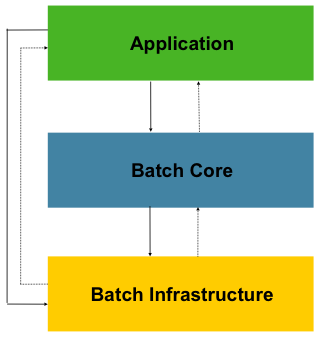
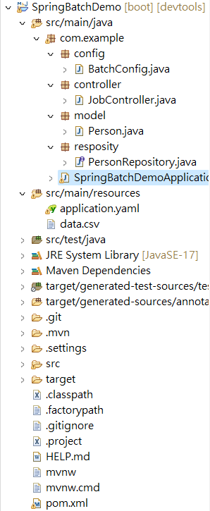
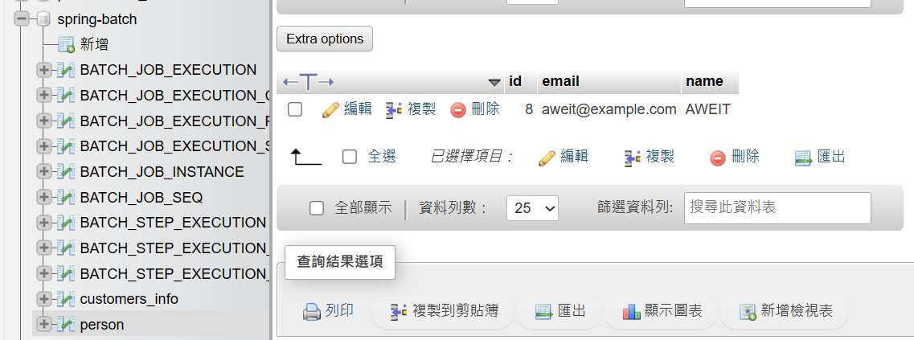
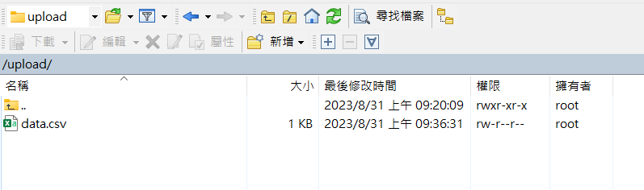
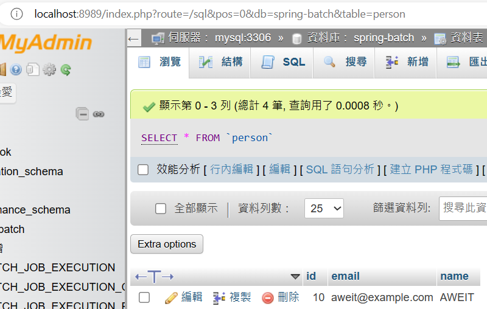

### Spring Boot 3 + Spring Batch 5

#### overview



圖片複製於：<https://docs.spring.io/spring-batch/docs/current/reference/html/index-single.html#business-scenarios>


1. Batch: A batch refers to a collection of related tasks or operations that are executed together. It typically involves processing a large amount of data in a systematic and efficient manner.

2. Job: In Spring Batch, a job represents a single batch processing unit. It consists of one or more steps that are executed sequentially. A job encapsulates the entire batch processing logic and provides a way to manage and monitor the execution of the batch.

3. Step: A step is a single unit of work within a job. It represents a specific task or operation that needs to be performed during the batch processing. Each step typically consists of an `ItemReader`, `ItemProcessor`, and `ItemWriter` component, which collectively handle the input, processing, and output of data for that step.

4. ItemReader: An `ItemReader` is responsible for reading data from a data source. It provides a way to retrieve data in chunks or one item at a time. The `ItemReader` interface defines the `read()` method, which returns the next item from the data source or `null` if there is no more data.

5. ItemWriter: An `ItemWriter` is responsible for writing the processed data to a desired destination, such as a database, file, or API. It receives data in chunks or one item at a time from the `ItemProcessor` and performs the necessary actions to persist or transmit the data.

6. ItemProcessor: An `ItemProcessor` is an optional component that performs any necessary processing on the input data before it is written by the `ItemWriter`. It allows you to transform or filter the data based on your business logic. The `ItemProcessor` interface defines the `process()` method, which takes an input item and returns a processed item or `null` to indicate that the item should be skipped.

7. JobLauncher: The `JobLauncher` is responsible for starting the execution of a job. It receives a job instance and launches it, triggering the execution of all the steps within the job. The `JobLauncher` interface defines the `run()` method, which takes a job instance and returns a `JobExecution` object representing the status and result of the job execution.


#### Demo

##### 情境說明

###### `有一個 CSV 檔案，內容記錄著人員的姓名與電子信箱，需要將資料同步到自己的 MySQL DB中。`

##### Project Structure

完整代碼 <https://github.com/aweit-zhu/SpringBatchDemo>



##### docker-compose.yml

```
services:
  mysql:
    image: mysql:5
    container_name: mysql
    restart: always
    environment:
      MYSQL_ROOT_PASSWORD: password
      MYSQL_DATABASE: cookbook
      MYSQL_USER: admin
      MYSQL_PASSWORD: password
    ports:
      - 3306:3306
    volumes:
      - ./data:/var/lib/mysql

  phpmyadmin:
    image: phpmyadmin/phpmyadmin
    container_name: phpmyadmin
    restart: always
    environment:
      PMA_HOST: mysql
      PMA_PORT: 3306
      MYSQL_ROOT_PASSWORD: password
    ports:
      - 8989:80
    depends_on:
      - mysql
```

##### pom.xml

```
<?xml version="1.0" encoding="UTF-8"?>
<project xmlns="http://maven.apache.org/POM/4.0.0"
	xmlns:xsi="http://www.w3.org/2001/XMLSchema-instance"
	xsi:schemaLocation="http://maven.apache.org/POM/4.0.0 https://maven.apache.org/xsd/maven-4.0.0.xsd">
	<modelVersion>4.0.0</modelVersion>
	<parent>
		<groupId>org.springframework.boot</groupId>
		<artifactId>spring-boot-starter-parent</artifactId>
		<version>3.1.3</version>
		<relativePath /> <!-- lookup parent from repository -->
	</parent>
	<groupId>com.example</groupId>
	<artifactId>spring-batch-demo</artifactId>
	<version>1.0.0</version>
	<name>SpringBatchDemo</name>
	<description>spring-batch-demo</description>
	<properties>
		<java.version>17</java.version>
	</properties>
	<dependencies>
		<dependency>
			<groupId>org.springframework.boot</groupId>
			<artifactId>spring-boot-starter-batch</artifactId>
		</dependency>
		<dependency>
			<groupId>org.springframework.boot</groupId>
			<artifactId>spring-boot-starter-data-jpa</artifactId>
		</dependency>
		<dependency>
			<groupId>org.springframework.boot</groupId>
			<artifactId>spring-boot-starter-web</artifactId>
		</dependency>
		<dependency>
			<groupId>org.springframework.boot</groupId>
			<artifactId>spring-boot-devtools</artifactId>
			<scope>runtime</scope>
			<optional>true</optional>
		</dependency>
		<dependency>
			<groupId>com.mysql</groupId>
			<artifactId>mysql-connector-j</artifactId>
			<scope>runtime</scope>
		</dependency>
		<dependency>
			<groupId>org.projectlombok</groupId>
			<artifactId>lombok</artifactId>
			<optional>true</optional>
		</dependency>
		<dependency>
			<groupId>org.springframework.boot</groupId>
			<artifactId>spring-boot-starter-test</artifactId>
			<scope>test</scope>
		</dependency>
		<dependency>
			<groupId>org.springframework.batch</groupId>
			<artifactId>spring-batch-test</artifactId>
			<scope>test</scope>
		</dependency>
		<!-- Other dependencies -->
		<dependency>
			<groupId>com.fasterxml.jackson.datatype</groupId>
			<artifactId>jackson-datatype-joda</artifactId>
			<version>2.9.4</version>
		</dependency>
		<dependency>
			<groupId>org.jadira.usertype</groupId>
			<artifactId>usertype.core</artifactId>
			<version>6.0.1.GA</version>
		</dependency>
	</dependencies>

	<build>
		<plugins>
			<plugin>
				<groupId>org.springframework.boot</groupId>
				<artifactId>spring-boot-maven-plugin</artifactId>
				<configuration>
					<excludes>
						<exclude>
							<groupId>org.projectlombok</groupId>
							<artifactId>lombok</artifactId>
						</exclude>
					</excludes>
				</configuration>
			</plugin>
		</plugins>
	</build>

</project>
```

##### 建立 data.csv 於 src/main/resources 資料夾中

```
name,email
Aweit,aweit@example.com
```

##### application.yaml

```
spring:
  batch:
    jdbc:
      initialize-schema: always
    job:
      enabled: false
  datasource:
    url: jdbc:mysql://localhost:3306/spring-batch
    username: admin
    password: password
    driver-class-name: com.mysql.cj.jdbc.Driver
  jpa:
    hibernate:
      ddl-auto: update
    show-sql: false
    properties:
      hibernate:
        format_sql: true
    database-platform: org.hibernate.dialect.MySQL8Dialect
```

##### 建立 Model 

```
@Data
@AllArgsConstructor
@NoArgsConstructor
@ToString
@Builder
@Entity
@Table
public class Person {

    @Id
    @GeneratedValue(strategy = GenerationType.IDENTITY)
    private long id;
    
    @Column
    private String name;
    
    @Column
    private String email;

}
```

##### 建立 Reposity

```
public interface PersonRepository extends JpaRepository<Person, Long>{

}
```

##### 建立 Batch Config

```
package com.example.config;

import javax.sql.DataSource;

import org.springframework.batch.core.Job;
import org.springframework.batch.core.Step;
import org.springframework.batch.core.job.builder.JobBuilder;
import org.springframework.batch.core.launch.support.RunIdIncrementer;
import org.springframework.batch.core.repository.JobRepository;
import org.springframework.batch.core.step.builder.StepBuilder;
import org.springframework.batch.item.ItemProcessor;
import org.springframework.batch.item.ItemReader;
import org.springframework.batch.item.ItemWriter;
import org.springframework.batch.item.data.RepositoryItemWriter;
import org.springframework.batch.item.file.FlatFileItemReader;
import org.springframework.batch.item.file.mapping.BeanWrapperFieldSetMapper;
import org.springframework.batch.item.file.mapping.DefaultLineMapper;
import org.springframework.batch.item.file.transform.DelimitedLineTokenizer;
import org.springframework.beans.factory.annotation.Autowired;
import org.springframework.context.annotation.Bean;
import org.springframework.context.annotation.Configuration;
import org.springframework.core.io.ClassPathResource;
import org.springframework.transaction.PlatformTransactionManager;

import com.example.model.Person;
import com.example.resposity.PersonRepository;

@Configuration
public class BatchConfig {

	@Autowired
	PersonRepository personRepository;
	
	@Bean
	public ItemReader<Person> csvReader() {
		FlatFileItemReader<Person> reader = new FlatFileItemReader<>();
		reader.setResource(new ClassPathResource("data.csv"));
		reader.setLinesToSkip(1);
		reader.setLineMapper(new DefaultLineMapper<Person>() {
			{
				setLineTokenizer(new DelimitedLineTokenizer() {
					{
						setNames("name", "email");
					}
				});
				setFieldSetMapper(new BeanWrapperFieldSetMapper<Person>() {
					{
						setTargetType(Person.class);
					}
				});
			}
		});
		return reader;
	}

	@Bean
	public ItemProcessor<Person, Person> personProcessor() {
		return person -> {
			person.setName(person.getName().toUpperCase());
			return person;
		};
	}

	@Bean
	public ItemWriter<Person> dbWriter(DataSource dataSource) {
		RepositoryItemWriter<Person> writer = new RepositoryItemWriter<>();
        writer.setRepository(personRepository);
        writer.setMethodName("save");
        return writer;
	}

	@Bean
	public Step step(ItemReader<Person> reader, ItemProcessor<Person, Person> processor, ItemWriter<Person> writer,
			JobRepository jobRepository, PlatformTransactionManager transactionManager) {
		return new StepBuilder("myStep", jobRepository)
				.<Person, Person>chunk(10, transactionManager)
				.reader(reader)
				.processor(processor)
				.writer(writer)
				.build();
	}

	@Bean
	public Job job(Step step, JobRepository jobRepository) {
		return new JobBuilder("myJob", jobRepository)
				.incrementer(new RunIdIncrementer())
				.flow(step)
				.end()
				.build();
	}

}
```


##### 建立 Controller

```
@RestController
@RequestMapping("/jobs")
public class JobController {

    @Autowired
    private JobLauncher jobLauncher;
    
    @Autowired
    private Job job;

    @GetMapping("/import")
    public void importCsvToDBJob() {
        JobParameters jobParameters = new JobParametersBuilder()
                .addLong("startAt", System.currentTimeMillis()).toJobParameters();
        try {
            jobLauncher.run(job, jobParameters);
        } catch (JobExecutionAlreadyRunningException | JobRestartException | JobInstanceAlreadyCompleteException | JobParametersInvalidException e) {
            e.printStackTrace();
        }
    }
}

```

##### 測試：http://localhost:8080/jobs/import




#### Spring Batch + SFTP Server

##### 情境

1. 本來是讀取 ClassPath Resources 的檔案，現在要改為讀取 SFTP Server 上的 /upload 資料夾，作為檔案來源。


##### docker-compose.ayml

```
services:
  sftp-server:
    image: atmoz/sftp
    volumes:
      - ./sftp:/home/user/upload
    ports:
      - "172.22.103.117:2222:22"
    environment:
      - SFTP_USERS=user:password:1001
```

##### pom.xml

```
  <!--SFTP-->
  <dependency>
    <groupId>com.jcraft</groupId>
    <artifactId>jsch</artifactId>
    <version>0.1.55</version>
  </dependency>
```

##### appication.yaml

```
sftp:
  host: 172.22.103.117
  port: 2222
  username: user
  password: password
```

##### SftpUtil.java

```
package com.example.util;

import java.io.IOException;
import java.io.InputStream;
import java.util.ArrayList;
import java.util.List;

import org.springframework.core.io.InputStreamResource;
import org.springframework.core.io.Resource;

import com.jcraft.jsch.ChannelSftp;
import com.jcraft.jsch.JSch;
import com.jcraft.jsch.JSchException;
import com.jcraft.jsch.Session;
import com.jcraft.jsch.SftpException;

public class SftpUtil {

	public static Resource[] getResources(ChannelSftp channelSftp, String remoteFolderPath) throws IOException {
		List<Resource> resourceList = new ArrayList<>();
		try {
			channelSftp.cd(remoteFolderPath);
			@SuppressWarnings("unchecked")
			List<ChannelSftp.LsEntry> lsEntries = channelSftp.ls(".");
			for (ChannelSftp.LsEntry entry : lsEntries) {
				if (!entry.getAttrs().isDir()) {
					InputStream inputStream = channelSftp.get(entry.getFilename());
					Resource resource = new InputStreamResource(inputStream);
					resourceList.add(resource);
				}
			}
		} catch (SftpException e) {
			throw new IOException("Failed to retrieve resources from the SFTP server", e);
		}
		return resourceList.toArray(new Resource[0]);
	}

}
```

##### SftpCOnfig.java

```
import org.springframework.beans.factory.annotation.Value;
import org.springframework.context.annotation.Bean;
import org.springframework.context.annotation.Configuration;

import com.jcraft.jsch.ChannelSftp;
import com.jcraft.jsch.JSch;
import com.jcraft.jsch.JSchException;
import com.jcraft.jsch.Session;

@Configuration
public class SftpConfig {
	
	@Value("${sftp.host}")
    private String sftpHost;

    @Value("${sftp.port}")
    private int sftpPort;

    @Value("${sftp.username}")
    private String sftpUsername;

    @Value("${sftp.password}")
    private String sftpPassword;


    @Bean 
    public ChannelSftp channelSftp() throws JSchException {
    	JSch jsch = new JSch();
		Session session = jsch.getSession(sftpUsername, sftpHost, sftpPort);
		session.setPassword(sftpPassword);
		session.setConfig("StrictHostKeyChecking", "no");
		session.connect();

		ChannelSftp channel = (ChannelSftp) session.openChannel("sftp");
		channel.connect();
		return channel;
    }

}
```

##### BatchConfig

```
@Configuration
public class BatchConfig {

  ...

  @Autowired
	ChannelSftp channelSftp;

  @Bean
  public ItemReader<Person> csvReader() throws JSchException, IOException, SftpException{

      Resource[] resources = SftpUtil.getResources(channelSftp, "/upload");

      FlatFileItemReader<Person> fReader = new FlatFileItemReader<>();
      fReader.setLinesToSkip(1);
      fReader.setLineMapper(new DefaultLineMapper<Person>() {
        {
          setLineTokenizer(new DelimitedLineTokenizer() {
            {
              setNames("name", "email");
            }
          });
          setFieldSetMapper(new BeanWrapperFieldSetMapper<Person>() {
            {
              setTargetType(Person.class);
            }
          });
        }
      });

      MultiResourceItemReader<Person> reader = new MultiResourceItemReader<>();
      reader.setResources(resources);
      reader.setDelegate(fReader);

      return reader;
    }
  }

  ...
```

##### Test

Docker 啟動的 SFTP


SFTP 上傳的檔案


DB資料
