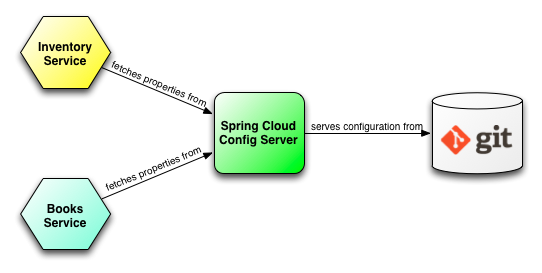
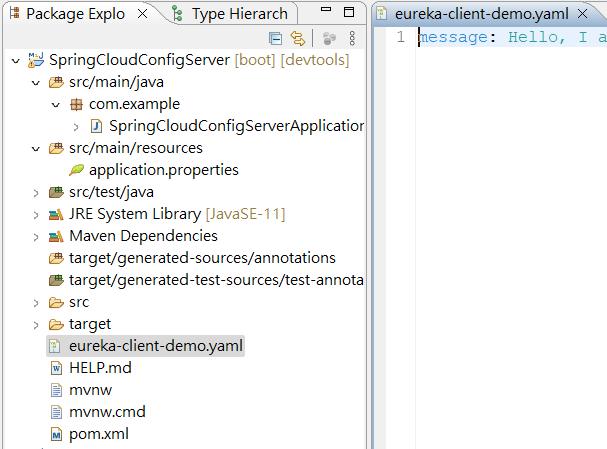
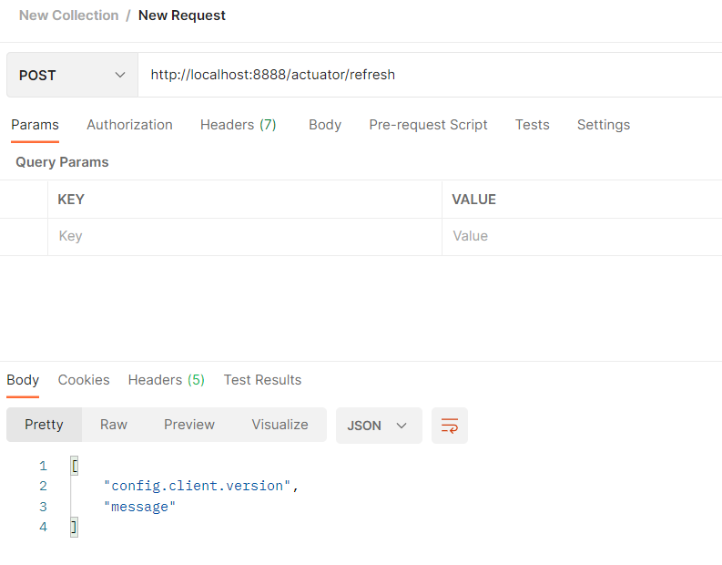
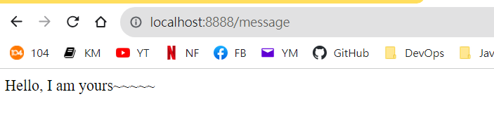
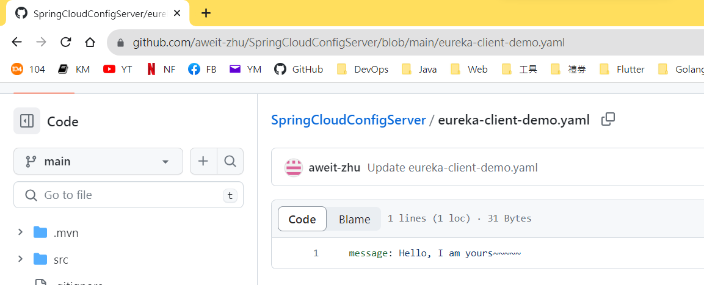

### Spring Cloud Config Server

程式碼：

1. Config Server：<https://github.com/aweit-zhu/SpringCloudConfigServer>
2. Eureka Client：<https://github.com/aweit-zhu/SpringCloudEurekaClient>

#### Config Server



>1. Centralized Configuration: The Config Server acts as a central repository for storing and managing configuration properties for multiple services or applications. Instead of having configuration properties hardcoded in each application, they can be stored in a version-controlled repository (such as Git) and accessed by the Config Server.
>2. Dynamic Configuration Refresh: The Config Server supports dynamic configuration updates without requiring a restart of the application. When a configuration property is modified in the repository, the Config Server notifies the subscribed applications, and they can fetch and apply the updated configuration without downtime.
>3. Configuration Profiles: The Config Server supports multiple configuration profiles, allowing you to define different sets of configuration properties for different environments (e.g., development, staging, production). Applications can retrieve the configuration specific to their active profile by specifying it in the request to the Config Server.
>4. Secure Configuration Access: The Config Server can be configured to enforce security measures to protect sensitive configuration properties. It can integrate with authentication and authorization mechanisms, such as Spring Security or OAuth, to ensure that only authorized applications can access specific configurations.
>5. Integration with Spring Cloud: The Config Server seamlessly integrates with other components of the Spring Cloud ecosystem. It can be used in conjunction with service discovery tools like Eureka Server and load balancing tools like Ribbon to provide dynamic and scalable configuration management for microservices.
>6. Externalized Configuration: By using the Config Server, you can externalize your application's configuration, separating it from the codebase. This approach promotes the Twelve-Factor App methodology, making your application more portable, configurable, and easier to manage across different environments.

#### Config Server code

1. pom.xml

```
<?xml version="1.0" encoding="UTF-8"?>
<project xmlns="http://maven.apache.org/POM/4.0.0"
	xmlns:xsi="http://www.w3.org/2001/XMLSchema-instance"
	xsi:schemaLocation="http://maven.apache.org/POM/4.0.0 https://maven.apache.org/xsd/maven-4.0.0.xsd">
	<modelVersion>4.0.0</modelVersion>
	<parent>
		<groupId>org.springframework.boot</groupId>
		<artifactId>spring-boot-starter-parent</artifactId>
		<version>2.7.14</version>
		<relativePath /> <!-- lookup parent from repository -->
	</parent>
	<groupId>com.example</groupId>
	<artifactId>config-server</artifactId>
	<version>1.0.0</version>
	<name>SpringCloudConfigServer</name>
	<description>Config Server using Spring Boot</description>
	<properties>
		<java.version>11</java.version>
		<spring-cloud.version>2021.0.8</spring-cloud.version>
	</properties>
	<dependencies>
		<dependency>
			<groupId>org.springframework.cloud</groupId>
			<artifactId>spring-cloud-config-server</artifactId>
		</dependency>

		<dependency>
			<groupId>org.springframework.boot</groupId>
			<artifactId>spring-boot-devtools</artifactId>
			<scope>runtime</scope>
			<optional>true</optional>
		</dependency>
		<dependency>
			<groupId>org.projectlombok</groupId>
			<artifactId>lombok</artifactId>
			<optional>true</optional>
		</dependency>
		<dependency>
			<groupId>org.springframework.boot</groupId>
			<artifactId>spring-boot-starter-test</artifactId>
			<scope>test</scope>
		</dependency>
	</dependencies>
	<dependencyManagement>
		<dependencies>
			<dependency>
				<groupId>org.springframework.cloud</groupId>
				<artifactId>spring-cloud-dependencies</artifactId>
				<version>${spring-cloud.version}</version>
				<type>pom</type>
				<scope>import</scope>
			</dependency>
		</dependencies>
	</dependencyManagement>

	<build>
		<plugins>
			<plugin>
				<groupId>org.springframework.boot</groupId>
				<artifactId>spring-boot-maven-plugin</artifactId>
				<configuration>
					<excludes>
						<exclude>
							<groupId>org.projectlombok</groupId>
							<artifactId>lombok</artifactId>
						</exclude>
					</excludes>
				</configuration>
			</plugin>
		</plugins>
	</build>

</project>

```

2. application.properties

```
spring.application.name=config-server
server.port=8889
spring.cloud.config.server.git.uri=https://github.com/aweit-zhu/SpringCloudConfigServer.git
```

3. Application：@EnableConfigServer

```
import org.springframework.boot.SpringApplication;
import org.springframework.boot.autoconfigure.SpringBootApplication;
import org.springframework.cloud.config.server.EnableConfigServer;

@SpringBootApplication
@EnableConfigServer
public class SpringCloudConfigServerApplication {

	public static void main(String[] args) {
		SpringApplication.run(SpringCloudConfigServerApplication.class, args);
	}

}

```

4. 建立設定檔案，因為 client 的 application name 為 eureka-client-demo，所以檔名為eureka-client-demo.yaml / eureka-client-demo.properties。路徑：根目錄。




#### Config Client Code

要實現自動更新注入屬性

1. pom.xml：新增這兩個依賴

```
		<dependency>
			<groupId>org.springframework.cloud</groupId>
			<artifactId>spring-cloud-config-client</artifactId>
		</dependency>
		<dependency>
			<groupId>org.springframework.boot</groupId>
			<artifactId>spring-boot-starter-actuator</artifactId>
		</dependency>
```

2. application.properties

```
server.port=8888
spring.application.name=eureka-client-demo
eureka.client.service-url.defaultZone=http://localhost:8761/eureka
management.endpoints.web.exposure.include=*
spring.config.import=configserver:http://localhost:8889
```

3. Application

@EnableScheduling：代表會有排程。
RefreshEndpoint：代表會從 GitHub 的設定檔中取得最新數據。

```
import org.springframework.beans.factory.annotation.Autowired;
import org.springframework.boot.SpringApplication;
import org.springframework.boot.autoconfigure.SpringBootApplication;
import org.springframework.cloud.client.discovery.EnableDiscoveryClient;
import org.springframework.cloud.endpoint.RefreshEndpoint;
import org.springframework.scheduling.annotation.EnableScheduling;
import org.springframework.scheduling.annotation.Scheduled;

@SpringBootApplication
@EnableDiscoveryClient
@EnableScheduling
public class SpringCloudEurekaClientApplication {
	
	@Autowired
	private RefreshEndpoint refreshEndpoint;

	public static void main(String[] args) {
		SpringApplication.run(SpringCloudEurekaClientApplication.class, args);
	}
	
	@Scheduled(fixedDelay = 5000) // Refresh every 5 seconds
	public void scheduleConfigRefresh() {
		refreshEndpoint.refresh();
	}

}
```


4. Contorller

@RefreshScope：自動更新的範圍

```
import org.springframework.beans.factory.annotation.Value;
import org.springframework.cloud.context.config.annotation.RefreshScope;
import org.springframework.web.bind.annotation.GetMapping;
import org.springframework.web.bind.annotation.RestController;

@RefreshScope
@RestController
public class MyController {

	@Value("${message:Default Hello}")
	private String message; 

	@GetMapping("/message")
	public String message() {
		return message;
	}
}
```


5.(可選) 如果要更新Config 屬性(標有@RefreshScope)，可以用 postmane 觸發

http://localhost:8888/actuator/refresh



#### Test

http://localhost:8888/message



