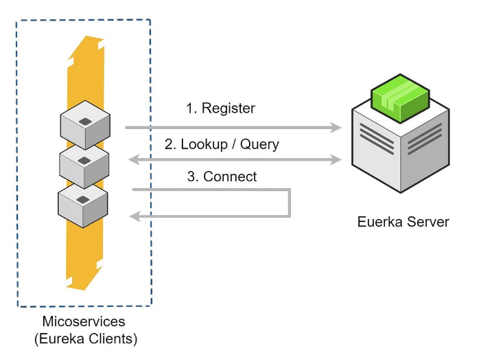
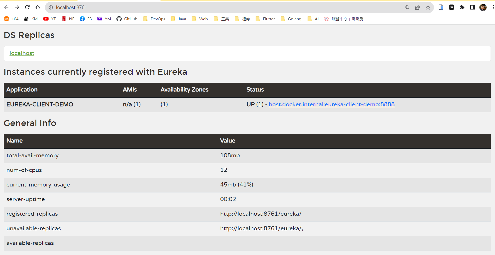
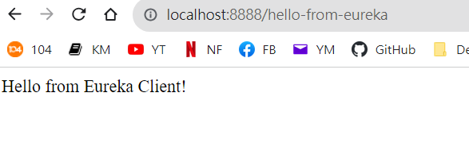

### Spring Cloud Eureka Server

程式碼：

1. Eureka Server：<https://github.com/aweit-zhu/SpringCloudEurekaServer>
2. Eureka Client：<https://github.com/aweit-zhu/SpringCloudEurekaClient>


#### Eureka Server



>1. Service Registration: Microservices that want to be discovered by other services register themselves with the Eureka Server. Each microservice instance is identified by a unique application name and instance ID.
>2. Service Discovery: Services that need to communicate with other services can query the Eureka Server to obtain the network location (host and port) of the desired service instance. Eureka Server maintains a registry of available service instances and provides this information to the clients.
>3. Heartbeat Monitoring: Eureka Server continuously checks the health of registered service instances by sending periodic heartbeat requests. If a service instance fails to respond to the heartbeat requests within a certain time period, it is considered offline and removed from the registry.
>4. Load Balancing: Eureka Server can also act as a load balancer by providing a list of available service instances for a particular service. Clients can use this information to implement load balancing strategies, such as round-robin or random selection, when making requests to the service.
>5. High Availability: Multiple instances of the Eureka Server can be deployed in a cluster to ensure high availability and fault tolerance. Each Eureka Server instance in the cluster keeps its own local registry, and they replicate and synchronize the registration information among themselves.
>6. Integration with Spring Cloud: Spring Cloud provides integration with Eureka Server through the `spring-cloud-starter-netflix-eureka-server` dependency. It simplifies the setup and configuration of Eureka Server in a Spring Boot application.

#### Eureka Server - Code

1. pom.xml

```
<?xml version="1.0" encoding="UTF-8"?>
<project xmlns="http://maven.apache.org/POM/4.0.0"
	xmlns:xsi="http://www.w3.org/2001/XMLSchema-instance"
	xsi:schemaLocation="http://maven.apache.org/POM/4.0.0 https://maven.apache.org/xsd/maven-4.0.0.xsd">
	<modelVersion>4.0.0</modelVersion>
	<parent>
		<groupId>org.springframework.boot</groupId>
		<artifactId>spring-boot-starter-parent</artifactId>
		<version>2.7.14</version>
		<relativePath /> <!-- lookup parent from repository -->
	</parent>
	<groupId>com.example</groupId>
	<artifactId>eureka-server</artifactId>
	<version>1.0.0</version>
	<name>SpringCloudEurekaServer</name>
	<description>Eureka Server using Spring Boot</description>
	<properties>
		<java.version>11</java.version>
		<spring-cloud.version>2021.0.8</spring-cloud.version>
	</properties>
	<dependencies>
		<dependency>
			<groupId>org.springframework.cloud</groupId>
			<artifactId>spring-cloud-starter-netflix-eureka-server</artifactId>
		</dependency>

		<dependency>
			<groupId>org.springframework.boot</groupId>
			<artifactId>spring-boot-devtools</artifactId>
			<scope>runtime</scope>
			<optional>true</optional>
		</dependency>
		<dependency>
			<groupId>org.projectlombok</groupId>
			<artifactId>lombok</artifactId>
			<optional>true</optional>
		</dependency>
		<dependency>
			<groupId>org.springframework.boot</groupId>
			<artifactId>spring-boot-starter-test</artifactId>
			<scope>test</scope>
		</dependency>
	</dependencies>
	<dependencyManagement>
		<dependencies>
			<dependency>
				<groupId>org.springframework.cloud</groupId>
				<artifactId>spring-cloud-dependencies</artifactId>
				<version>${spring-cloud.version}</version>
				<type>pom</type>
				<scope>import</scope>
			</dependency>
		</dependencies>
	</dependencyManagement>

	<build>
		<plugins>
			<plugin>
				<groupId>org.springframework.boot</groupId>
				<artifactId>spring-boot-maven-plugin</artifactId>
				<configuration>
					<excludes>
						<exclude>
							<groupId>org.projectlombok</groupId>
							<artifactId>lombok</artifactId>
						</exclude>
					</excludes>
				</configuration>
			</plugin>
		</plugins>
	</build>

</project>

```

2. application.yaml

```
server:
  port: 8761

eureka:
  client:
    register-with-eureka: false
    fetch-registry: false
```

3. Application.java：新增 @EnableEurekaServer

```
import org.springframework.boot.SpringApplication;
import org.springframework.boot.autoconfigure.SpringBootApplication;
import org.springframework.cloud.netflix.eureka.server.EnableEurekaServer;

@SpringBootApplication
@EnableEurekaServer
public class SpringCloudEurekaServerApplication {

	public static void main(String[] args) {
		SpringApplication.run(SpringCloudEurekaServerApplication.class, args);
	}

}

```

4. 啟動，並開啟瀏覽器，輸入：http://localhost:8761/




#### Eureka Client - Code

1. pom.xml

```
<?xml version="1.0" encoding="UTF-8"?>
<project xmlns="http://maven.apache.org/POM/4.0.0"
	xmlns:xsi="http://www.w3.org/2001/XMLSchema-instance"
	xsi:schemaLocation="http://maven.apache.org/POM/4.0.0 https://maven.apache.org/xsd/maven-4.0.0.xsd">
	<modelVersion>4.0.0</modelVersion>
	<parent>
		<groupId>org.springframework.boot</groupId>
		<artifactId>spring-boot-starter-parent</artifactId>
		<version>2.7.14</version>
		<relativePath /> <!-- lookup parent from repository -->
	</parent>
	<groupId>com.example</groupId>
	<artifactId>eureka-client</artifactId>
	<version>1.0.0</version>
	<name>SpringCloudEurekaClient</name>
	<description>Eureka Client using Spring Boot</description>
	<properties>
		<java.version>11</java.version>
		<spring-cloud.version>2021.0.8</spring-cloud.version>
	</properties>
	<dependencies>
		<dependency>
			<groupId>org.springframework.boot</groupId>
			<artifactId>spring-boot-starter-web</artifactId>
		</dependency>
		<dependency>
			<groupId>org.springframework.cloud</groupId>
			<artifactId>spring-cloud-starter-netflix-eureka-client</artifactId>
		</dependency>

		<dependency>
			<groupId>org.springframework.boot</groupId>
			<artifactId>spring-boot-devtools</artifactId>
			<scope>runtime</scope>
			<optional>true</optional>
		</dependency>
		<dependency>
			<groupId>org.projectlombok</groupId>
			<artifactId>lombok</artifactId>
			<optional>true</optional>
		</dependency>
		<dependency>
			<groupId>org.springframework.boot</groupId>
			<artifactId>spring-boot-starter-test</artifactId>
			<scope>test</scope>
		</dependency>
		<!-- Spring Cloud Config Client -->
		<dependency>
			<groupId>org.springframework.cloud</groupId>
			<artifactId>spring-cloud-config-client</artifactId>
		</dependency>
		<dependency>
			<groupId>org.springframework.boot</groupId>
			<artifactId>spring-boot-starter-actuator</artifactId>
		</dependency>
	</dependencies>
	<dependencyManagement>
		<dependencies>
			<dependency>
				<groupId>org.springframework.cloud</groupId>
				<artifactId>spring-cloud-dependencies</artifactId>
				<version>${spring-cloud.version}</version>
				<type>pom</type>
				<scope>import</scope>
			</dependency>
		</dependencies>
	</dependencyManagement>

	<build>
		<plugins>
			<plugin>
				<groupId>org.springframework.boot</groupId>
				<artifactId>spring-boot-maven-plugin</artifactId>
				<configuration>
					<excludes>
						<exclude>
							<groupId>org.projectlombok</groupId>
							<artifactId>lombok</artifactId>
						</exclude>
					</excludes>
				</configuration>
			</plugin>
		</plugins>
	</build>

</project>

```

2. application.properties

```
server.port=8888
spring.application.name=eureka-client-demo
eureka.client.service-url.defaultZone=http://localhost:8761/eureka
management.endpoints.web.exposure.include=*
```

3. Application

```
@SpringBootApplication
@EnableDiscoveryClient
public class SpringCloudEurekaClientApplication {
	
	public static void main(String[] args) {
		SpringApplication.run(SpringCloudEurekaClientApplication.class, args);
	}
	
}
```

4. RestTemplateConfig.java

```
import org.springframework.context.annotation.Bean;
import org.springframework.context.annotation.Configuration;
import org.springframework.web.client.RestTemplate;

@Configuration
public class RestTemplateConfig {

    @Bean
    public RestTemplate restTemplate() {
        return new RestTemplate();
    }
}
```

5. EurekaClientDemoClient.java：eureka-client-demo 為服務註冊的名字。

```
import java.util.List;

import org.springframework.beans.factory.annotation.Autowired;
import org.springframework.cloud.client.ServiceInstance;
import org.springframework.cloud.client.discovery.DiscoveryClient;
import org.springframework.stereotype.Component;

@Component
public class EurekaClientDemoClient {
	
	@Autowired
	private DiscoveryClient discoveryClient;
	
    public String getServiceUrl() {

    	// Retrieve the instances of the service by application name
        List<ServiceInstance> instances = discoveryClient.getInstances("eureka-client-demo");

        // Choose one of the instances (e.g., the first one)
        ServiceInstance instance = instances.get(0);

        // Get the URL of the service instance
        String serviceUrl = instance.getUri().toString();

        return serviceUrl;
    }
}
```

6. HelloController.java

@GetMapping("/hello")、@GetMapping("/hello-from-eureka") 皆為註冊到 Eureka 的方式，和原本的寫法一模一樣。

@GetMapping("/hello-from-eureka") 是為了要測試是否可以成功呼叫到Eureka 上的服務。serviceUrl就是 Eureka 的服務。

```
import org.springframework.beans.factory.annotation.Autowired;
import org.springframework.web.bind.annotation.GetMapping;
import org.springframework.web.bind.annotation.RestController;
import org.springframework.web.client.RestTemplate;

import com.example.service.EurekaClientDemoClient;

@RestController
public class HelloController {

	@Autowired
	private RestTemplate restTemplate;

	@Autowired
	private EurekaClientDemoClient client;

	@GetMapping("/hello")
	public String hello() {
		return "Hello from Eureka Client!";
	}

	@GetMapping("/hello-from-eureka")
	public String hello2() {
		String serviceUrl = client.getServiceUrl();
		String helloUrl = serviceUrl + "/hello";
		String response = restTemplate.getForObject(helloUrl, String.class);
		return response;
	}
}
```

#### Test

<http://localhost:8888/hello-from-eureka>

