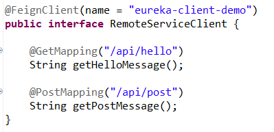
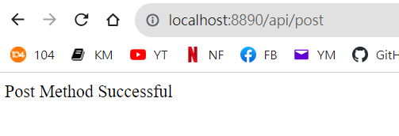
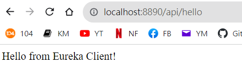
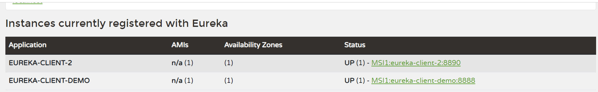

### Spring Cloud with OpenFiegn Client

#### 情境

1. Eureka Client：建立Controller，並將 /api/** 的 Controller 透過 Spring Security 來保護，這邊使用簡單的 In memory authencate. 所以註冊上去的服務也需要透過 http base 來登入。

2. 透過 OpenFiegn 的 Client 呼叫註冊在 Eureka Server 上的服務，也需要將每一請求加上 authorization token。也需要實作 Spring security。

3. 雙方的 Spring Security 的 User 來源皆要同源，才有辦法直接登
入。(user/password 作為簡單的帳密認證)

#### 程式碼：

1. FeignClient：<https://github.com/aweit-zhu/SpringCloudFeignClient>

2. Eureka Client：<https://github.com/aweit-zhu/SpringCloudEurekaClient>

#### OpenFiegn

它封裝了呼叫遠端服務的套件，讓您可以透過定義服務接口，免去了實作 @RestTemplete (不用去理會 Http Request 和 Http Response)。


圖片來源：<https://www.javaguides.net/2022/10/spring-boot-microservices-communication-using-spring-cloud-open-feign.html>



我們可以透過上述代碼，看看 ChatGPT 如何解釋？

Certainly! Let's go through your code step by step:

```
java
@FeignClient(name = "eureka-client-demo")
public interface RemoteServiceClient {
    
    @GetMapping("/api/hello")
    String getHelloMessage();
    
    @PostMapping("/api/post")
    String getPostMessage();
}
```

1. `@FeignClient(name = "eureka-client-demo")`: This annotation is used to indicate that this interface is a Feign client and specifies the name of the Eureka client that you want to communicate with. In this case, the Eureka client is named "eureka-client-demo".

2. `@GetMapping("/api/hello")`: This annotation is used to map the `getHelloMessage()` method to the HTTP GET request with the endpoint path "/api/hello". It indicates that this method will be used to retrieve a hello message from the specified endpoint.

3. `String getHelloMessage()`: This method signature defines the contract for the Feign client. It specifies that the method will return a String, which represents the hello message retrieved from the endpoint.

4. `@PostMapping("/api/post")`: This annotation is used to map the `getPostMessage()` method to the HTTP POST request with the endpoint path "/api/post". It indicates that this method will be used to send a post message to the specified endpoint.

5. `String getPostMessage()`: This method signature defines the contract for the Feign client. It specifies that the method will return a String, which represents the response message received from the endpoint after sending the post request.

Overall, this code defines a Feign client interface `RemoteServiceClient` that communicates with the "eureka-client-demo" Eureka client. It provides two methods, `getHelloMessage()` and `getPostMessage()`, which correspond to GET and POST requests, respectively, and are mapped to specific endpoint paths ("/api/hello" and "/api/post").

#### OpenFiegn with spring security

1. pom.xml

```
<dependencies>
    <!-- Spring Cloud OpenFeign -->
    <dependency>
        <groupId>org.springframework.cloud</groupId>
        <artifactId>spring-cloud-starter-openfeign</artifactId>
    </dependency>

    <!-- Spring Cloud Starter Netflix Eureka Client (if using service
    discovery) -->
    <dependency>
        <groupId>org.springframework.cloud</groupId>
        <artifactId>spring-cloud-starter-netflix-eureka-client</artifactId>
    </dependency>

    <!-- Spring Boot Starter Web -->
    <dependency>
        <groupId>org.springframework.boot</groupId>
        <artifactId>spring-boot-starter-web</artifactId>
    </dependency>

    <!-- Spring Boot DevTools (optional) -->
    <dependency>
        <groupId>org.springframework.boot</groupId>
        <artifactId>spring-boot-devtools</artifactId>
        <scope>runtime</scope>
        <optional>true</optional>
    </dependency>
    <dependency>
        <groupId>org.springframework.boot</groupId>
        <artifactId>spring-boot-starter-security</artifactId>
    </dependency>
    <dependency>
        <groupId>org.projectlombok</groupId>
        <artifactId>lombok</artifactId>
        <optional>true</optional>
    </dependency>
    <dependency>
        <groupId>org.springframework.boot</groupId>
        <artifactId>spring-boot-starter-test</artifactId>
        <scope>test</scope>
    </dependency>
</dependencies>
```

2. Application：@EnableDiscoveryClient、@EnableFeignClients

```
@SpringBootApplication
@EnableDiscoveryClient
@EnableFeignClients
public class SpringCloudFeignClientApplication {

	public static void main(String[] args) {
		SpringApplication.run(SpringCloudFeignClientApplication.class, args);
	}

}
```

3. Feign Service 

```
@FeignClient(name = "eureka-client-demo")
public interface RemoteServiceClient {
	
    @GetMapping("/api/hello")
    String getHelloMessage();
    
    @PostMapping("/api/post")
    String getPostMessage();
}
```

4. Controller

```
@RestController
public class HelloController {
    
	@Autowired
	RemoteServiceClient remoteServiceClient;

    @GetMapping("/api/hello")
    public String getHelloMessageFromRemoteService() {
        return remoteServiceClient.getHelloMessage();
    }
    
    @GetMapping("/api/post")
    public String getPostMessageFromRemoteService() {
        return remoteServiceClient.getPostMessage();
    }
}
```

5. Security Config

```
@Configuration
@EnableWebSecurity
public class SecurityConfig extends WebSecurityConfigurerAdapter {
		
    @Bean
    public PasswordEncoder passwordEncoder() {
        return new BCryptPasswordEncoder();
    }

    @Override
    public void configure(AuthenticationManagerBuilder auth) throws Exception {
        auth.inMemoryAuthentication()
            .withUser("user")
            .password(passwordEncoder().encode("password"))
            .roles("USER");
    }

    @Override
    protected void configure(HttpSecurity http) throws Exception {
        http.authorizeRequests()
            .antMatchers("/api/**").authenticated()
            .anyRequest().permitAll()
            .and()
            .httpBasic()
            .and()
            .csrf().disable();
    }
}
```

6. Interceptor 

FeignConfiguration
```
@Configuration
public class FeignConfiguration {

    @Bean
    public FeignClientInterceptor feignClientInterceptor() {
        return new FeignClientInterceptor();
    }
    
}
```

FeignClientInterceptor
```
public class FeignClientInterceptor implements RequestInterceptor {
    
	@Autowired
    private HttpServletRequest request;
    
	@Override
    public void apply(RequestTemplate requestTemplate) {
        String reqAuthInput= request.getHeader("authorization");
        if (reqAuthInput!= null) {
            requestTemplate.header("authorization",reqAuthInput);
        }
    }

}
```

7. application.properties

```
server.port=8890
spring.application.name=eureka-client-2
eureka.client.service-url.defaultZone=http://localhost:8761/eureka
```

#### Eureka Client with spring security

1. pom.xml

```
<!-- Spring Security -->
<dependency>
    <groupId>org.springframework.boot</groupId>
    <artifactId>spring-boot-starter-security</artifactId>
</dependency>
```

2. Security Config

```
@Configuration
@EnableWebSecurity
public class SecurityConfig extends WebSecurityConfigurerAdapter {

    @Bean
    public PasswordEncoder passwordEncoder() {
        return new BCryptPasswordEncoder();
    }

    @Override
    public void configure(AuthenticationManagerBuilder auth) throws Exception {
        auth.inMemoryAuthentication()
            .withUser("user")
            .password(passwordEncoder().encode("password"))
            .roles("USER");
    }

    @Override
    protected void configure(HttpSecurity http) throws Exception {
        http.authorizeRequests()
            .antMatchers("/api/**").authenticated()
            .anyRequest().permitAll()
            .and()
            .httpBasic()
            .and()
            .csrf().disable();
    }
}
```
3. Controller

```
@RestController
public class HelloController {
	@GetMapping("/api/hello")
	public String hello() {
		return "Hello from Eureka Client!";
	}
	
	@PostMapping("/api/post")
	public String post() {
		return "Post Method Successful";
	}
}
```

#### Test

1. Feign Client Web API (POST)：<http://localhost:8890/api/post>


1. Feign Client Web API (GET)：<http://localhost:8890/api/hello>


3. Eureka Server：<http://localhost:8761/> 可以看到 兩個服務被註冊。

