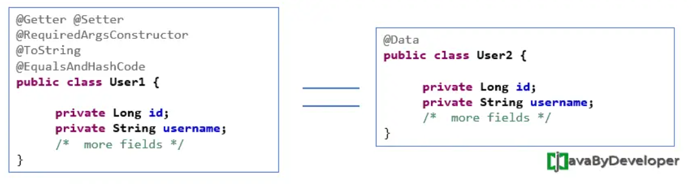

### JPA

> JPA(Java Persistence API) 是 SUN 針對 ORM 技術提出的規範，目的為簡化持久化的開發工作以及整合各家 ORM 技術(Hibernate、TopLink、OpenJpa…)。

### Spring Data JPA

> Spring Data JPA 是 Spring 根據 ORM 框架和 JPA 規範而封裝的 JPA 應用框架，目的是降低存取資料層的工作量，讓開發人員只需寫出 repository 的介面，而 Spring 自動幫你實作其功能。


1. 依賴

```
<dependency>
    <groupId>org.springframework.boot</groupId>
    <artifactId>spring-boot-starter-data-jpa</artifactId>
</dependency>

<!--推薦用 lombok-->
<dependency>
    <groupId>org.projectlombok</groupId>
    <artifactId>lombok</artifactId>
    <optional>true</optional>
</dependency>
```

2. 配置 Datasource (以單個資料庫為例)

```
spring:
  datasource:
    url: jdbc:mysql://172.31.93.122:3306/db
    username: user
    password: password
    driver-class-name: com.mysql.cj.jdbc.Driver
  jpa:
    hibernate:
      ddl-auto: update
    show-sql: false
    properties:
      hibernate:
        format_sql: true
    database-platform: org.hibernate.dialect.MySQL8Dialect
```

3. 實作 User 與 Todo，兩者為一`(User)`對多`(Todo)`的關係。

```
@Data
@Builder
@Entity
@Table
public class User {
	
    @Id
    @GeneratedValue(strategy = GenerationType.IDENTITY)
    Integer id;

    @Column
    public String name;

    @Column(insertable = false, columnDefinition = "int default 1")
    Integer gender = 1;

    @Column
    public String password;

    @JsonManagedReference
    @OneToMany(cascade = CascadeType.ALL, mappedBy = "user")
    @EqualsAndHashCode.Exclude
    private Set<Todo> todos;
}
```

** 註解說明

> @Data Equivalent to @Getter @Setter @RequiredArgsConstructor @ToString @EqualsAndHashCode. <>

參考資料:<https://javabydeveloper.com/lombok-data-annotation/>

> @EqualsAndHashCode: 標註在類別上，Lombok 會自動實作 equals(Object other) 與 hashCode()。實作者兩者的方法是為了比對兩物件是否相等時，且比對時比較有效率。

> 讀者可想成自己在逛書店，並透過書名來找書。一般來說，書櫃上會標示那一區的書籍分類。那麼透過書名來決定該前往哪一區尋找，相當於計算 hash code、找出 bucket 的過程。接著，因為一個區域仍有許多書籍，所以我們得一一比對它們的書名。就如同在 bucket 中，呼叫 equals 方法比對 key 的過程。參考自 <https://chikuwa-tech-study.blogspot.com/2022/01/java-equals-hashcode-hashmap.html>

> @GeneratedValue(strategy = GenerationType.IDENTITY) 主鍵由資料庫控制，自動增長。

> @Column
從定義可以看出，@Column註解一共有10個屬性，這10個屬性均為可選屬性，各屬性含義分別如下：
1、name  name屬性定義了被標註欄位在資料庫表中所對應欄位的名稱；
2、unique  unique屬性表示該欄位是否為唯一標識，預設為false。如果表中有一個欄位需要唯一標識，則既可以使用該標記，也可以使用@Table標記中的@UniqueConstraint。
3、nullable  nullable屬性表示該欄位是否可以為null值，預設為true。
4、insertable  insertable屬性表示在使用“INSERT”指令碼插入資料時，是否需要插入該欄位的值。
5、updatable  updatable屬性表示在使用“UPDATE”指令碼插入資料時，是否需要更新該欄位的值。insertable和updatable屬性一般多用於只讀的屬性，例如主鍵和外來鍵等。這些欄位的值通常是自動生成的。
6、columnDefinition  columnDefinition屬性表示建立表時，該欄位建立的SQL語句，一般用於通過Entity生成表定義時使用。（也就是說，如果DB中表已經建好，該屬性沒有必要使用。）
7、table  table屬性定義了包含當前欄位的表名。
8、length  length屬性表示欄位的長度，當欄位的型別為varchar時，該屬性才有效，預設為255個字元。
9、precision和10、scale
precision屬性和scale屬性表示精度，當欄位型別為double時，precision表示數值的總長度，scale表示小數點所佔的位數。
<https://www.796t.com/content/1547656050.html>

>@CreatedDate 資料新增時會自動存入創建時間
@CreatedBy 創建者
@LastModifiedDate 最後修改時間
@LastModifiedBy 最後修改者
<https://hackmd.io/@winnienotes/ry-62tqZ9>