## 實作 Securing Spring Boot 3.1.0 Applications with Spring Security and Keycloak 21

參考資料：<https://medium.com/@rickors560/securing-spring-boot-3-1-0-applications-with-spring-security-and-keycloak-21-e694c6f5617d>

參考資料：<https://hennge.com/tw/blog/what-is-openid-connect.html>

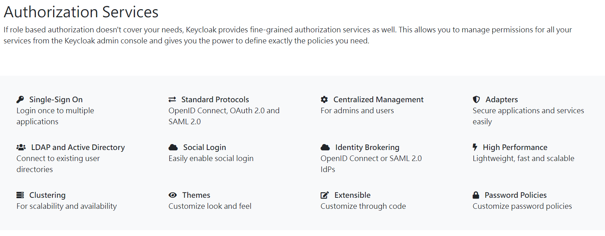

環境準備：
1. Spring Boot / Spring Security 3.1.2
2. JDK 17
3. Spring Boot Docker Compose
4. Docker (進而安裝 keycloak 22、MySQL)

#### pom.xml

```
<?xml version="1.0" encoding="UTF-8"?>
<project xmlns="http://maven.apache.org/POM/4.0.0"
	xmlns:xsi="http://www.w3.org/2001/XMLSchema-instance"
	xsi:schemaLocation="http://maven.apache.org/POM/4.0.0 https://maven.apache.org/xsd/maven-4.0.0.xsd">
	<modelVersion>4.0.0</modelVersion>
	<parent>
		<groupId>org.springframework.boot</groupId>
		<artifactId>spring-boot-starter-parent</artifactId>
		<version>3.1.2</version>
		<relativePath /> <!-- lookup parent from repository -->
	</parent>
	<groupId>com.example</groupId>
	<artifactId>HelloSpringBoo2</artifactId>
	<version>0.0.1-SNAPSHOT</version>
	<name>HelloSpringBoo2</name>
	<description>Demo project for Spring Boot</description>
	<properties>
		<java.version>17</java.version>
	</properties>
	<dependencies>
		<dependency>
			<groupId>org.springframework.boot</groupId>
			<artifactId>spring-boot-starter-oauth2-resource-server</artifactId>
		</dependency>
		<dependency>
			<groupId>org.springframework.security</groupId>
			<artifactId>spring-security-oauth2-jose</artifactId>
		</dependency>
		<dependency>
			<groupId>org.springframework.boot</groupId>
			<artifactId>spring-boot-starter-security</artifactId>
		</dependency>
		<dependency>
			<groupId>org.springframework.boot</groupId>
			<artifactId>spring-boot-starter-web</artifactId>
		</dependency>

		<dependency>
			<groupId>org.springframework.boot</groupId>
			<artifactId>spring-boot-devtools</artifactId>
			<scope>runtime</scope>
			<optional>true</optional>
		</dependency>
		<dependency>
			<groupId>org.springframework.boot</groupId>
			<artifactId>spring-boot-docker-compose</artifactId>
			<scope>runtime</scope>
			<optional>true</optional>
		</dependency>
		<dependency>
			<groupId>org.projectlombok</groupId>
			<artifactId>lombok</artifactId>
			<optional>true</optional>
		</dependency>
		<dependency>
			<groupId>org.springframework.boot</groupId>
			<artifactId>spring-boot-starter-test</artifactId>
			<scope>test</scope>
		</dependency>
		<dependency>
			<groupId>org.springframework.security</groupId>
			<artifactId>spring-security-test</artifactId>
			<scope>test</scope>
		</dependency>
	</dependencies>

	<build>
		<plugins>
			<plugin>
				<groupId>org.springframework.boot</groupId>
				<artifactId>spring-boot-maven-plugin</artifactId>
				<configuration>
					<excludes>
						<exclude>
							<groupId>org.projectlombok</groupId>
							<artifactId>lombok</artifactId>
						</exclude>
					</excludes>
				</configuration>
			</plugin>
		</plugins>
	</build>

</project>
```

#### compose.yaml
```
volumes:
  mysql_data:
      driver: local

services:
  mysql:
      image: mysql
      volumes:
        - mysql_data:/var/lib/mysql
      environment:
        MYSQL_ROOT_PASSWORD: root
        MYSQL_DATABASE: keycloak
        MYSQL_USER: keycloak
        MYSQL_PASSWORD: password
      ports:
        - 3306:3306
  keycloak:
    image: quay.io/keycloak/keycloak:22.0.1
    container_name: keycloak
    environment:
      - KEYCLOAK_ADMIN=admin
      - KEYCLOAK_ADMIN_PASSWORD=password
      - KC_DB=mysql
      - KC_DB_URL_HOST=mysql
      - KC_DB_URL_DATABASE=keycloak
      - KC_DB_USERNAME=keycloak
      - KC_DB_PASSWORD=password
      - KC_HEALTH_ENABLED=true
    ports:
      - "9090:8080"
    command: start-dev
    depends_on:
      - mysql
#    healthcheck:
#      test: "curl -f http://localhost:9090/health/ready || exit 1"
  adminer:
    image: adminer
    restart: always
    ports:
      - 8081:8080
```

#### Spring Security Config

```
@Configuration
@EnableWebSecurity
@EnableMethodSecurity
public class WebSecurityConfig {

	@Bean
	public SecurityFilterChain securityFilterChain(HttpSecurity httpSecurity) throws Exception {
		httpSecurity.authorizeHttpRequests(registry -> registry
				// .requestMatchers("/secured/**").hasRole("SYS_ADMIN")
				// .requestMatchers("/secured/**").permitAll()
				.anyRequest().authenticated())
				.oauth2ResourceServer(oauth2Configurer -> oauth2Configurer
						.jwt(jwtConfigurer -> jwtConfigurer.jwtAuthenticationConverter(jwt -> {
							Map<String, Collection<String>> realmAccess = jwt.getClaim("realm_access");
							Collection<String> roles = realmAccess.get("roles");
							var grantedAuthorities = roles.stream()
									.map(role -> new SimpleGrantedAuthority("ROLE_" + role)).toList();
							return new JwtAuthenticationToken(jwt, grantedAuthorities);
						})));

		return httpSecurity.build();
	}
}
```

#### Controller

> 可以在 Controller 層中加入 @PreAuthorize，代表需要擁有 SYS_ADMIN 角色的用戶，才能夠存取這一個Controller 的資源。

> @PreAuthorize 也可以放到 Controller 層中的每一個 Method 中。以做更細顆粒度的授權。

```
@RequestMapping("/secured")
@RestController
@PreAuthorize("hasRole('SYS_ADMIN')")
public class MySuperSecuredController {

    @GetMapping("/get-data")
    public String get(){
        return "SUPER SECURED DATA"; 
    }

}
```

#### application.yaml

```
server:
  port: 8080

spring:
  security:
    oauth2:
      resourceserver:
        jwt:
          issuer-uri: http://localhost:9090/realms/MyAppRealm
          jwk-set-uri: http://localhost:9090/realms/MyAppRealm/protocol/openid-connect/certs
```
MyAppRealm：需要在Keycloak中新增此Realm。相關設定如下。

#### Keycloak 在 Docker 與 設定 Keycloak

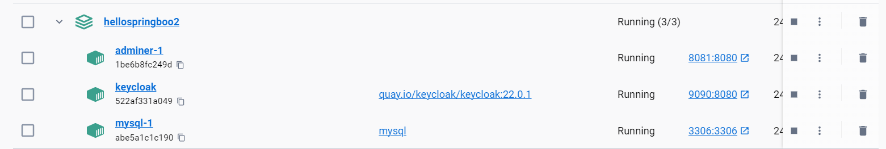

打開瀏覽器，開啟 Keycloak 登入頁面 (http://localhost:9090)
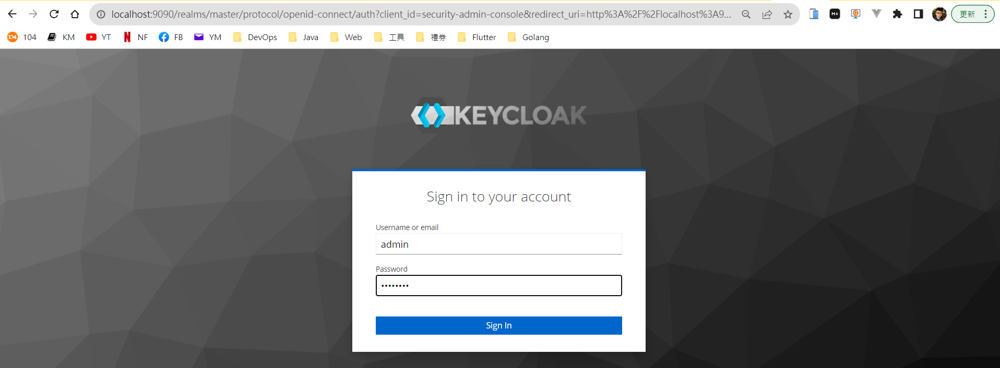

Realm
輸入 Realm name：MyAppRealm
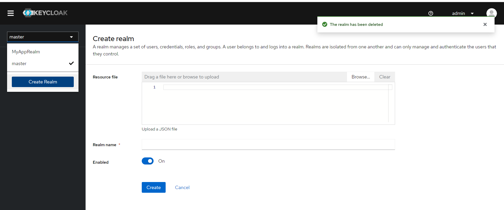

Client

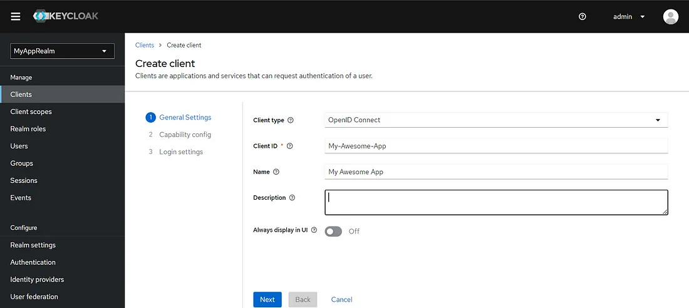

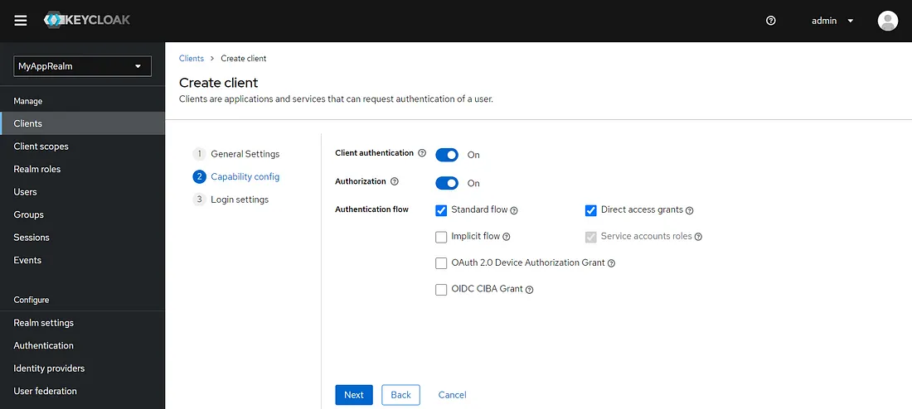

Role：SYS_ADMIN

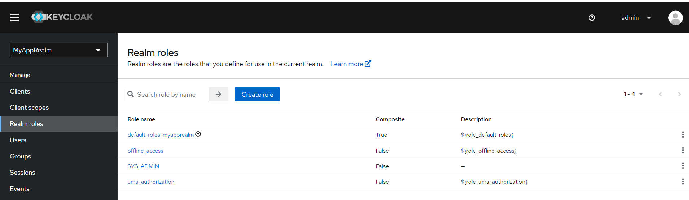

User：建立一個 User，並且將角色綁定進去。

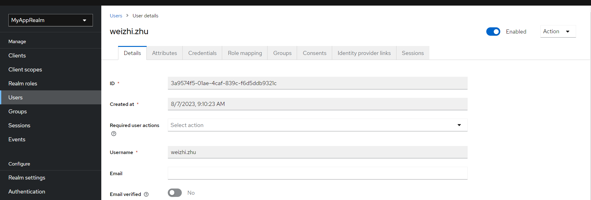


#### Postman 測試

透過 OpenID Connect 取得 Token
<http://localhost:9090/realms/MyAppRealm/protocol/openid-connect/token>
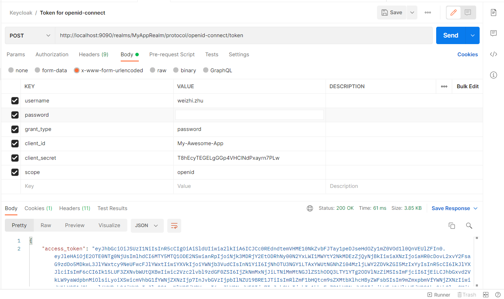

利用剛剛取得的Token，存取 Web API 資訊
<http://localhost:8080/secured/get-data>
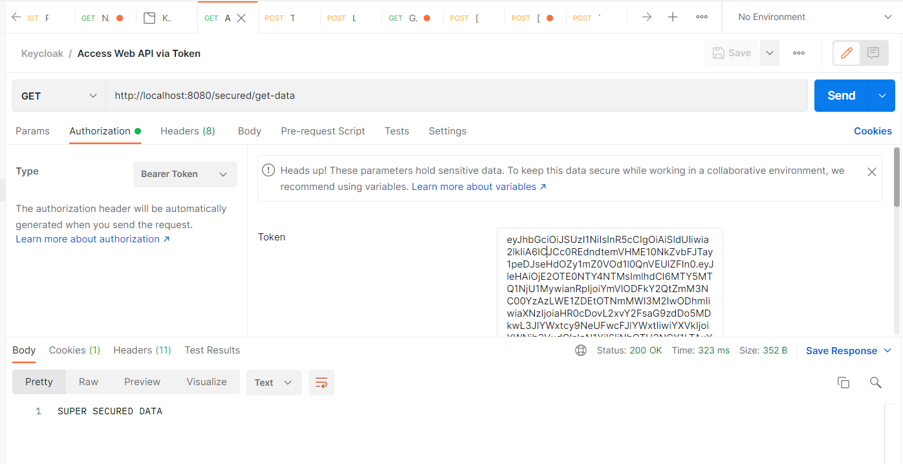

如果要登出某一用戶的所有 Session

<http://localhost:9090/realms/master/protocol/openid-connect/token>
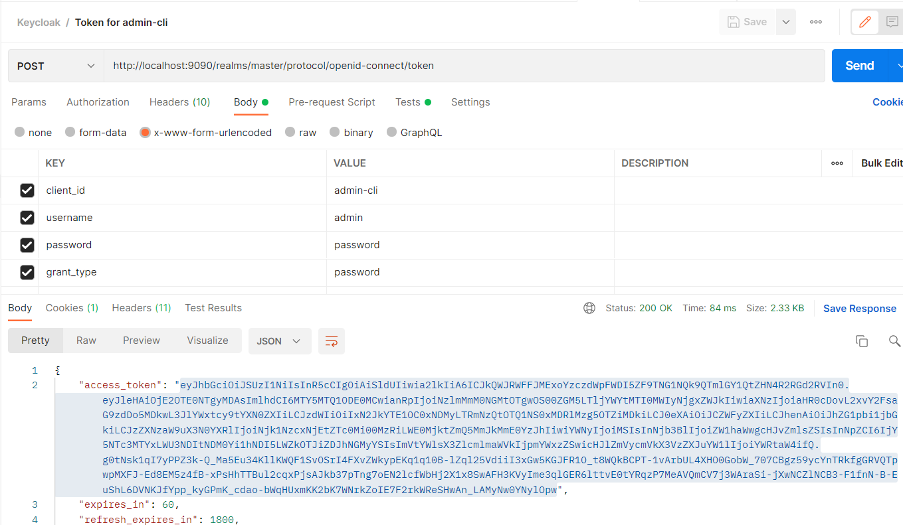


<http://localhost:9090/admin/realms/MyAppRealm/users/3a9574f5-01ae-4caf-839c-f6d5ddb9321c/logout>
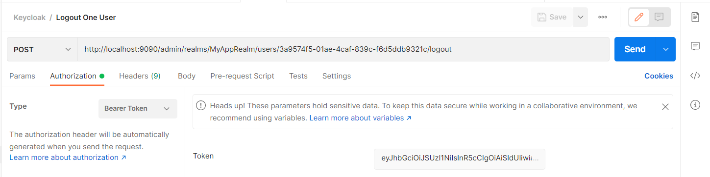


### 參考 Hub

<https://github.com/aweit-zhu/HelloSpringBoo2>