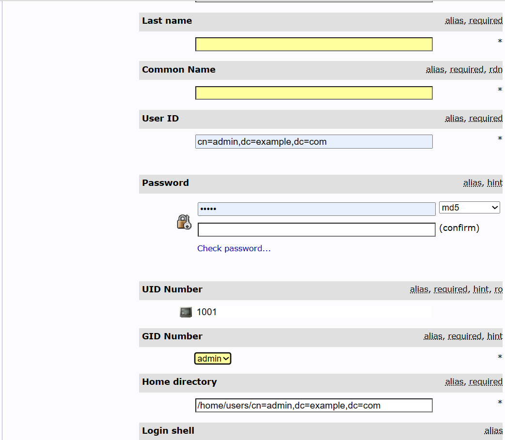

# Spring Security & LDAP

完整程式碼：<https://github.com/aweit-zhu/SpringSecurityLdap>

### LDAP

> LDAP (Lightweight Directory Access Protocol, 輕型目錄存取協定)，除了有 Windows 的 AD(Active Directory)外，還有開源的 OpenLDAP。

> OpenLDAP 可以透過瀏覽器直接管理 (phpLDAPadmin )。

1.docker-compose.yaml

```
services:
  openldap:
    image: osixia/openldap
    environment:
      - LDAP_ORGANISATION=Example Inc.
      - LDAP_DOMAIN=example.com
      - LDAP_ADMIN_PASSWORD=admin
    ports:
      - 389:389
    volumes:
      - ./data/ldap:/var/lib/ldap
      - ./data/slapd:/etc/ldap/slapd.d

  phpldapadmin:
    image: osixia/phpldapadmin
    environment:
      - PHPLDAPADMIN_LDAP_HOSTS=openldap
      - PHPLDAPADMIN_HTTPS=false
    ports:
      - 8080:80
    depends_on:
      - openldap
```


網址：http://localhost:8080/
帳號：cn=admin,dc=example,dc=com
密碼：admin


2. 建立 OU (Organisational Unit)：groups、users。

點選 Organisational Unit


輸入 users


接著重複動作，建立 users。

3. 建立 Generic: Posix Group：admin、user


4. 在 ou=groups上，建立兩個角色：admin、user


5. 在 ou-users上，建立 Generic: User Account：weizhi


GID Number = Group ID 號碼，就是剛剛建立的 admin 和 user


6. 綁定 User Account 至 Posix Group 中，要用 DN 新增。


### Spring Security and LDAP

> 建立具有認證與授權的Controller，其中 /admin 的路徑需要有 ADMIN 權限、/user 的路徑需要有 USER 權限。

> 使用 Spring Security 的機制，但 User 的整合(帳號、密碼、授權) 需要由 LDAP提供。


1. pom.xml

```
<project xmlns="http://maven.apache.org/POM/4.0.0"
	xmlns:xsi="http://www.w3.org/2001/XMLSchema-instance"
	xsi:schemaLocation="http://maven.apache.org/POM/4.0.0 https://maven.apache.org/xsd/maven-4.0.0.xsd">
	<modelVersion>4.0.0</modelVersion>
	<parent>
		<groupId>org.springframework.boot</groupId>
		<artifactId>spring-boot-starter-parent</artifactId>
		<version>2.6.15</version>
		<relativePath /> <!-- lookup parent from repository -->
	</parent>
	<groupId>com.example</groupId>
	<artifactId>SpringSecurityLdap</artifactId>
	<version>0.0.1-SNAPSHOT</version>
	<name>SpringSecurityLdap</name>
	<description>Demo project for Spring Boot</description>
	<properties>
		<java.version>17</java.version>
	</properties>
	<dependencies>
		<dependency>
			<groupId>org.springframework.boot</groupId>
			<artifactId>spring-boot-starter-web</artifactId>
		</dependency>
		<!-- Spring Security -->
		<dependency>
			<groupId>org.springframework.boot</groupId>
			<artifactId>spring-boot-starter-security</artifactId>
		</dependency>

		<!-- Spring LDAP -->
		<dependency>
			<groupId>org.springframework.boot</groupId>
			<artifactId>spring-boot-starter-data-ldap</artifactId>
		</dependency>
		<dependency>
			<groupId>org.springframework.security</groupId>
			<artifactId>spring-security-ldap</artifactId>
		</dependency>
		<dependency>
			<groupId>org.springframework.boot</groupId>
			<artifactId>spring-boot-devtools</artifactId>
			<scope>runtime</scope>
			<optional>true</optional>
		</dependency>
		<dependency>
			<groupId>org.projectlombok</groupId>
			<artifactId>lombok</artifactId>
			<optional>true</optional>
		</dependency>
		<dependency>
			<groupId>org.springframework.boot</groupId>
			<artifactId>spring-boot-starter-test</artifactId>
			<scope>test</scope>
		</dependency>
		<dependency>
			<groupId>org.springframework.security</groupId>
			<artifactId>spring-security-test</artifactId>
			<scope>test</scope>
		</dependency>
	</dependencies>

	<build>
		<plugins>
			<plugin>
				<groupId>org.springframework.boot</groupId>
				<artifactId>spring-boot-maven-plugin</artifactId>
				<configuration>
					<excludes>
						<exclude>
							<groupId>org.projectlombok</groupId>
							<artifactId>lombok</artifactId>
						</exclude>
					</excludes>
				</configuration>
			</plugin>
		</plugins>
	</build>

</project>

```

2. application.properties

```
ldap.url=ldap://localhost:389
ldap.username=cn=admin,dc=example,dc=com
ldap.password=admin
ldap.baseDn=dc=example,dc=com
server.port=8091
```

3. LdapConfig.java

```
import org.springframework.beans.factory.annotation.Value;
import org.springframework.context.annotation.Bean;
import org.springframework.context.annotation.Configuration;
import org.springframework.ldap.core.LdapTemplate;
import org.springframework.ldap.core.support.LdapContextSource;

@Configuration
public class LdapConfig {

	@Value("${ldap.url}")
	private String ldapUrl;

	@Value("${ldap.username}")
	private String ldapUsername;

	@Value("${ldap.password}")
	private String ldapPassword;

	@Bean
	public LdapContextSource ldapContextSource() {
		LdapContextSource ldapContextSource = new LdapContextSource();
		ldapContextSource.setUrl(ldapUrl);
		ldapContextSource.setUserDn(ldapUsername);
		ldapContextSource.setPassword(ldapPassword);
		return ldapContextSource;
	}

	@Bean
	public LdapTemplate ldapTemplate() {
		return new LdapTemplate(ldapContextSource());
	}
}

```

4. SecurityConfig.java

```
import org.springframework.beans.factory.annotation.Autowired;
import org.springframework.context.annotation.Bean;
import org.springframework.context.annotation.Configuration;
import org.springframework.ldap.core.LdapTemplate;
import org.springframework.ldap.core.support.LdapContextSource;
import org.springframework.security.authentication.AuthenticationProvider;
import org.springframework.security.config.annotation.authentication.builders.AuthenticationManagerBuilder;
import org.springframework.security.config.annotation.web.builders.HttpSecurity;
import org.springframework.security.config.annotation.web.configuration.WebSecurityConfigurerAdapter;
import org.springframework.security.crypto.bcrypt.BCryptPasswordEncoder;
import org.springframework.security.crypto.password.PasswordEncoder;
import org.springframework.security.ldap.authentication.BindAuthenticator;
import org.springframework.security.ldap.authentication.LdapAuthenticationProvider;
import org.springframework.security.ldap.authentication.LdapAuthenticator;
import org.springframework.security.ldap.search.FilterBasedLdapUserSearch;
import org.springframework.security.ldap.search.LdapUserSearch;
import org.springframework.security.ldap.userdetails.DefaultLdapAuthoritiesPopulator;
import org.springframework.security.ldap.userdetails.LdapAuthoritiesPopulator;
import org.springframework.security.web.authentication.www.BasicAuthenticationFilter;

import com.example.filter.LdapAuthoritiesFilter;
import com.example.mapper.LdapUserDetailsMapper;

@Configuration
public class SecurityConfig extends WebSecurityConfigurerAdapter {

	@Autowired
	LdapContextSource ldapContextSource;

	@Autowired
	LdapTemplate ldapTemplate;
	
	@Autowired
	LdapAuthoritiesFilter ldapAuthoriesFilter;

	@Override
	protected void configure(AuthenticationManagerBuilder auth) throws Exception {
		auth.authenticationProvider(ldapAuthenticationProvider());
	}

	@Bean
	public AuthenticationProvider ldapAuthenticationProvider() {
		LdapAuthenticationProvider ldapAuthenticationProvider = new LdapAuthenticationProvider(ldapBindAuthenticator(),
				ldapAuthoritiesPopulator());
		ldapAuthenticationProvider.setUserDetailsContextMapper(new LdapUserDetailsMapper());
		return ldapAuthenticationProvider;
	}

	@Bean
	public LdapAuthenticator ldapBindAuthenticator() {
		BindAuthenticator bindAuthenticator = new BindAuthenticator(ldapContextSource);
		bindAuthenticator.setUserSearch(ldapUserSearch());
		return bindAuthenticator;
	}

	@Bean
	public LdapAuthoritiesPopulator ldapAuthoritiesPopulator() {
		DefaultLdapAuthoritiesPopulator authoritiesPopulator = new DefaultLdapAuthoritiesPopulator(ldapContextSource,
				"ou=groups,dc=example,dc=com");
		authoritiesPopulator.setGroupSearchFilter("memberUid={0}");
		return authoritiesPopulator;
	}

	@Bean
	public LdapUserSearch ldapUserSearch() {
		return new FilterBasedLdapUserSearch("ou=users,dc=example,dc=com", "(uid={0})", ldapContextSource);
	}

	@Override
	protected void configure(HttpSecurity http) throws Exception {
		http.
		addFilterBefore(ldapAuthoriesFilter,BasicAuthenticationFilter.class).authorizeRequests()
		  .antMatchers("/admin/**").hasAnyRole("ADMIN")	
		  .antMatchers("/user/**").hasAnyRole("ADMIN", "USER")
		  .anyRequest().authenticated()
		.and()
		  .csrf().ignoringAntMatchers("/admin/user")
		.and()
		  .formLogin()
		.and()
		  .logout();
	}

	@Bean
	public PasswordEncoder passwordEncoder() {
		return new BCryptPasswordEncoder();
	}
}
}
```

4.LdapUserDetailsMapper.java

```
import java.nio.charset.StandardCharsets;
import java.util.Collection;

import org.springframework.ldap.core.DirContextAdapter;
import org.springframework.ldap.core.DirContextOperations;
import org.springframework.security.core.GrantedAuthority;
import org.springframework.security.core.userdetails.User;
import org.springframework.security.core.userdetails.UserDetails;
import org.springframework.security.ldap.userdetails.UserDetailsContextMapper;

public class LdapUserDetailsMapper implements UserDetailsContextMapper {

    @Override
    public UserDetails mapUserFromContext(DirContextOperations ctx, String username, Collection<? extends GrantedAuthority> authorities) {
        String ldapUsername = ctx.getStringAttribute("uid");
        byte[] binaryData = (byte[]) ctx.getObjectAttribute("userPassword");
        String ldapPassword = new String(binaryData, StandardCharsets.UTF_8);        
        return User.builder()
                .username(ldapUsername)
                .password(ldapPassword)
                .authorities(authorities)
                .build();
    }

    @Override
    public void mapUserToContext(UserDetails user, DirContextAdapter ctx) {
        // Not implemented as this is not needed for authentication
    }
}
```

5.LdapAuthoritiesFilter.java 

```
import java.io.IOException;
import java.util.Collection;
import java.util.HashSet;
import java.util.Set;

import javax.naming.NamingException;
import javax.naming.directory.Attributes;
import javax.naming.directory.SearchControls;
import javax.servlet.FilterChain;
import javax.servlet.ServletException;
import javax.servlet.http.HttpServletRequest;
import javax.servlet.http.HttpServletResponse;

import org.springframework.beans.factory.annotation.Autowired;
import org.springframework.ldap.core.ContextMapper;
import org.springframework.ldap.core.DirContextOperations;
import org.springframework.ldap.core.LdapTemplate;
import org.springframework.security.authentication.UsernamePasswordAuthenticationToken;
import org.springframework.security.core.Authentication;
import org.springframework.security.core.GrantedAuthority;
import org.springframework.security.core.authority.SimpleGrantedAuthority;
import org.springframework.security.core.context.SecurityContextHolder;
import org.springframework.security.core.userdetails.User;
import org.springframework.security.web.authentication.WebAuthenticationDetailsSource;
import org.springframework.stereotype.Component;
import org.springframework.web.filter.OncePerRequestFilter;

@Component
public class LdapAuthoritiesFilter extends OncePerRequestFilter {

	@Autowired
	LdapTemplate ldapTemplate;

	@Override
	protected void doFilterInternal(HttpServletRequest request, HttpServletResponse response, FilterChain filterChain)
			throws ServletException, IOException {
		Authentication authentication = SecurityContextHolder.getContext().getAuthentication();

		if (authentication != null && authentication.isAuthenticated()
				&& authentication instanceof UsernamePasswordAuthenticationToken) {
			UsernamePasswordAuthenticationToken usernamePasswordAuthenticationToken = (UsernamePasswordAuthenticationToken) authentication;
			if (usernamePasswordAuthenticationToken.getPrincipal() instanceof User) {
				User ldapUserDetails = (User) usernamePasswordAuthenticationToken.getPrincipal();
				UsernamePasswordAuthenticationToken updatedAuthentication = new UsernamePasswordAuthenticationToken(
						ldapUserDetails, ldapUserDetails.getPassword(),
						retrieveLdapAuthorities(ldapUserDetails.getUsername()));
				updatedAuthentication.setDetails(new WebAuthenticationDetailsSource().buildDetails(request));
				SecurityContextHolder.getContext().setAuthentication(updatedAuthentication);
			}
		}

		// Proceed with the filter chain
		filterChain.doFilter(request, response);
	}

	private Collection<? extends GrantedAuthority> retrieveLdapAuthorities(String username) {

		// Define the LDAP search filter to retrieve the authorities for the user
		String filter = "(memberUid=cn=" + username + ",ou=users,dc=example,dc=com)";

		// Set the search controls to limit the attributes returned
		SearchControls searchControls = new SearchControls();
		searchControls.setSearchScope(SearchControls.SUBTREE_SCOPE);
		searchControls.setReturningAttributes(new String[] { "cn" });

		// Perform the LDAP search and retrieve the authorities
		Set<GrantedAuthority> authorities = new HashSet<>();
		ldapTemplate.search("ou=groups,dc=example,dc=com", filter, searchControls, (ContextMapper<Void>) ctx -> {
			Attributes attributes = ((DirContextOperations) ctx).getAttributes();
			try {
				javax.naming.directory.Attribute memberOfAttribute = attributes.get("cn");
				if (memberOfAttribute != null) {
					for (int i = 0; i < memberOfAttribute.size(); i++) {
						String authority = (String) memberOfAttribute.get(i);
						authorities.add(new SimpleGrantedAuthority("ROLE_" + authority.toUpperCase()));
					}
				}
			} catch (NamingException e) {
				e.printStackTrace();
			}
			return null;
		});
		return authorities;
	}
}
```

6. 建立 Controller：Admin、Controller

```
import java.security.NoSuchAlgorithmException;

import org.springframework.beans.factory.annotation.Autowired;
import org.springframework.web.bind.annotation.GetMapping;
import org.springframework.web.bind.annotation.PostMapping;
import org.springframework.web.bind.annotation.RequestBody;
import org.springframework.web.bind.annotation.RequestMapping;
import org.springframework.web.bind.annotation.RestController;

import com.example.model.LdapUser;
import com.example.service.LdapUserService;

@RestController
@RequestMapping("/admin")
public class AdminController {

	@Autowired
	LdapUserService ldapUserService;
    
	@GetMapping("")
	public String admin() {
		return "admin is here";
	}
	
    @PostMapping("/user")
    public void createUser(@RequestBody LdapUser user) throws NoSuchAlgorithmException {
        ldapUserService.createUser(user);
    }
}
```

```
import org.springframework.web.bind.annotation.GetMapping;
import org.springframework.web.bind.annotation.RequestMapping;
import org.springframework.web.bind.annotation.RestController;

@RestController
@RequestMapping("/user")
public class UserController {

	@GetMapping("")
	public String index() {
		return "Welcome to the User page!";
	}

}
```

7. 建立 Service

```
import java.security.MessageDigest;
import java.security.NoSuchAlgorithmException;
import java.util.Base64;

import javax.naming.Name;
import javax.naming.directory.Attributes;
import javax.naming.directory.Attribute;
import javax.naming.directory.BasicAttribute;
import javax.naming.directory.BasicAttributes;
import javax.naming.directory.DirContext;
import javax.naming.directory.ModificationItem;

import org.springframework.beans.factory.annotation.Autowired;
import org.springframework.ldap.core.LdapTemplate;
import org.springframework.ldap.support.LdapUtils;
import org.springframework.security.crypto.password.PasswordEncoder;
import org.springframework.stereotype.Service;

import com.example.model.LdapUser;

@Service
public class LdapUserService {

	@Autowired
	PasswordEncoder passwordEncoder;

	@Autowired
	LdapTemplate ldapTemplate;

	final Base64.Encoder encoder = Base64.getEncoder();

	public void createUser(LdapUser user) throws NoSuchAlgorithmException {

		// Create user
		Attribute objectClass = new BasicAttribute("objectClass");
		objectClass.add("top");
		objectClass.add("person");
		objectClass.add("organizationalPerson");
		objectClass.add("inetOrgPerson");

		Attributes attributes = new BasicAttributes();
		attributes.put(objectClass);
		attributes.put("cn", user.getUsername());
		attributes.put("sn", user.getUsername());
		attributes.put("userid", user.getUsername());
		attributes.put("userPassword", "{md5}" + encodePassword(user.getPassword()));

		String dnStr = "cn=" + user.getUsername() + ",ou=users,dc=example,dc=com";
		Name dn = LdapUtils.newLdapName(dnStr);
		ldapTemplate.bind(dn, null, attributes);

		// Add role list to 'cn=users,ou=groups,dc=example,dc=com'
		Attribute memberUid = new BasicAttribute("memberUid", dnStr);
		ModificationItem[] modificationItems = new ModificationItem[1];
		modificationItems[0] = new ModificationItem(DirContext.ADD_ATTRIBUTE, memberUid);

		Name groupDn = LdapUtils.newLdapName("cn=user,ou=groups,dc=example,dc=com");
		ldapTemplate.modifyAttributes(groupDn, modificationItems);

	}

	private String encodePassword(String password) throws NoSuchAlgorithmException {
		MessageDigest md = MessageDigest.getInstance("MD5");
		md.update(password.getBytes());
		byte[] digest = md.digest();
		String base64str = encoder.encodeToString(digest);
		return base64str;
	}

}
```

8. 建立 Model：LdapUser、ErrorResponse

```
import lombok.Builder;
import lombok.Getter;
import lombok.Setter;
import lombok.ToString;

@Getter
@Setter
@Builder
@ToString
public class LdapUser {
    private String username;
    private String password;
}
```

```
import lombok.Builder;
import lombok.Getter;
import lombok.Setter;

@Getter
@Setter
@Builder
public class ErrorResponse {
    private String message;
    private int status;
    private long timestamp;
}
```

9. 建立全域捕捉例外

```
import org.springframework.http.HttpStatus;
import org.springframework.web.bind.annotation.ExceptionHandler;
import org.springframework.web.bind.annotation.ResponseStatus;
import org.springframework.web.bind.annotation.RestControllerAdvice;

import com.example.model.ErrorResponse;

@RestControllerAdvice
public class GlobalExceptionHandler {

    @ExceptionHandler(Exception.class)
    @ResponseStatus(HttpStatus.INTERNAL_SERVER_ERROR)
    public ErrorResponse handleCustomException(Exception ex) {
        return ErrorResponse.builder()
    		    .message(ex.getMessage())
    		    .status(HttpStatus.INTERNAL_SERVER_ERROR.value())
    		    .timestamp(System.currentTimeMillis())
    		    .build();
    }
}

```

### 測試

1. 建立 User (要先取得Token，並且將 Token 複製到 Postman 中)


2. 預設帳號只有 User 功能，所以用 yushu.wu 測試。

輸入 http://localhost:8090/user 會轉址到登入頁面(輸入yushu.wu/123)


成功後即會看到正確訊息


3.若接著輸入 http://localhost:8090/admin，則會因為權限問題回傳403錯誤。


### 補充-客製403錯誤頁面


1. SecurityConfig.java

```
import org.springframework.security.web.access.AccessDeniedHandler;
import com.example.exception.CustomAccessDeniedHandler;
...
	@Override
	protected void configure(HttpSecurity http) throws Exception {
		http
		.addFilterBefore(ldapAuthoriesFilter,BasicAuthenticationFilter.class).authorizeRequests()
		  .antMatchers("/admin/**").hasAnyRole("ADMIN")	
		  .antMatchers("/user/**").hasAnyRole("ADMIN", "USER")
		  .anyRequest().authenticated()
		.and()
		  .csrf().ignoringAntMatchers("/admin/user")
		.and()
		  .formLogin()
		.and()
		  .exceptionHandling().accessDeniedHandler(accessDeniedHandler())
		.and()
		  .logout();
	}
	
	@Bean
    public AccessDeniedHandler accessDeniedHandler() {
        return new CustomAccessDeniedHandler();
    }
...
```

CustomAccessDeniedHandler.java

```
import java.io.IOException;

import javax.servlet.ServletException;
import javax.servlet.http.HttpServletRequest;
import javax.servlet.http.HttpServletResponse;

import org.springframework.security.access.AccessDeniedException;
import org.springframework.security.web.access.AccessDeniedHandler;
import org.springframework.stereotype.Component;

@Component
public class CustomAccessDeniedHandler implements AccessDeniedHandler {

    @Override
    public void handle(HttpServletRequest request, HttpServletResponse response, 
                       AccessDeniedException accessDeniedException) throws IOException, ServletException {
        response.sendRedirect("/error-403"); // Redirect to the custom error page
    }
}
```

HomeController.java

```
import org.springframework.stereotype.Controller;
import org.springframework.web.bind.annotation.RequestMapping;

@Controller
public class HomeController {

	@RequestMapping("/error-403")
	public String accessDenied() {
	    return "error/error-403";
	}
}
```

error-403.html (路徑： src/main/resources/application.properties )

```
<!DOCTYPE html>
<html>
<head>
    <title>403 Error - Access Denied</title>
    <style>
        body {
            font-family: Arial, sans-serif;
            background-color: #f8f8f8;
        }

        .container {
            max-width: 400px;
            margin: 0 auto;
            padding: 20px;
            background-color: #fff;
            border: 1px solid #ddd;
            border-radius: 5px;
            box-shadow: 0 2px 4px rgba(0, 0, 0, 0.1);
        }

        h1 {
            font-size: 24px;
            color: #333;
            margin-bottom: 20px;
        }

        p {
            font-size: 16px;
            color: #666;
            margin-bottom: 20px;
        }

        a {
            color: #007bff;
            text-decoration: none;
        }

        a:hover {
            text-decoration: underline;
        }
    </style>
</head>
<body>
    <div class="container">
        <h1>403 Error - Access Denied</h1>
        <p>You are not authorized to access this page.</p>
        <p>Please contact the administrator for assistance or go back to the <a href="/">home page</a>.</p>
    </div>
</body>
</html>
```