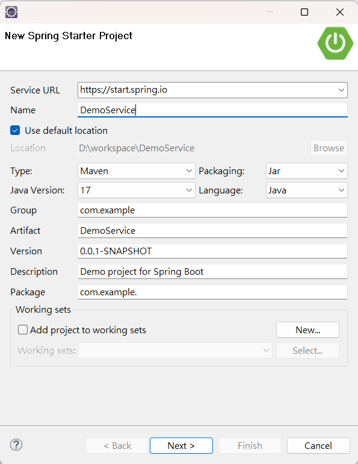
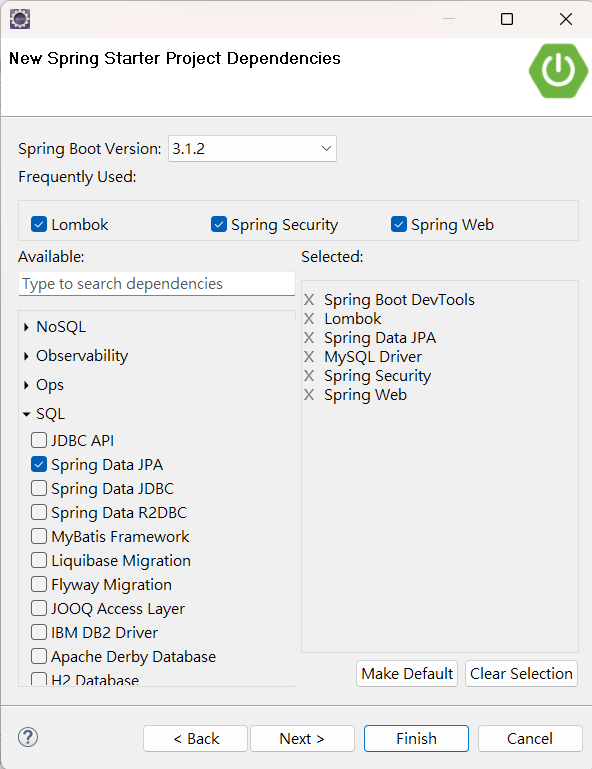
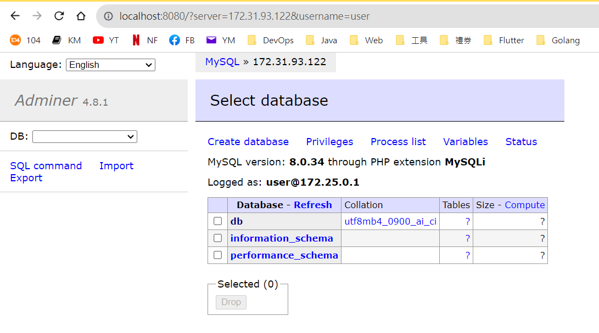
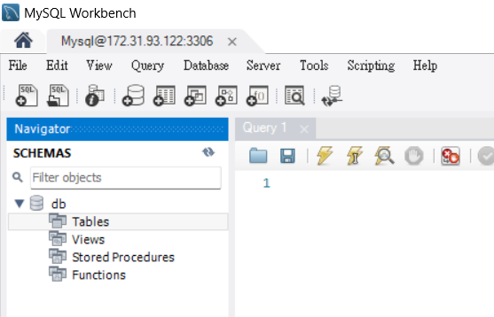
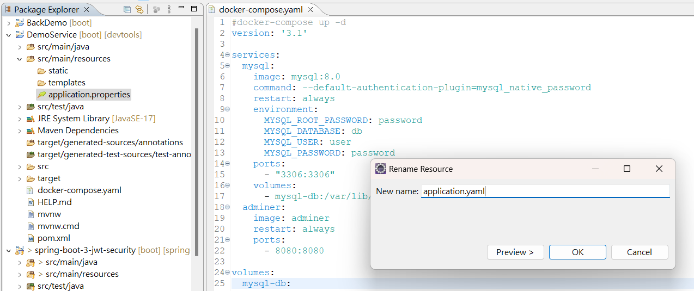
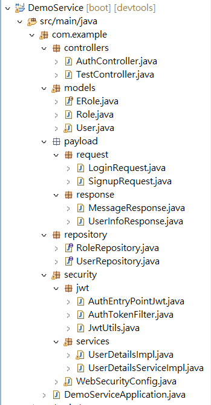

### (實作)JWT Authentication and Authorization with Spring Boot 3 and Spring Security 6 + MySQL

參考資料：
Bezkoder:
<https://www.bezkoder.com/spring-boot-security-jwt/>

Truong Bui:
<https://medium.com/@truongbui95/jwt-authentication-and-authorization-with-spring-boot-3-and-spring-security-6-2f90f9337421>


#### New Project





#### docker-compose.yaml 設定

```
version: '3.1'

services:
  mysql:
    image: mysql:8.0
    command: --default-authentication-plugin=mysql_native_password
    restart: always
    environment:
      MYSQL_ROOT_PASSWORD: password
      MYSQL_DATABASE: db
      MYSQL_USER: user
      MYSQL_PASSWORD: password
    ports:
      - "3306:3306"
    volumes:
      - mysql-db:/var/lib/mysql
  adminer:
    image: adminer
    restart: always
    ports:
      - 8080:8080

volumes:
  mysql-db:
```

```
docker-compose up -d
```


開啟 http://localhost:8080/




如果不喜歡這個介面，可以改用 MySQL Workbench



#### application.yaml 設定

先把預設的 properties 改成 yaml 檔案


applicaion.yaml
```
spring:
  datasource:
    url: jdbc:mysql://172.31.93.122:3306/db
    username: user
    password: password
    driver-class-name: com.mysql.cj.jdbc.Driver
  jpa:
    hibernate:
      ddl-auto: update
    show-sql: true
    properties:
      hibernate:
        format_sql: true
    database-platform: org.hibernate.dialect.MySQL8Dialect
    
# App Properties
bezkoder:
  app:
    jwtCookieName: bezkoder
    jwtSecret: ======================BezKoder=Spring===========================
    jwtExpirationMs: 86400000
```

#### pom.xml 設定

新增 JWT 相關套件
```
<dependency>
	<groupId>org.springframework.boot</groupId>
	<artifactId>spring-boot-starter-validation</artifactId>
</dependency>

<dependency>
	<groupId>io.jsonwebtoken</groupId>
	<artifactId>jjwt-api</artifactId>
	<version>0.11.5</version>
</dependency>

<dependency>
	<groupId>io.jsonwebtoken</groupId>
	<artifactId>jjwt-impl</artifactId>
	<version>0.11.5</version>
	<scope>runtime</scope>
</dependency>

<dependency>
	<groupId>io.jsonwebtoken</groupId>
	<artifactId>jjwt-jackson</artifactId>
	<version>0.11.5</version>
	<scope>runtime</scope>
</dependency>
```

#### 專案結構




#### 參考程式

DemoService
<https://github.com/aweit-zhu/DemoService>