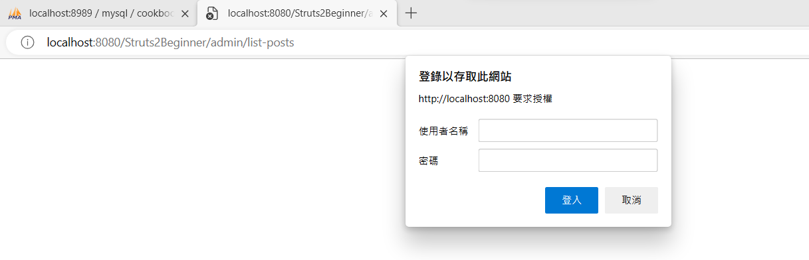

### SSH (Struts2 + Spring5 + Hibernate4)

#### SSH 說明

這些是一組框架的組合，也是目前最為流行的 Java Web 開發架構。每個框架都各司其職，也都有其主要目的。而資通的 Java 相關案子也都是採用這樣的架構做開發。

Struts 主要在是作為 MVC（Model-Viewer-Controller）的實現，將頁面的呈現及流程與商業邏輯切分。然而，與其說切分不如解釋為降低每個環節的藕合性。同時做了開發分工，網頁設計著重在 UI／UX 的設計，商業邏輯交給後端 Business Layer 去負責，在降低每個環節的藕合性的同時，也將每一階層都做了很完整的定義。前端使用 HTML 或 Tag 與相對也減低的前端頁面暴露在外的資安問題諸如 SQL injection、Cross-site Script，由工程師設計出來的頁面也不會每次都被使用者嫌棄美感不足了。

Spring 延續了 MVC 架構中的 Model 部分，幾個主要特色，依賴注入（DI）、反轉控制（IoC）和 AOP（Aspect Oriented Programming）。IoC 這裡的基礎概念是 BeanFactory，它提供對 Factory 模式的經典實現來消除對程序性單例模式（Singleton）的需要，並真正地允許你從程序邏輯中分離出依賴關係和配置。當然若能配合其他 Design Pattern 使用更可看出架構的完整性，AOP 中應用到的是資料庫的 Transaction 控管，它讓開發者可以完全不需要去寫到 Transaction 相關的 code，只要定義好哪些 code 需要加上 Transaction 的控制即可。

Hibernate ORM （Oriented-Relational Mapping）提供了常用的「對象／關係」映射 APIs 的集成層。 其中包括 JPA、JDO、iBatis 和 Hibernate 。利用 ORM package，可以混合使用所有 Spring 提供的特性進行「對象／關係」映射。

(參考來源：<https://marketing.ares.com.tw/newsletter/2015-08-outsourcing/ssh>)

反轉控制（IoC）


(參考資料：)

AOP（Aspect Oriented Programming）：剖面導向程式設計


(參考資料：<https://ithelp.ithome.com.tw/articles/10229664>)


#### GitHub 完整代碼：<https://github.com/aweit-zhu/Struts2Beginner>

##### 使用環境

- Struts 2.3.8
- Struts JSON Plugin 2.3.8
- Struts Convention Plugin 2.3.8
- Struts Spring Plugin 2.3.8
- Spring Core 5.3.29
- Spring Context 5.3.29
- Spring Web MVC 5.3.29
- Spring Web 5.3.29
- Spring Beans 5.3.29
- Spring Context Support 5.1.5.RELEASE
- Spring Security Core 5.1.4.RELEASE
- Spring Security Taglibs 5.1.4.RELEASE
- Spring Security Web 5.1.4.RELEASE
- Spring Security Config 5.1.4.RELEASE
- Hibernate Core 5.4.32.Final
- MySQL Connector/J 8.0.25

##### pom.xml

```
<project xmlns="http://maven.apache.org/POM/4.0.0"
	xmlns:xsi="http://www.w3.org/2001/XMLSchema-instance"
	xsi:schemaLocation="http://maven.apache.org/POM/4.0.0 https://maven.apache.org/xsd/maven-4.0.0.xsd">
	<modelVersion>4.0.0</modelVersion>
	<groupId>Struts2Beginner</groupId>
	<artifactId>Struts2Beginner</artifactId>
	<version>0.0.1-SNAPSHOT</version>
	<packaging>war</packaging>
	<dependencies>

		<!-- lombok -->
		<dependency>
			<groupId>org.projectlombok</groupId>
			<artifactId>lombok</artifactId>
			<version>1.18.20</version>
			<scope>provided</scope>
		</dependency>

		<!-- Servlet -->
		<dependency>
			<groupId>javax.servlet</groupId>
			<artifactId>jstl</artifactId>
			<version>1.2</version>
		</dependency>

		<!-- Struts 2 -->
		<dependency>
			<groupId>org.apache.struts</groupId>
			<artifactId>struts2-core</artifactId>
			<version>2.3.8</version>
		</dependency>
		<dependency>
			<groupId>org.apache.struts</groupId>
			<artifactId>struts2-json-plugin</artifactId>
			<version>2.3.8</version>
		</dependency>
		<dependency>
			<groupId>org.apache.struts</groupId>
			<artifactId>struts2-convention-plugin</artifactId>
			<version>2.3.8</version>
		</dependency>
		<dependency>
			<groupId>org.apache.struts</groupId>
			<artifactId>struts2-convention-plugin</artifactId>
			<version>2.3.8</version>
			<exclusions>
				<exclusion>
					<groupId>org.apache.struts</groupId>
					<artifactId>struts2-core</artifactId>
				</exclusion>
			</exclusions>
		</dependency>
		<dependency>
			<groupId>org.apache.struts</groupId>
			<artifactId>struts2-spring-plugin</artifactId>
			<version>2.3.8</version>
		</dependency>

		<!-- Spring dependencies -->
		<dependency>
			<groupId>org.springframework</groupId>
			<artifactId>spring-core</artifactId>
			<version>5.3.29</version>
		</dependency>
		<dependency>
			<groupId>org.springframework</groupId>
			<artifactId>spring-context</artifactId>
			<version>5.3.29</version>
		</dependency>
		<dependency>
			<groupId>org.springframework</groupId>
			<artifactId>spring-webmvc</artifactId>
			<version>5.3.29</version>
		</dependency>
		<dependency>
			<groupId>org.springframework</groupId>
			<artifactId>spring-web</artifactId>
			<version>5.3.29</version>
		</dependency>
		<dependency>
			<groupId>org.springframework</groupId>
			<artifactId>spring-beans</artifactId>
			<version>5.3.29</version>
		</dependency>
		<dependency>
			<groupId>org.springframework</groupId>
			<artifactId>spring-context-support</artifactId>
			<version>5.1.5.RELEASE</version>
		</dependency>
		<dependency>
			<groupId>org.springframework.security</groupId>
			<artifactId>spring-security-core</artifactId>
			<version>5.1.4.RELEASE</version>
		</dependency>
		<dependency>
			<groupId>org.springframework.security</groupId>
			<artifactId>spring-security-taglibs</artifactId>
			<version>5.1.4.RELEASE</version>
		</dependency>
		<dependency>
			<groupId>org.springframework.security</groupId>
			<artifactId>spring-security-web</artifactId>
			<version>5.1.4.RELEASE</version>
		</dependency>
		<dependency>
			<groupId>org.springframework.security</groupId>
			<artifactId>spring-security-config</artifactId>
			<version>5.1.4.RELEASE</version>
		</dependency>
		<!-- Hibernate -->
		<dependency>
			<groupId>org.hibernate</groupId>
			<artifactId>hibernate-core</artifactId>
			<version>5.4.32.Final</version>
		</dependency>
		<dependency>
			<groupId>mysql</groupId>
			<artifactId>mysql-connector-java</artifactId>
			<version>8.0.25</version>
		</dependency>
	</dependencies>
	<build>
		<resources>
			<resource>
				<directory>src/main/</directory>
				<excludes>
					<exclude>**/*.java</exclude>
				</excludes>
			</resource>
		</resources>
		<plugins>
			<plugin>
				<artifactId>maven-compiler-plugin</artifactId>
				<version>3.8.1</version>
				<configuration>
					<release>17</release>
				</configuration>
			</plugin>
			<plugin>
				<artifactId>maven-war-plugin</artifactId>
				<version>3.2.3</version>
			</plugin>
		</plugins>
		<finalName>Struts2Beginner</finalName>
	</build>
</project>

```

##### 配置 MySQL 

```
version: '3.8'

services:
  mysql:
    image: mysql:5
    container_name: mysql
    restart: always
    environment:
      MYSQL_ROOT_PASSWORD: password
      MYSQL_DATABASE: cookbook
      MYSQL_USER: admin
      MYSQL_PASSWORD: password
    ports:
      - 3306:3306
    volumes:
      - ./data:/var/lib/mysql

  phpmyadmin:
    image: phpmyadmin/phpmyadmin
    container_name: phpmyadmin
    restart: always
    environment:
      PMA_HOST: mysql
      PMA_PORT: 3306
      MYSQL_ROOT_PASSWORD: password
    ports:
      - 8989:80
    depends_on:
      - mysql
```

##### 三個配置檔


1. struts.xml

```
<?xml version="1.0" encoding="UTF-8"?>
<!DOCTYPE struts PUBLIC
    "-//Apache Software Foundation//DTD Struts Configuration 2.0//EN"
    "http://struts.apache.org/dtds/struts-2.0.dtd">

<struts>
	<constant name="struts.action.excludePattern"
		value="/spring/.*" />

    <constant name="struts.objectFactory" value="spring" />

	<constant name="struts.objectFactory.spring.autoWireAlways"
		value="true" />

	<constant name="struts.objectFactory.spring.autoWire"
		value="name" />

	<constant name="struts.objectFactory.spring.useClassCache"
		value="true" />

	<package name="Struts2Beginner" namespace="/admin"
		extends="struts-default">
		<action name="index">
			<result>/WEB-INF/jsp/calculate/input.jsp</result>
		</action>
	</package>
</struts>
```

(1) struts.action.excludePattern：哪些路由不要透過 Struts。如果有些路由要走 Spring Controller 則可以利用這個方式設定。

(2) struts.objectFactory：如果為 Spirng，代表可以使用 Spring 的 DI 和 IoC的功能。

(3) struts.objectFactory.spring.autoWire：如果 Bean 定義的 Name 為 abc，則有要注入的其他Bean的 property 的名稱也要為 abc，則會自動注入。

2. applicationContext.xml

```
<beans xmlns="http://www.springframework.org/schema/beans"
	xmlns:xsi="http://www.w3.org/2001/XMLSchema-instance"
	xsi:schemaLocation="http://www.springframework.org/schema/beans
                           http://www.springframework.org/schema/beans/spring-beans.xsd">

  
	<bean id="springController" class="com.example.spring.controller.SpringController">
	   <property name="helloService" ref="helloService" />
	</bean>
	

	<bean id="helloService" class="com.example.spring.service.HelloService"/>
	
</beans>
```

In the context of the provided XML code, the "applicationContext.xml" file is not explicitly mentioned. However, based on the configuration settings in the Struts XML file, it is likely that the Spring object factory is being used to manage objects and dependencies in the Struts application.

In a typical setup, the "applicationContext.xml" file would be responsible for defining the Spring beans, specifying their dependencies, and configuring other aspects of the Spring application context. It might include components such as data sources, transaction managers, service beans, and more.


3. hibernate.cfg.xml

```
<?xml version="1.0" encoding="UTF-8"?>
<!DOCTYPE hibernate-configuration PUBLIC
        "-//Hibernate/Hibernate Configuration DTD 3.0//EN"
        "http://hibernate.sourceforge.net/hibernate-configuration-3.0.dtd">
<hibernate-configuration>
	<session-factory>
		<property name="hibernate.dialect">org.hibernate.dialect.MySQL8Dialect</property>
		<property name="hibernate.connection.driver_class">com.mysql.cj.jdbc.Driver</property>
		<property name="hibernate.connection.url">jdbc:mysql://localhost:3306/cookbook</property>
		<property name="hibernate.connection.username">admin</property>
		<property name="hibernate.connection.password">password</property>
		<property name="hibernate.show_sql">true</property>
		<property name="hibernate.hbm2ddl.auto">update</property>
		<mapping class = "com.example.hibernate.entity.Post" />
		<mapping class = "com.example.hibernate.entity.Comment" />
	</session-factory>
</hibernate-configuration>
```

(1) property：設定連線資訊

(2) mapping：只要有一個物件需要與表格做關聯，都要在這邊定義。


##### 配置 Spirng Secutiry

```
import org.springframework.beans.factory.annotation.Autowired;
import org.springframework.context.annotation.Bean;
import org.springframework.context.annotation.ComponentScan;
import org.springframework.context.annotation.Configuration;
import org.springframework.security.config.annotation.authentication.builders.AuthenticationManagerBuilder;
import org.springframework.security.config.annotation.web.builders.HttpSecurity;
import org.springframework.security.config.annotation.web.configuration.EnableWebSecurity;
import org.springframework.security.config.annotation.web.configuration.WebSecurityConfigurerAdapter;
import org.springframework.security.crypto.bcrypt.BCryptPasswordEncoder;
import org.springframework.security.crypto.password.PasswordEncoder;
import org.springframework.transaction.annotation.EnableTransactionManagement;
import org.springframework.web.cors.CorsConfiguration;
import org.springframework.web.cors.CorsConfigurationSource;
import org.springframework.web.cors.UrlBasedCorsConfigurationSource;

@Configuration
@ComponentScan("com.example")
@EnableTransactionManagement
@EnableWebSecurity
public class AppConfig extends WebSecurityConfigurerAdapter {

	@Override
	protected void configure(HttpSecurity httpSecurity) throws Exception {

		httpSecurity.cors().and().csrf().disable();

		httpSecurity.authorizeRequests()
					.antMatchers("/superadmin/**").access("hasRole('ROLE_SUPER_ADMIN')")
					.antMatchers("/admin/**").access("hasRole('ROLE_SUPER_ADMIN') or hasRole('ROLE_ADMIN')")
					.antMatchers("/employee/**").access("hasRole('ROLE_SUPER_ADMIN') or hasRole('ROLE_ADMIN') or hasRole('ROLE_EMPLOYEE')")
					.antMatchers("/spring/**").access("hasRole('ROLE_SUPER_ADMIN') or hasRole('ROLE_ADMIN')")
					.and()
					.httpBasic()
					.and()
					.logout()
					.and()
					.exceptionHandling();
	}

	@Bean
	public CorsConfigurationSource corsConfigurationSource() {
		UrlBasedCorsConfigurationSource source = new UrlBasedCorsConfigurationSource();
		source.registerCorsConfiguration("/**", new CorsConfiguration().applyPermitDefaultValues());
		return source;
	}

	@Autowired
	public void configureGlobal(AuthenticationManagerBuilder auth) throws Exception {
		auth.inMemoryAuthentication()
			.withUser("superadmin").password(passwordEncoder().encode("123456")).authorities("ROLE_SUPER_ADMIN", "ROLE_ADMIN", "ROLE_EMPLOYEE")
			.and()
			.withUser("admin").password(passwordEncoder().encode("123456")).authorities("ROLE_ADMIN", "ROLE_EMPLOYEE")
			.and()
			.withUser("employee").password(passwordEncoder().encode("123456")).authorities("ROLE_EMPLOYEE");
	}

	@Bean
	public PasswordEncoder passwordEncoder() {
		return new BCryptPasswordEncoder();
	}
	
}
```

##### Action + Service


HelloAction
```
import org.apache.struts2.convention.annotation.Action;
import org.apache.struts2.convention.annotation.Namespace;
import org.apache.struts2.convention.annotation.Result;
import org.apache.struts2.convention.annotation.Results;
import org.springframework.beans.factory.annotation.Autowired;

import com.example.spring.service.HelloService;
import com.opensymphony.xwork2.ActionSupport;

@Namespace("/")
@Results(value = { 
    @Result(name = "hello", location = "/WEB-INF/jsp/hello.jsp") ,
    @Result(name = "goodbye", location = "/WEB-INF/jsp/goodbye.jsp") 
})
public class HelloAction extends ActionSupport {

	@Autowired
    HelloService helloService;
	
    @Action(value = "hello")
    public String hello() {
    	System.out.println(helloService.getHello());
        return "hello";
    }
    
    @Action(value = "goodbye")
    public String goodbye() {
        return "goodbye";
    }
}
```

HelloService

```
import org.springframework.stereotype.Service;

@Service
public class HelloService {

	public String getHello() {
		return "service, hello";
	}
	
}
```

hello.jsp

```
<%@ page language="java" contentType="text/html; charset=UTF-8"
	pageEncoding="UTF-8"%>
<%@ taglib prefix="s" uri="/struts-tags"%>
Hello
```

goobye.jsp

```
<%@ page language="java" contentType="text/html; charset=UTF-8"
	pageEncoding="UTF-8"%>
<%@ taglib prefix="s" uri="/struts-tags"%>
GoodBye
```


#### Struts 整合 DAO

##### HibernateUtil

```
import org.hibernate.SessionFactory;
import org.hibernate.cfg.Configuration;

public class HibernateUtil {
	
    private static final SessionFactory sessionFactory;

    static {
        try {
            sessionFactory = new Configuration().configure().buildSessionFactory();
        } catch (Throwable ex) {
            System.err.println("Initial SessionFactory creation failed." + ex);
            throw new ExceptionInInitializerError(ex);
        }
    }

    public static SessionFactory getSessionFactory() {
        return sessionFactory;
    }
}
```

##### Post

```
import java.util.ArrayList;
import java.util.List;

import javax.persistence.CascadeType;
import javax.persistence.Column;
import javax.persistence.Entity;
import javax.persistence.FetchType;
import javax.persistence.GeneratedValue;
import javax.persistence.GenerationType;
import javax.persistence.Id;
import javax.persistence.OneToMany;
import javax.persistence.Table;

import lombok.Data;
import lombok.ToString;

@Entity
@Table(name = "posts")
@Data
@ToString(exclude = "comments")
public class Post {
    
	@Id
    @GeneratedValue(strategy = GenerationType.IDENTITY)
    private int id;

	@Column
    private String title;
	
	@Column
    private String content;
	
	@OneToMany(mappedBy = "post", cascade = CascadeType.ALL, fetch = FetchType.EAGER)
    private List<Comment> comments = new ArrayList<>();
	
}
```

##### Comment

```
import javax.persistence.Entity;
import javax.persistence.GeneratedValue;
import javax.persistence.GenerationType;
import javax.persistence.Id;
import javax.persistence.JoinColumn;
import javax.persistence.ManyToOne;
import javax.persistence.Table;

import lombok.Data;
import lombok.ToString;

@Entity
@Table(name = "comments")
@Data
@ToString(exclude = "post")
public class Comment {

    @Id
    @GeneratedValue(strategy = GenerationType.IDENTITY)
    private Long id;

    private String content;

    @ManyToOne
    @JoinColumn(name = "post_id")
    private Post post;
}
```
##### PostDao

```
import java.util.List;

import org.hibernate.Session;
import org.hibernate.Transaction;
import org.springframework.stereotype.Service;

import com.example.hibernate.HibernateUtil;
import com.example.hibernate.entity.Post;

@Service
public class PostDao {
	
    public void save(Post post) {
        try (Session session = HibernateUtil.getSessionFactory().openSession()) {
            Transaction transaction = session.beginTransaction();
            session.save(post);
            transaction.commit();
        } catch (Exception e) {
            e.printStackTrace();
        }
    }

    public void update(Post post) {
        try (Session session = HibernateUtil.getSessionFactory().openSession()) {
            Transaction transaction = session.beginTransaction();
            session.update(post);
            transaction.commit();
        } catch (Exception e) {
            e.printStackTrace();
        }
    }

    public void delete(Post post) {
        try (Session session = HibernateUtil.getSessionFactory().openSession()) {
            Transaction transaction = session.beginTransaction();
            session.delete(post);
            transaction.commit();
        } catch (Exception e) {
            e.printStackTrace();
        }
    }

    public Post getById(int id) {
        try (Session session = HibernateUtil.getSessionFactory().openSession()) {
            return session.get(Post.class, id);
        } catch (Exception e) {
            e.printStackTrace();
            return null;
        }
    }

    public List<Post> getAll() {
        try (Session session = HibernateUtil.getSessionFactory().openSession()) {
            return session.createQuery("FROM Post", Post.class).getResultList();
        } catch (Exception e) {
            e.printStackTrace();
            return null;
        }
    }
}

```


##### CommentDao

```
import java.util.List;

import org.hibernate.Session;
import org.hibernate.Transaction;
import org.hibernate.query.Query;
import org.springframework.stereotype.Service;

import com.example.hibernate.HibernateUtil;
import com.example.hibernate.entity.Comment;
import com.example.hibernate.entity.Post;

@Service
public class CommentDao {

    public void saveComment(Comment comment) {
        try (Session session = HibernateUtil.getSessionFactory().openSession()) {
            Transaction transaction = session.beginTransaction();
            session.save(comment);
            transaction.commit();
        } catch (Exception e) {
            e.printStackTrace();
        }
    }

    public Comment getCommentById(Long commentId) {
        try (Session session = HibernateUtil.getSessionFactory().openSession()) {
            return session.get(Comment.class, commentId);
        } catch (Exception e) {
            e.printStackTrace();
            return null;
        }
    }

    public List<Comment> getCommentsByPost(Post post) {
        try (Session session = HibernateUtil.getSessionFactory().openSession()) {
            Query<Comment> query = session.createQuery("FROM Comment WHERE post = :post", Comment.class);
            query.setParameter("post", post);
            return query.list();
        } catch (Exception e) {
            e.printStackTrace();
            return null;
        }
    }

    public void updateComment(Comment comment) {
        try (Session session = HibernateUtil.getSessionFactory().openSession()) {
            Transaction transaction = session.beginTransaction();
            session.update(comment);
            transaction.commit();
        } catch (Exception e) {
            e.printStackTrace();
        }
    }

    public void deleteComment(Comment comment) {
        try (Session session = HibernateUtil.getSessionFactory().openSession()) {
            Transaction transaction = session.beginTransaction();
            session.delete(comment);
            transaction.commit();
        } catch (Exception e) {
            e.printStackTrace();
        }
    }
}
```

##### PostAction

```
import java.util.List;

import org.apache.struts2.convention.annotation.Action;
import org.apache.struts2.convention.annotation.Namespace;
import org.apache.struts2.convention.annotation.Result;
import org.apache.struts2.convention.annotation.Results;
import org.springframework.beans.factory.annotation.Autowired;

import com.example.hibernate.dao.CommentDao;
import com.example.hibernate.dao.PostDao;
import com.example.hibernate.entity.Comment;
import com.example.hibernate.entity.Post;
import com.opensymphony.xwork2.ActionSupport;

import lombok.Data;

@Namespace("/admin")
@Results({
    @Result(name = "success", location = "/list-posts.jsp"),
    @Result(name = "error", location = "/error.jsp")
})
@Data
public class PostAction extends ActionSupport {
    
	@Autowired
	PostDao postDao;
	
	@Autowired
	CommentDao commentDao;
	
	private int id;
    
	private String title;
    
	private String content;
    
	private List<Post> posts;

    @Action(value = "/create-post", results = {
        @Result(name = "success", location = "/list-posts", type = "redirect")
    })
    public String create() {
        Post post = new Post();
        post.setTitle(title);
        post.setContent(content);
        postDao.save(post);
        
        Comment comment = new Comment();
        comment.setContent("Test Comment");
        
        addCommentToPost(post.getId(),comment);
        
        return SUCCESS;
    }
    
    public void addCommentToPost(int postId, Comment comment) {
        Post post = postDao.getById(postId);
        if (post != null) {
            comment.setPost(post);
            commentDao.saveComment(comment);
        }
    }


    @Action(value = "/update-post", results = {
        @Result(name = "success", location = "/list-posts", type = "redirect")
    })
    public String update() {
        Post post = postDao.getById(id);

        if (post != null) {
            post.setTitle(title);
            post.setContent(content);
            postDao.update(post);
        } else {
            return ERROR;
        }

        return SUCCESS;
    }

    @Action(value = "/delete-post", results = {
        @Result(name = "success", location = "/list-posts", type = "redirect")
    })
    public String delete() {
        Post post = postDao.getById(id);

        if (post != null) {
        	postDao.delete(post);
        } else {
            return ERROR;
        }

        return SUCCESS;
    }

    @Action(value = "/view-post", results = {
        @Result(name = "success", location = "/view-post.jsp")
    })
    public String view() {
        Post post = postDao.getById(id);
       
        if (post != null) {
            title = post.getTitle();
            content = post.getContent();
            
            List<Comment> comments = commentDao.getCommentsByPost(post);
            System.out.println(comments);
            
        } else {
            return ERROR;
        }

        return SUCCESS;
    }

    @Action(value = "/list-posts", results = {
        @Result(name = "success", location = "/list-posts.jsp")
    })
    public String list() {
        posts = postDao.getAll();
        return SUCCESS;
    }
}
```


##### 相關JSP

list-post.jsp
```
<%@ page contentType="text/html;charset=UTF-8" language="java" %>
<%@ taglib prefix="s" uri="/struts-tags" %>
<!DOCTYPE html>
<html>
<head>
    <title>List of Posts</title>
</head>
<body>
    <h1>List of Posts</h1>
    <table>
        <tr>
            <th>ID</th>
            <th>Title</th>
            <th>Content</th>
            <th>Action</th>
        </tr>
        <s:iterator value="posts">
            <tr>
                <td><s:property value="id" /></td>
                <td><s:property value="title" /></td>
                <td><s:property value="content" /></td>
                <td>
                    <a href="<s:url action='view-post'><s:param name='id' value='%{id}' /></s:url>">View</a>
                    <a href="<s:url action='delete-post'><s:param name='id' value='%{id}' /></s:url>">Delete</a>
                </td>
            </tr>
        </s:iterator>
    </table>
    <h2>Create New Post</h2>
    <form action="<s:url action='create-post' />" method="POST">
        <label for="title">Title:</label>
        <input type="text" name="title" id="title" required /><br>
        <label for="content">Content:</label>
        <textarea name="content" id="content" required></textarea><br>
        <input type="submit" value="Create" />
    </form>
</body>
</html>
```


view-posts.jsp

```
<%@ page contentType="text/html;charset=UTF-8" language="java" %>
<%@ taglib prefix="s" uri="/struts-tags" %>
<!DOCTYPE html>
<html>
<head>
    <title>View Post</title>
</head>
<body>
    <h1>View Post</h1>
    <table>
        <tr>
            <th>ID</th>
            <th>Title</th>
            <th>Content</th>
        </tr>
        <tr>
            <td><s:property value="id" /></td>
            <td><s:property value="title" /></td>
            <td><s:property value="content" /></td>
        </tr>
    </table>
    <h2>Edit Post</h2>
    <form action="<s:url action='update-post' />" method="POST">
        <input type="hidden" name="id" value="<s:property value='id' />" />
        <label for="title">Title:</label>
        <input type="text" name="title" id="title" value="<s:property value='title' />" required /><br>
        <label for="content">Content:</label>
        <textarea name="content" id="content" required><s:property value='content' /></textarea><br>
        <input type="submit" value="Update" />
    </form>
</body>
</html>
```

##### Test

1. 打開瀏覽器：http://localhost:8080/Struts2Beginner/admin/list-posts

2. 彈出登入視窗，表示Spring Security 是正確的。




3. 輸入正確帳密後(admin/123456)，就可以看到畫面。


4. 對照一下資料庫的資料，比對是否一致。

