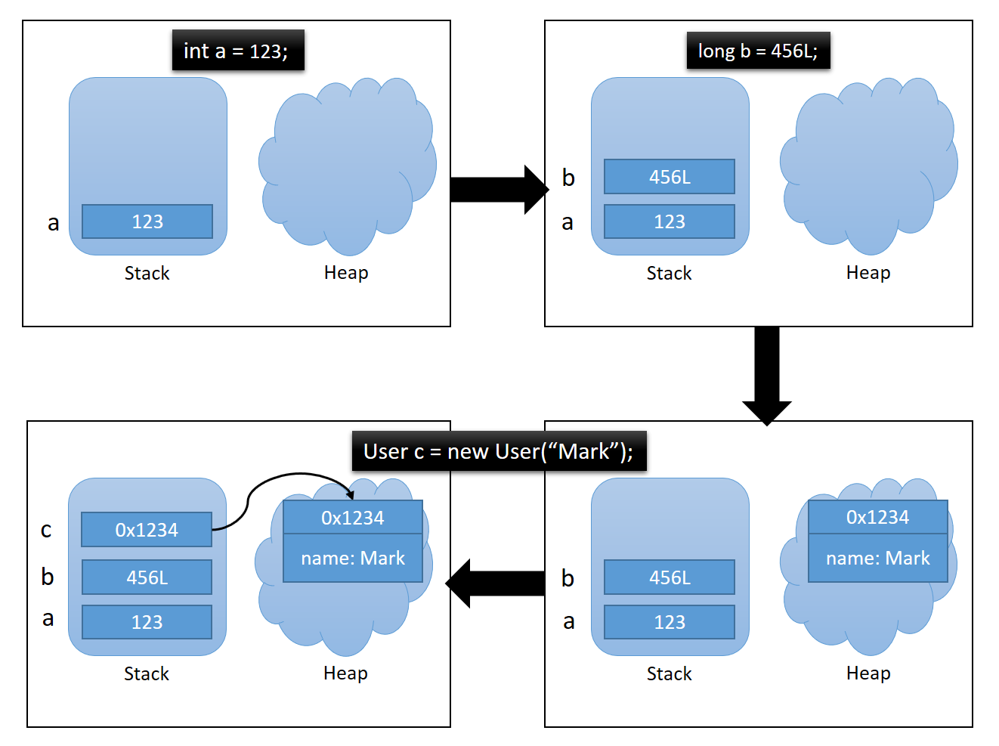

### JVM - Stack & Heap

#### 問題意識

```
String str1 = "aaa";
String str2 = "aaa";
String str3 = new String("aaa"); 

System.out.println(str1 == str2); // true
System.out.println(str1 == str3); // false
```

#### Stack(棧) &  Heap (堆)

圖片來源：<https://blog.marklee.tw/java-interview-jvm-stack-heap/>


- Stack：

  (1) 儲存基本型別( **int 、 short 、 long 、 byte 、 float 、 double 、 boolean 、 char**) 的值，以及儲存**參考位置(Reference Type) 的位址**。  (**沒有 String**)

  (2) 在宣告時，就分配內存。且超過作用域就會釋放。

- Heap：

  (1) 儲存 Class Type (String、Integer、自己的物件) 變數值與物件位址。通常為透過 new 方式建立。

  (2) 在宣告時，尚不會分配資源，等到 new 時，才會分配內存。並且在沒有引用指向他們時會釋放。

#### String Pool (字串池)

**1.採用字面值創建String**：

字串池實際上是堆(Heap)中的一部分，而不是獨立的記憶體區域。字串池的存在是為了優化字串的存儲和共享，以提高效能和節省記憶體。

當你使用字面值創建字串物件時，Java會先檢查字串池中是否已經存在相同內容的字串。如果存在，則`直接返回字串池中的實例，而不會在堆中創建新的物件`。

如果字串池中不存在相同內容的字串，則會 `在字串池中創建一個新的實例，並在堆中創建相應的物件`。

結論來說，**`如果用字面值創建String，回傳的是同一物件的參考位址`**。

**2.採用 new 建立String**

在Java中，當你使用 `new` 關鍵字創建一個字串對象時，**`都會在堆中創建一個新的字串對象`**。

JVM會首先在`字串池（String Pool）`中查找是否已經存在相同內容的字串。如果字串池中已經存在相同內容的字串，則不會在字串池中再次創建該字串，而是 `直接在堆（Heap）中創建一個新的字串對象`，並將該字串對象的引用返回給你。

如果字串池中不存在相同內容的字串，則會先在字串池中創建一個字串對象，然後`再在堆中創建一個新的字串對象`，並將該字串對象的引用返回給你。

> PS：儘管在使用`new`關鍵字創建字串對象時，字串池的檢查似乎是多餘的，但這是Java語言的設計選擇，以確保字串對象的一致性和效能。

#### 解決問題：

```
String str1 = "aaa"; // 在字串池中創建字串對象
String str2 = "aaa"; // 使用字串池中的字串對象
String str3 = new String("aaa"); // 在堆中創建一個新的字串對象

System.out.println(str1 == str2); // true，兩個引用指向字串池中的同一個字串對象
System.out.println(str1 == str3); // false，兩個引用指向不同的字串對象
```

補充：

1. **a == b**：比對兩物件的參考位址是否相等。
2. **a.equals(b)**：比對兩物件的值是否相等。