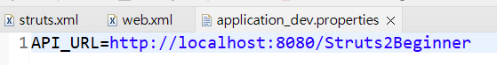
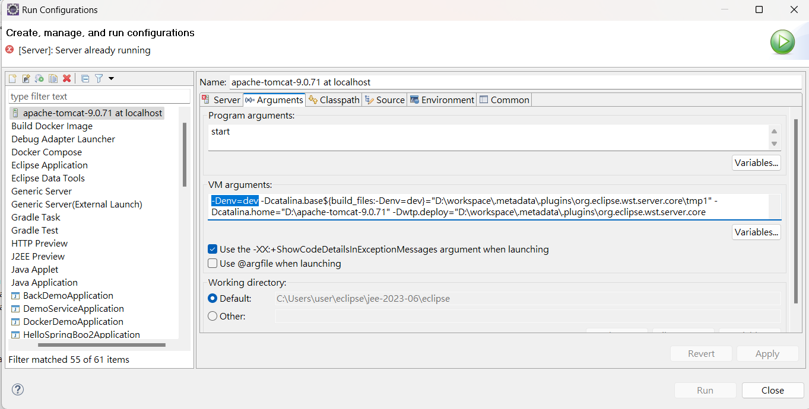
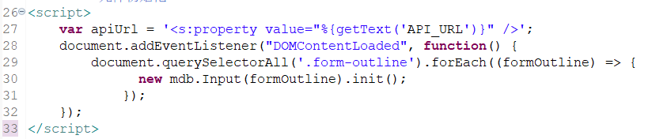
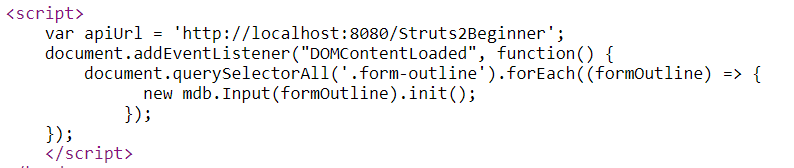

#### Struts2 Properties Config

##### 問題描述

有時候要依據系統變數(例如：env)，決定Application的環境，這樣才可以讀取到正確的設定值，例如：API、DB 連線。

如何在 Struts2 做到呢？上網可能會發現可以使用 `<constant name="struts.custom.i18n.resources" value="application_${env}" />`。但是如果版本是低於2.5的，會發現無法work。(本文是用2.3.8)

那該如何解決？需滿足以下目標：

1. 依照系統變數，決定Application的設定檔。例如：env=dev, 則讀取 application_dev.properties。

2. 如何讀取設定檔值？

##### 利用 StrutsPrepareAndExecuteFilter 的過濾參數

```
<filter>
    <filter-name>struts2</filter-name>
    <filter-class>
        org.apache.struts2.dispatcher.ng.filter.StrutsPrepareAndExecuteFilter</filter-class>
    <init-param>
        <param-name>struts.custom.i18n.resources</param-name>
        <param-value>application_${env}</param-value>
    </init-param>
</filter>
```
1. 測試後發現，必須要帶有_的才能。如果是 `application.${env}` 則無法work。

2. 且一定要寫在過濾參數中，寫在 struts.xml 會無法 work。但是如果是寫死的，struts.xml 可以 work。

##### 於 src/main/resources 新增 Properties 檔案





##### 在執行應用的指令中加入環境變數，以下以 Eclipse 為例

加入以下指令(以dev為例)：
```
-Denv=dev
```



##### 如何讀取設定檔值？

```
 // 寫在 JS 中
 var apiUrl = '<s:property value="%{getText('API_URL')}" />';

 // 寫在 JSP 中
 <s:property value="%{getText('API_URL')}" />
```
JS


瀏覽器輸出

