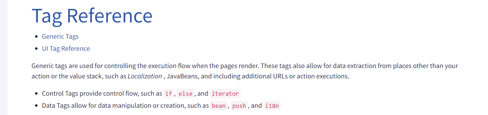
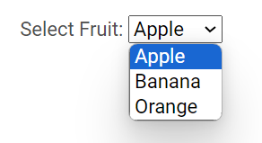
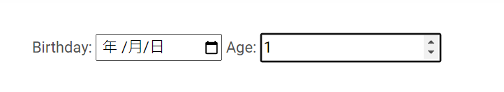
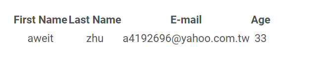
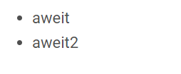
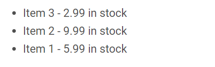

### Struts Tags

參考資料：

官網
<https://struts.apache.org/tag-developers/tag-reference.html>



#### 起手式

```
<%@ taglib prefix="s" uri="/struts-tags" %\> 

// 使用各種 Struts 標籤
```

#### form

解析前
```
<s:form action="hello">
    <s:textfield name="userName" label="Your name" />
    <s:submit value="Submit" />
</s:form>
```

解析後
```
<form id="hello" name="hello" action="/Struts2Beginner/hello.action" method="post">
    <table class="wwFormTable">
        <tbody>
            <tr>
                <td class="tdLabel">
                    <label for="hello_userName" class="label">Your name:</label>
                </td>
                <td>
                    <input type="text" name="userName" value="" id="hello_userName">
                </td>
            </tr>
            <tr>
                <td colspan="2">
                    <div align="right">
                        <input type="submit" id="hello_0" value="Submit">
                    </div>
                </td>
            </tr>
        </tbody>
    </table>
</form>
```

##### - textfield

```
<s:textfield name="userName" label="Your name" />
```

##### - dropdown

解析前
```
<s:select label="Select Fruit" name="fruit" list="#{'apple':'Apple', 'banana':'Banana', 'orange':'Orange'}" />
```

> The `#{'apple':'Apple', 'banana':'Banana', 'orange':'Orange'}` is an EL expression. It represents a HashMap where the keys are the option values and the values are the option labels for the select dropdown

解析後

```
<label for="fruit" class="label">Select Fruit:</label>
<select name="fruit" id="fruit">
    <option value="apple">Apple</option>
    <option value="banana">Banana</option>
    <option value="orange">Orange</option>
</select>
```



##### - radio

解析前

```
<s:radio label="Select Gender" name="gender" list="#{'male':'Male', 'female':'Female'}" value="female" />
```

解析後

```

<label for="gender" class="label">Select Gender:</label>
<input type="radio" name="gender" id="gendermale" value="male">
<label for="gendermale">Male</label>
<input type="radio" name="gender" id="genderfemale" value="female"><label for="genderfemale">Female</label>
```


##### - checkbox

解析前

```
<s:checkbox label="checkbox test" name="checkboxField1" value="aBoolean" fieldValue="true"/>
```

解析後

```
<input type="checkbox" name="checkboxField1" value="true" checked="checked" />
```

##### - 日期、數字

```
<s:textfield name="birthday" label="Birthday" type="date" />
<s:textfield name="age" label="Age" type="number" />
```



#### URL

##### - 基本

**<s:url>** 會將應用程式的名稱寫進去，以正確從根目錄去尋找Action或頁面。

解析前
```
<a href="<s:url action='hello'/>">Hello World</a>
```
解析後

```
<a href="/Struts2Beginner/hello.action">Hello World</a>
```


##### - 帶有請求參數

解析前
```
<s:url action="hello" var="helloLink">
    <s:param name="userName">aweit</s:param>
</s:url>
<p><a href="${helloLink}">帶有請求參數的連結</a></p>
```

解析後
```
<a href="/Struts2Beginner/hello.action?userName=%E9%98%BF%E5%81%89">帶有請求參數的連結</a>
```

#### table

JSP
```
<table>
    <tr>
        <th>First Name</th>
        <th>Last Name</th>
        <th>E-mail</th>
        <th>Age</th>
    </tr>
    <s:iterator value="items">
        <tr>
            <td><s:property value="firstName" /></td>
            <td><s:property value="lastName" /></td>
            <td><s:property value="email" /></td>
            <td><s:property value="age" /></td>
        </tr>
    </s:iterator>
</table>
```

Action

```
@Namespace("/")
@Results(value = { 
    @Result(name = "hello", location = "/WEB-INF/jsp/hello.jsp") ,
    @Result(name = "goodbye", location = "/WEB-INF/jsp/goodbye.jsp") 
})
@Data
public class HelloAction extends ActionSupport {
	
    private List<Person> items;
	
    @Action(value = "hello")
    public String hello() {

    	items = new ArrayList();
    	
    	items.add(new Person("aweit","zhu","a4192696@yahoo.com.tw", 33));
    	
        return "hello";
    }
}
```

Person

```
@Data
@AllArgsConstructor
@NoArgsConstructor
public class Person {
	private String firstName;
	private String lastName;
	private String email;
	private int age;
}
```



#### ul、li

用 List 去接
```
<ul>
    <s:iterator value="items">
        <li style="text-align:left"><s:property value="firstName" /></li>
    </s:iterator>
</ul>
```




用 Map 去接
```
<ul>
  <s:iterator value="itemsMap" var="entry">
    <li style="text-align:left">
      <s:property value="#entry.key" /> - <s:property value="#entry.value" /> in stock
    </li>
  </s:iterator>
</ul>
```

itemsMap
```
@Namespace("/")
@Results(value = { 
    @Result(name = "hello", location = "/WEB-INF/jsp/hello.jsp") ,
    @Result(name = "goodbye", location = "/WEB-INF/jsp/goodbye.jsp") 
})
@Data
public class HelloAction extends ActionSupport {

    private Map itemsMap;
	
    @Action(value = "hello")
    public String hello() {

    	itemsMap = new HashMap();
        itemsMap.put("Item 1", 5.99);
        itemsMap.put("Item 2", 9.99);
        itemsMap.put("Item 3", 2.99);
    		
        return "hello";
    }
}
```



#### 其他

##### - Poperty

```
// bean 中的屬性 方式
<s:property value="messageStore.message" />

// 屬性方式
<s:property value="message" />
```

##### - if

JSP
```
<s:if test="%{person.admin}">
    <div>Admin</div>
</s:if>
<s:elseif test="%{!person.admin}">
    <div>User</div>
</s:elseif>
<s:else>
    <div>Non User</div>
</s:else>
```

`%{}`: The `%{}` syntax is used to evaluate an expression in Struts tags. It allows you to access properties, invoke methods, and perform other operations on objects.


Action

```
@Namespace("/")
@Results(value = { @Result(name = "hello", location = "/WEB-INF/jsp/hello.jsp")})
@Data
public class HelloAction extends ActionSupport {

	Person person;

	@Action(value = "hello")
	public String hello() {
		person = new Person("aweit", "zhu", "a4192696@yahoo.com.tw", 33, true);
		return "hello";
	}
}
```

Person

```
@Data
@AllArgsConstructor
@NoArgsConstructor
public class Person {
	private String firstName;
	private String lastName;
	private String email;
	private int age;
	private boolean admin;
}
```