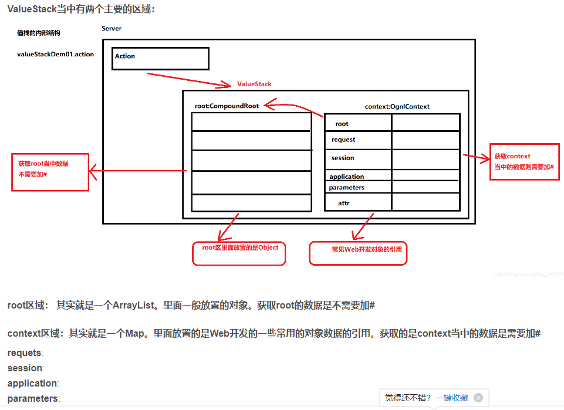
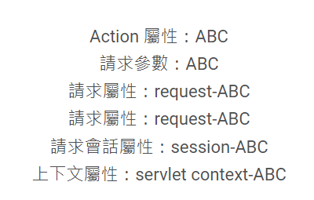
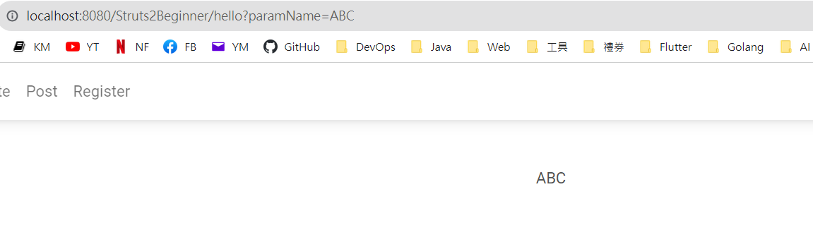
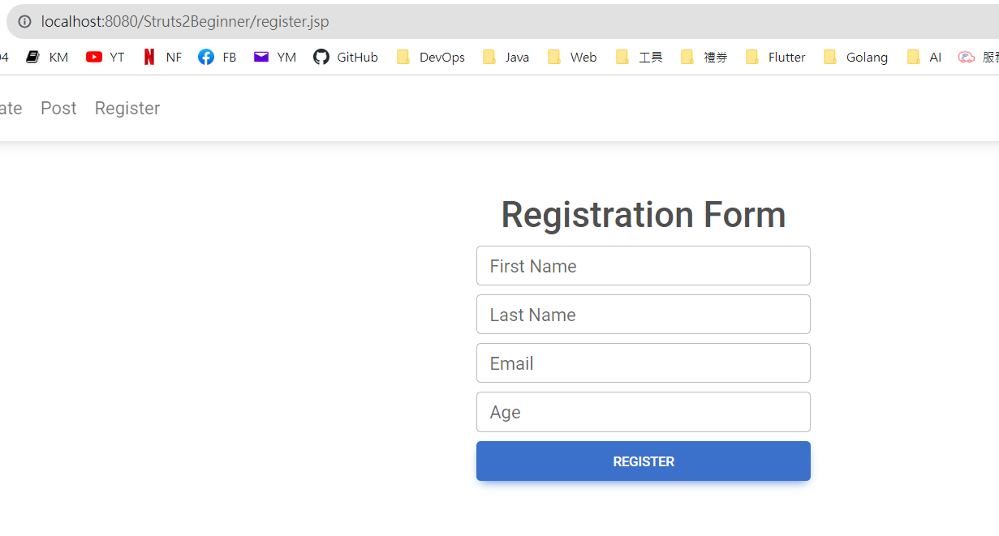
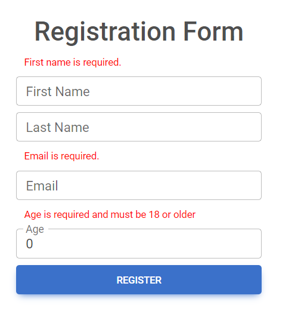
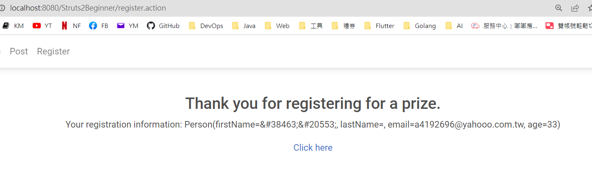

### Struts2 + ValueStack + Form Validate

#### ValueStack

1. 觀念：



參考資料：<https://blog.csdn.net/qq_44757034/article/details/106838688>

2. 範例：

Action
```
@Namespace("/")
@Results(value = { 
    @Result(name = "hello", location = "/WEB-INF/jsp/hello.jsp") ,
    @Result(name = "goodbye", location = "/WEB-INF/jsp/goodbye.jsp") 
})
@Data
public class HelloAction extends ActionSupport {
	
    private String paramName;
	
    @Action(value = "hello")
    public String hello() {
    	
    	// Root
    	ActionContext.getContext().getValueStack().set("name", "root-ABC");
    	    	
    	// Request
    	ServletActionContext.getRequest().setAttribute("name", "request-ABC");
    	
    	// Request Session
    	ServletActionContext.getRequest().getSession().setAttribute("name", "session-ABC");
    	
    	// Servlet Context
    	ServletActionContext.getServletContext().setAttribute("name", "servlet context-ABC");
    	
        return "hello";
    }
}
```

JSP
```
<%@ page language="java" contentType="text/html; charset=UTF-8"
	pageEncoding="UTF-8"%>
<%@ taglib prefix="s" uri="/struts-tags"%>
Action 屬性：<s:property value="paramName" />
<br>
請求參數：<s:property value="#parameters.paramName" />
<br>
請求屬性：<s:property value="#request.name" />
<br>
請求屬性：<s:property value="#attr.name" />
<br>
請求會話屬性：<s:property value="#session.name" />
<br>
上下文屬性：<s:property value="#application.name" />
```


#### 請求參數

1. Action：只要有 @Data 標註，S2 會自動依照請求參數的名稱，對應到 Action 屬性名稱相符的屬性。

```
@Namespace("/")
@Results(value = { 
    @Result(name = "hello", location = "/WEB-INF/jsp/hello.jsp") ,
    @Result(name = "goodbye", location = "/WEB-INF/jsp/goodbye.jsp") 
})
@Data
public class HelloAction extends ActionSupport {
	
    private String paramName;
	
    @Action(value = "hello")
    public String hello() {
    	System.out.println(paramName);
        return "hello";
    }
}
```

2. JSP：

```
<%@ taglib prefix="s" uri="/struts-tags"%>
<s:property value="paramName" />
```

3. Test： <http://localhost:8080/Struts2Beginner/hello?paramName=ABC>



#### Validate Form

只要在 Action 中 新增一個 validate 方法，把要驗證的邏輯寫進去。這樣每一次 Action 的請求，都會先經過 validate 方法，如果有錯誤，則將訊息透過 addFieldError 這種紀錄下來。如果沒有錯誤，則會接著呼叫 execute 方法，進而來到 View 的 JSP。

1、Action

```
import org.apache.commons.lang3.StringUtils;
import org.apache.commons.validator.routines.EmailValidator;
import org.apache.struts2.convention.annotation.Action;
import org.apache.struts2.convention.annotation.Namespace;
import org.apache.struts2.convention.annotation.Result;
import org.apache.struts2.convention.annotation.Results;

import com.example.struts.model.Person;
import com.opensymphony.xwork2.ActionSupport;

import lombok.Data;

@Data
@Namespace("/")
@Action(value = "register")
@Results(value = { 
		@Result(name = "success", location = "/thankyou.jsp"),
		@Result(name = "input", location = "/register.jsp"),}
)
public class RegisterAction extends ActionSupport {

	private Person person;

	public String execute() throws Exception {
		return SUCCESS;
	}

	public void validate() {
		
		if (person == null || person.getFirstName().length() == 0) {
			addFieldError("person.firstName", "First name is required.");
		}

		if (person == null || person.getEmail().length() == 0) {
			addFieldError("person.email", "Email is required.");
		}
		
		if (person != null && !StringUtils.isEmpty(person.getEmail())) {
			boolean isValid = EmailValidator.getInstance().isValid(person.getEmail());
			if(!isValid) {
				addFieldError("person.email", "Email is invalided.");
			}
		}

		if (person == null || person.getAge() < 18) {
			addFieldError("person.age", "Age is required and must be 18 or older");
		}
	}
}

```

2. JSP：<s:form>、<s:textfield>、<s:fielderror>

(不加入MDB)
```
<%@ taglib prefix="s" uri="/struts-tags"%>
<h1>Registration Form</h1>
<s:form action="register">
    <s:textfield name="person.firstName" label="First Name" />
    <s:textfield name="person.lastName" label="Last Name" />
    <s:textfield name="person.email" label="Email" />
    <s:textfield name="person.age" label="Age" type="number" />
    <s:submit value="Register" />
</s:form>
<s:fielderror fieldName="person.firstName" cssClass="error" />
<s:fielderror fieldName="person.lastName" cssClass="error" />
<s:fielderror fieldName="person.email" cssClass="error" />
<s:fielderror fieldName="person.age" cssClass="error" />
```

(加入 MDB)
```
<%@ taglib prefix="s" uri="/struts-tags"%>
<div class="d-flex justify-content-center">
    <div style="width: 300px;">
        <h2>Registration Form</h2>
        <s:form action="register" theme="simple">
            <s:fielderror fieldName="person.firstName" cssClass="error small-red-text"/>
            <div class="form-outline my-2">
                <s:textfield name="person.firstName" cssClass="form-control" id="firstName" required="true"/>
                <label class="form-label" for="firstName" style="">First Name</label>
            </div>
            
            <s:fielderror fieldName="person.lastName" cssClass="error small-red-text"/>
            <div class="form-outline my-2">
                <s:textfield name="person.lastName" cssClass="form-control" id="lastName" required="true"/>
                <label class="form-label"  for="lastName" style="">Last Name</label>
            </div>
            
            <s:fielderror fieldName="person.email" cssClass="error small-red-text"/>
            <div class="form-outline my-2">
                <s:textfield name="person.email" cssClass="form-control" id="email" type="email"/>
                <label class="form-label" for="email" style="">Email</label>
            </div>
            
            <s:fielderror fieldName="person.age" cssClass="error small-red-text"/>
            <div class="form-outline my-2">
                <s:textfield name="person.age" cssClass="form-control" id="age" type="number" />
                <label class="form-label" for="age"	style="">Age</label>
            </div>
            <button type="submit" class="btn btn-primary btn-block my-2">Register</button>
        </s:form>
    </div>
</div>
```

CSS

```
.error {
	color: red;
}

.small-red-text {
	font-size: 11px;
	text-align: left;
	margin-left: 10px !important;
}

ul.error {
	list-style-type: none;
	padding-left: 0;
	margin: 0%;
	
}
```

3. Test：

(1) 第一次不用顯示錯誤訊息，所以直接存取該JSP

<http://localhost:8080/Struts2Beginner/register.jsp>



(2) 直接按下提交，畫面會顯示錯誤訊息。



(3) 欄位接輸入後，且通過檢查後，才會顯示正確頁面。

