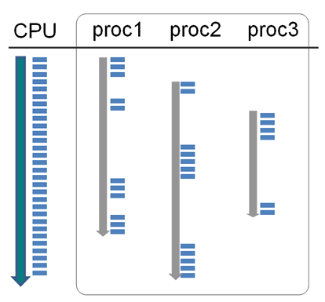
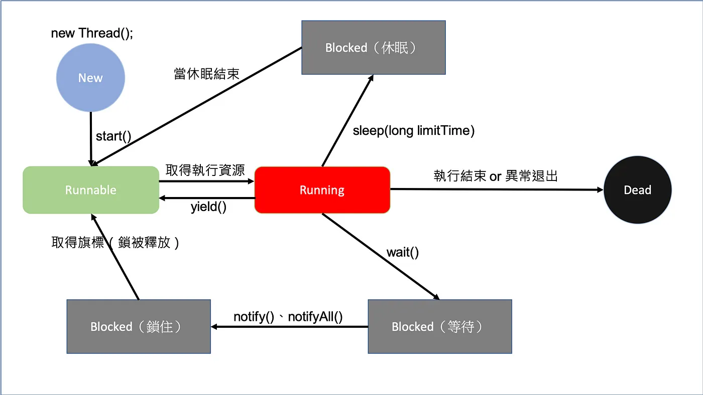
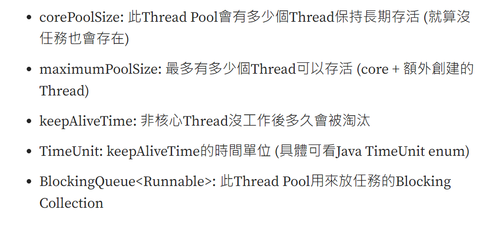

### Thread

#### 參考資料：

1. <https://rickbsr.medium.com/%E6%B7%BA%E8%AB%87-java-%E5%9F%B7%E8%A1%8C%E7%B7%92%E7%9A%84%E7%94%9F%E5%91%BD%E9%80%B1%E6%9C%9F%E8%88%87%E7%8B%80%E6%85%8B-cfc4f1e10c77>

2. <https://litotom.com/java-thread-priority-synchronized/>

3. <https://openhome.cc/Gossip/JavaGossip-V2/WaitNotify.htm >


#### 1CPU與多個Process



> 一個應用程式或行程（Process）可以向作業系統取得多個執行緒（threads），多個執行緒可以模擬出平行處理的效果。一個具備單一（此處的CPU僅考慮單核心）的系統，事實上同一時間只能執行一件事，但如果將一個 CPU 的執行時間切割為很小的單位，將這些單位分給多個行程去使用，就可以模擬出多工（multi-task）的效果

即：1 個 Process 也可以對應到多個 Thread (執行緒) (main 方法底下，可以模擬出不同多執行緒的方式)。

#### 如何在Java定義執行緒並啟動

用 implements Runnable 比較好，因為如果用 extends Thread 的話，會受到 Java 物件只能繼成一個類別的限制。


```
public class DemoRunner implements Runnable {

	@Override
	public void run() {
		int h = 0;
		for (int i = 0; i < 5000; i++) {
			h++;
			System.out.println(h);
		}
	}

}
```

執行一個 Runner

```
public class DemoExecute {

	public static void main(String[] args) {
		
		DemoRunner runner = new DemoRunner();
		
		Thread thread = new Thread(runner);
		
		thread.start();
		
	}
}
```

#### 執行緒(Thread)相關概念




##### 執行緒

1. start: 將執行緒物件，放入 Runnable，等待 Java 程序安排執行。

2. join：當執行緒物件呼叫 join()方法時，表示告訴 Java 程序，需要等到所有執行緒物件(包含：主執行緒、子執行緒)皆完成後，才會繼續進行。

3. sleep：當執行緒物件呼叫 sleep()方法時，表示要讓自身的執行緒進入 Blocked 狀態，並且讓出資源，給其他執行緒先行執行。

4. yield：當執行緒物件呼叫 yield() 方法時，表示要讓自身的執行緒進入 Runnable 狀態，等待著 Java 程序進行分配。

##### 物件

1. synchronized ： 分成同步方法或同步區塊。表示同一時間，只能有一個執行緒使用此方法或物件。需要等到一個執行緒執行完畢後，才能讓另一個執行緒操作此物件或方法。

2. volatile：在變數前加上volatile，此變數會改為不使用各執行緒的working memory，永遠從主記憶體做存取與讀寫。(詳細有專文介紹：)

在Java中，有兩種類型的鎖可以用於實現線程同步 - 對象級鎖和類級鎖。

同步方法：

```
public synchronized void methodName() {


}
```
同步區塊：

```
synchronized( 物件 ){

} 
```

例如1：

Sender物件，專於負責寄送訊息的。假設同一時間只能一個執行緒，進行寄送訊息的任務。

Sender

```
public class Sender {
	public void send(String msg) {
		System.out.println("Sending\t" + msg);
		try {
			Thread.sleep(1000);
		} catch (Exception e) {
			System.out.println("Thread  interrupted.");
		}
		System.out.println("\n" + msg + "Sent");
	}
}
```

ThreadedSend
```
public class ThreadedSend extends Thread {
	
	private String msg;
	
	Sender sender;

	ThreadedSend(String m, Sender obj) {
		msg = m;
		sender = obj;
	}

	public void run() {
		synchronized (sender) {
			sender.send(msg);
		}
	}
}

```

SyncDemo

```
public class SyncDemo {
	
	public static void main(String args[]) {
		Sender send = new Sender();
		ThreadedSend S1 = new ThreadedSend(" Hi ", send);
		ThreadedSend S2 = new ThreadedSend(" Bye ", send);

		// Start two threads of ThreadedSend type
		S1.start();
		S2.start();

		// wait for threads to end
		try {
			S1.join();
			S2.join();
		} catch (Exception e) {
			System.out.println("Interrupted");
		}
	}
}
```

Output: 每次結果都會這樣。

```
Sending	 Hi 

 Hi Sent
Sending	 Bye 

 Bye Sent

```

如果我不鎖定物件，會出現什麼情況：

ThreadedSend
```
public class ThreadedSend extends Thread {
	
	private String msg;
	
	Sender sender;

	ThreadedSend(String m, Sender obj) {
		msg = m;
		sender = obj;
	}

	public void run() {
		sender.send(msg);
	}
}

```

Output：每個執行緒都可以直接使用該物件的方法，不需要排隊等候。

```
Sending	 Bye 
Sending	 Hi 

 Bye Sent

 Hi Sent
```

例如2：

```

public class Account {

	private int balance = 10000;
	private String password;

	private final Object balanceLock = new Object();
	private final Object passwordLock = new Object();

	// Withdraw money from account
	int withdraw(int amt) {
		synchronized (balanceLock) {
			if (this.balance > amt) {
				this.balance -= amt;
				return this.balance;
			}
			return 0;
		}
	}

	// Check the balance
	int getBalance() {
		synchronized (passwordLock) {
			return balance;
		}
	}

	void transfer(Account source, int amt) {
		synchronized (balanceLock) {
			int money = source.withdraw(amt);
			if (money > 0)
				this.balance += amt;
		}
	}

	// Change the password
	void updatePassword(String pw) {
		synchronized (passwordLock) {
			this.password = pw;
		}
	}

	// Check the password
	String getPassword() {
		synchronized (passwordLock) {
			return password;
		}
	}

	public static void main(String[] args) throws InterruptedException {
		final Account a1 = new Account();
		final Account a2 = new Account();

		Thread t1 = new Thread(() -> {
			a1.transfer(a2, 1000);
		});

		Thread t2 = new Thread(() -> {
			a1.updatePassword("new1234");
		});

		t1.start();
		t2.start();

		Thread.sleep(1000);

		System.out.println(a1.getBalance());
		System.out.println(a2.getBalance());
		System.out.println(a1.getPassword());
	}
}
```


2. wait、notify、notifyAll：如果有執行緒執行到具有 synchronized 地方時，若因為某種條件被該物件呼叫了 wait() 方法，則該執行緒就會被放置 Blocked 區塊中。直到該物件呼叫了 notify()、notifyAll() 方法後，才會重新進行該執行緒。


#### 例子說明，可參考：

1. Java Gossip: wait()、notify()
<https://openhome.cc/Gossip/JavaGossip-V2/WaitNotify.htm>


#### JUC (java.util.concurrent 的簡稱)

Java Concurrency #12: JUC — 別讓Thread們失控 Executor & 線程池
<https://medium.com/bucketing/java-concurrency-12-juc-%E5%88%A5%E8%AE%93thread%E5%80%91%E5%A4%B1%E6%8E%A7-executor-%E7%B7%9A%E7%A8%8B%E6%B1%A0-3f5688121d4b>


1. 上程式，看差異：

Count
```
public class Count {
	int cnt = 0;

	void addctn() {
		synchronized (this) {
			try {
				Thread.sleep(100);
			} catch (InterruptedException e) {
				e.printStackTrace();
			}
			cnt++;
		}
	}

	int getctn() {
		synchronized (this) {
			return cnt;
		}
	}
}

```

SimpleThread

```
public class SimpleThread {

	public static void main(String[] args) throws InterruptedException {

		Count t1 = new Count();

		for (int i = 0; i < 20; i++) {
			Thread t = new Thread(() -> {
				String threadName = Thread.currentThread().getName();
				System.out.println("run " + threadName + " thread");
				t1.addctn();
			});
			t.start();
		}

		Thread.sleep(1000);

		System.out.println(t1.getctn());
	}

}

---
run Thread-1 thread
run Thread-3 thread
run Thread-0 thread
run Thread-2 thread
run Thread-5 thread
run Thread-4 thread
run Thread-6 thread
run Thread-7 thread
run Thread-8 thread
run Thread-9 thread
run Thread-10 thread
run Thread-11 thread
run Thread-12 thread
run Thread-13 thread
run Thread-14 thread
run Thread-15 thread
run Thread-16 thread
run Thread-17 thread
run Thread-18 thread
run Thread-19 thread
20

```

SimpleThreadPool

```
import java.util.concurrent.ExecutorService;
import java.util.concurrent.Executors;

public class SimpleThreadPool {

	public static void main(String[] args) throws InterruptedException {

		Count t1 = new Count();

		ExecutorService executor = Executors.newFixedThreadPool(10);

		for (int i = 0; i < 20; i++) {
			executor.execute(() -> {
				String threadName = Thread.currentThread().getName();
				System.out.println("run " + threadName + " thread");
				t1.addctn();
			});
		}

		executor.shutdown();
		executor.awaitTermination(Long.MAX_VALUE, java.util.concurrent.TimeUnit.NANOSECONDS);

		System.out.println(t1.getctn());
	}
}

---

run pool-1-thread-1 thread
run pool-1-thread-3 thread
run pool-1-thread-2 thread
run pool-1-thread-5 thread
run pool-1-thread-4 thread
run pool-1-thread-6 thread
run pool-1-thread-7 thread
run pool-1-thread-8 thread
run pool-1-thread-9 thread
run pool-1-thread-10 thread
run pool-1-thread-1 thread
run pool-1-thread-10 thread
run pool-1-thread-9 thread
run pool-1-thread-8 thread
run pool-1-thread-7 thread
run pool-1-thread-6 thread
run pool-1-thread-4 thread
run pool-1-thread-5 thread
run pool-1-thread-2 thread
run pool-1-thread-3 thread
20

```

2. 原因？

(1) 過多的執行緒會讓CPU效率差。因此需要控制執行緒數量，即請使用執行緒池。

3. ThreadPoolExecutor 與 Executors？

(1) 直接使用 Executors 即可。

> newFixedThreadPool
core數量與max一樣，代表創建後能執行的任務就是這樣
使用 LinkedBlockingQueue<Runnable>當作task存放的資料結構，沒有限制數量一樣會有OOM風險

(2) 介紹 ThreadPoolExecutor

```
public ThreadPoolExecutor(int corePoolSize,
                          int maximumPoolSize,
                          long keepAliveTime,
                          TimeUnit unit,
                          BlockingQueue<Runnable> workQueue,
                          ThreadFactory threadFactory,
                          RejectedExecutionHandler handler);
```

