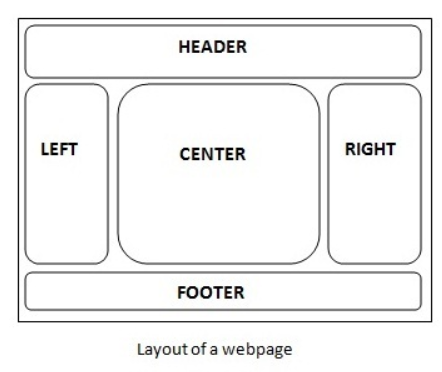
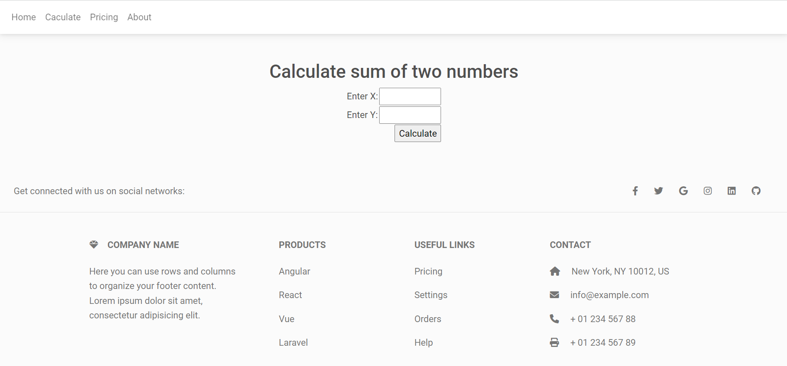

#### Struts2 + Apache Tiles + MDB

##### UI 框架

###### 1. MDB: <https://mdbootstrap.com/>

###### 2. Tiles: <https://www.viralpatel.net/struts-2-tiles-plugin-tutorial-with-example-in-eclipse/>




##### 範例

###### Github 程式碼：

<https://github.com/aweit-zhu/Struts2Beginner>

###### pom.xml

```
<!-- Tiles2 -->
<dependency>
    <groupId>org.apache.struts</groupId>
    <artifactId>struts2-tiles-plugin</artifactId>
    <version>2.3.8</version>
</dependency>
```

###### web.xml

```
<!-- Tiles2 -->
<listener>
    <listener-class>org.apache.struts2.tiles.StrutsTilesListener</listener-class>
</listener>
<context-param>
    <param-name>tilesDefinitions</param-name>
    <param-value>/WEB-INF/tiles.xml</param-value>
</context-param>
```

###### tiles.xml

```
<!DOCTYPE tiles-definitions PUBLIC
    "-//Apache Software Foundation//DTD Tiles Configuration 2.0//EN"
    "http://tiles.apache.org/dtds/tiles-config_2_0.dtd">

<tiles-definitions>
    <definition name="baseLayout" template="/WEB-INF/layouts/baseLayout.jsp">
        <put-attribute name="title" value="My Application" />
        <put-attribute name="header" value="/WEB-INF/layouts/header.jsp" />
        <put-attribute name="body" value="" />
        <put-attribute name="footer" value="/WEB-INF/layouts/footer.jsp" />
    </definition>
</tiles-definitions>
```

###### baseLayout.jsp

```
<%@ taglib prefix="tiles" uri="http://tiles.apache.org/tags-tiles"%>
<!DOCTYPE html>
<html>
<head>
	<title><tiles:getAsString name="title" /></title>
	<!-- Font Awesome -->
	<link href="https://cdnjs.cloudflare.com/ajax/libs/font-awesome/6.0.0/css/all.min.css" rel="stylesheet" />
	<!-- Google Fonts -->
	<link href="https://fonts.googleapis.com/css?family=Roboto:300,400,500,700&display=swap" rel="stylesheet" />
	<!-- MDB -->
	<link href="${pageContext.request.contextPath}/css/mdb.min.css" rel="stylesheet" />
	<!-- MDB -->
	<script type="text/javascript" src="${pageContext.request.contextPath}/js/mdb.min.js"></script>
</head>
<body>
	<header>
		<tiles:insertAttribute name="header" />
	</header>

	<main>
		<tiles:insertAttribute name="body" />
	</main>

	<footer>
		<tiles:insertAttribute name="footer" />
	</footer>
</body>
</html>
```

###### header.jsp

```
<%@ page language="java" contentType="text/html; charset=UTF-8"
	pageEncoding="UTF-8"%>

<header>
	<!-- Navbar -->
	<nav class="navbar navbar-expand-lg navbar-light bg-white fixed-top">
		<div class="container-fluid">
			<button class="navbar-toggler" type="button"
				data-mdb-toggle="collapse" data-mdb-target="#navbarExample01"
				aria-controls="navbarExample01" aria-expanded="false"
				aria-label="Toggle navigation">
				<i class="fas fa-bars"></i>
			</button>
			<div class="collapse navbar-collapse" id="navbarExample01">
				<ul class="navbar-nav me-auto mb-2 mb-lg-0">
					<li class="nav-item active"><a class="nav-link"	aria-current="page" href="${pageContext.request.contextPath}/hello">Home</a></li>
					<li class="nav-item"><a class="nav-link" href="${pageContext.request.contextPath}/admin/index">Caculate</a></li>
					<li class="nav-item"><a class="nav-link" href="#">Pricing</a></li>
					<li class="nav-item"><a class="nav-link" href="#">About</a></li>
				</ul>
			</div>
		</div>
	</nav>
</header>
```

###### footer.jsp

```
<%@ page language="java" contentType="text/html; charset=UTF-8"
	pageEncoding="UTF-8"%>

<!-- Footer -->
<footer class="text-center text-lg-start bg-light text-muted">
	<!-- Section: Social media -->
	<section
		class="d-flex justify-content-center justify-content-lg-between p-4 border-bottom">
		<!-- Left -->
		<div class="me-5 d-none d-lg-block">
			<span>Get connected with us on social networks:</span>
		</div>
		<!-- Left -->

		<!-- Right -->
		<div>
			<a href="" class="me-4 text-reset"> <i class="fab fa-facebook-f"></i>
			</a> <a href="" class="me-4 text-reset"> <i class="fab fa-twitter"></i>
			</a> <a href="" class="me-4 text-reset"> <i class="fab fa-google"></i>
			</a> <a href="" class="me-4 text-reset"> <i class="fab fa-instagram"></i>
			</a> <a href="" class="me-4 text-reset"> <i class="fab fa-linkedin"></i>
			</a> <a href="" class="me-4 text-reset"> <i class="fab fa-github"></i>
			</a>
		</div>
		<!-- Right -->
	</section>
	<!-- Section: Social media -->

	<!-- Section: Links  -->
	<section class="">
		<div class="container text-center text-md-start mt-5">
			<!-- Grid row -->
			<div class="row mt-3">
				<!-- Grid column -->
				<div class="col-md-3 col-lg-4 col-xl-3 mx-auto mb-4">
					<!-- Content -->
					<h6 class="text-uppercase fw-bold mb-4">
						<i class="fas fa-gem me-3"></i>Company name
					</h6>
					<p>Here you can use rows and columns to organize your footer
						content. Lorem ipsum dolor sit amet, consectetur adipisicing elit.
					</p>
				</div>
				<!-- Grid column -->

				<!-- Grid column -->
				<div class="col-md-2 col-lg-2 col-xl-2 mx-auto mb-4">
					<!-- Links -->
					<h6 class="text-uppercase fw-bold mb-4">Products</h6>
					<p>
						<a href="#!" class="text-reset">Angular</a>
					</p>
					<p>
						<a href="#!" class="text-reset">React</a>
					</p>
					<p>
						<a href="#!" class="text-reset">Vue</a>
					</p>
					<p>
						<a href="#!" class="text-reset">Laravel</a>
					</p>
				</div>
				<!-- Grid column -->

				<!-- Grid column -->
				<div class="col-md-3 col-lg-2 col-xl-2 mx-auto mb-4">
					<!-- Links -->
					<h6 class="text-uppercase fw-bold mb-4">Useful links</h6>
					<p>
						<a href="#!" class="text-reset">Pricing</a>
					</p>
					<p>
						<a href="#!" class="text-reset">Settings</a>
					</p>
					<p>
						<a href="#!" class="text-reset">Orders</a>
					</p>
					<p>
						<a href="#!" class="text-reset">Help</a>
					</p>
				</div>
				<!-- Grid column -->

				<!-- Grid column -->
				<div class="col-md-4 col-lg-3 col-xl-3 mx-auto mb-md-0 mb-4">
					<!-- Links -->
					<h6 class="text-uppercase fw-bold mb-4">Contact</h6>
					<p>
						<i class="fas fa-home me-3"></i> New York, NY 10012, US
					</p>
					<p>
						<i class="fas fa-envelope me-3"></i> info@example.com
					</p>
					<p>
						<i class="fas fa-phone me-3"></i> + 01 234 567 88
					</p>
					<p>
						<i class="fas fa-print me-3"></i> + 01 234 567 89
					</p>
				</div>
				<!-- Grid column -->
			</div>
			<!-- Grid row -->
		</div>
	</section>
	<!-- Section: Links  -->

	<!-- Copyright -->
	<div class="text-center p-4"
		style="background-color: rgba(0, 0, 0, 0.05);">
		© 2021 Copyright: <a class="text-reset fw-bold"
			href="https://mdbootstrap.com/">MDBootstrap.com</a>
	</div>
	<!-- Copyright -->
</footer>
<!-- Footer -->
```

###### Dynamic Body

```
<%@taglib prefix="tiles" uri="http://tiles.apache.org/tags-tiles"%>
<%@ taglib prefix="s" uri="/struts-tags"%>
<tiles:insertDefinition name="baseLayout">
	<tiles:putAttribute name="body">
		<div class="p-5 text-center bg-light" style="margin-top: 58px;">
			<center>
				<h2>Calculate sum of two numbers</h2>
				<s:form action="/admin/calculateSumAction" method="post">
					<s:textfield name="x" size="10" label="Enter X" />
					<s:textfield name="y" size="10" label="Enter Y" />
					<s:submit value="Calculate" />
				</s:form>
			</center>
		</div>
	</tiles:putAttribute>
</tiles:insertDefinition>
```

##### Test

<http://localhost:8080/Struts2Beginner/admin/index>

