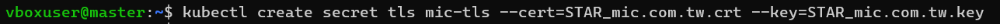

## Traefik

#### With K8S + CRD (Custom Resource Definitions)

- IngressRoute Definition

        # Install Traefik Resource Definitions:
        kubectl apply -f https://raw.githubusercontent.com/traefik/traefik/v2.10/docs/content/reference/dynamic-configuration/kubernetes-crd-definition-v1.yml

        # Install RBAC for Traefik:
        kubectl apply -f https://raw.githubusercontent.com/traefik/traefik/v2.10/docs/content/reference/dynamic-configuration/kubernetes-crd-rbac.yml

- Services

        kubectl apply -f https://raw.githubusercontent.com/traefik/traefik/v2.10/docs/content/user-guides/crd-acme/02-services.yml

  - 修改 traefik

    ```
    apiVersion: v1
    kind: Service
    metadata:
    name: traefik
    spec:
    type: LoadBalancer # 多加這一行，暴露街口
    ports:
        - protocol: TCP
        name: web # web 入口
        port: 8000
        - protocol: TCP
        name: admin # dashboard 入口
        port: 8080
        - protocol: TCP
        name: websecure # web https 入口
        port: 4443
    selector:
        app: traefik
    ```
- Deployments

        kubectl apply -f https://raw.githubusercontent.com/traefik/traefik/v2.10/docs/content/user-guides/crd-acme/03-deployments.yml

- Traefik Routers
    ```
    apiVersion: traefik.io/v1alpha1
    kind: IngressRoute
    metadata:
    name: simpleingressroute
    namespace: default
    spec:
    entryPoints:
        - web
    routes:
    - match: Host(`192.168.0.17`) && PathPrefix(`/notls`)
      kind: Rule
      services:
        - name: whoami
      port: 80
    ```

    ```
    apiVersion: traefik.io/v1alpha1
    kind: IngressRoute
    metadata:
    name: docker-demo
    namespace: default
    spec:
    entryPoints:
        - web
    routes:
    - match: PathPrefix(`/docker-demo`)
      kind: Rule
      services:
        - name: myapp
      port: 80
    ```

- Dashboard

  <http://192.168.0.23:8080/dashboard/#/>

  

- 測試 URL： http://192.168.0.23:8000/notls

  


- Middlewares

  - 概念

  

  - 修改 IngressRoute
    ```
    apiVersion: traefik.io/v1alpha1
    kind: IngressRoute
    metadata:
    name: simpleingressroute
    namespace: default
    spec:
    entryPoints:
        - web
    routes:
        - match: Host(`192.168.0.23`) && PathPrefix(`/notls`)
        kind: Rule
        middlewares:
            - name: test-auth
        services:
            - name: whoami
            port: 80
    ```
 - 建立 Middleware
    ```
    apiVersion: traefik.io/v1alpha1
    kind: Middleware
    metadata:
    name: test-auth
    spec:
    basicAuth:
        secret: authsecret

    
    # Note: in a kubernetes secret the string (e.g. generated by htpasswd) must be base64-encoded first.
    # To create an encoded user:password pair, the following command can be used:
    # htpasswd -nb user password | openssl base64
    apiVersion: v1
    kind: Secret
    metadata:
    name: authsecret
    namespace: default
    data:
    users: dXNlcjokYXByMSRicC5FV295eCRXTWttUktBLzdjQWcycXNIL09XbXIxCgo=

    ```

        htpasswd -nb user password | openssl base64

    

    去看 Traefik Dashboard，會看到多一個 Middlewares

    

    打開瀏覽器，輸入 http://192.168.0.23:8000/notls

    

    輸入：user/password 後，就可以登入成功，並取得資訊

    

### Middleware - Error


建立一個 Service
```
apiVersion: v1
kind: Service
metadata:
  name: traefikerror
spec:
  type: LoadBalancer
  ports:
  - name: http
    targetPort: 80
    port: 80
  selector:
    app: traefikerror
---
apiVersion: apps/v1
kind: Deployment
metadata:
  name: traefikerror
spec:
  replicas: 1
  selector:
    matchLabels:
      app: traefikerror
  template:
    metadata:
      labels:
        app: traefikerror
    spec:
      containers:
      - name: traefikerror
        image: guillaumebriday/traefik-custom-error-pages
        ports:
        - containerPort: 80
```

建立 Middleware

```
apiVersion: traefik.io/v1alpha1
kind: Middleware
metadata:
  name: test-errors
spec:
  errors:
    status:
      - "400-599"
    query: /{status}.html
    service:
      name: traefikerror
      port: 80
```

加入 Middleware
```
apiVersion: traefik.io/v1alpha1
kind: IngressRoute
metadata:
  name: simpleingressroute
  namespace: default
spec:
  entryPoints:
    - web
  routes:
    - match: Host(`192.168.0.23`) && PathPrefix(`/notls`)
      kind: Rule
      middlewares:
        - name: test-auth
        - name: test-errors
      services:
        - name: whoami
          port: 80

```

#### 暴露 HTTPS 服務

先把 STAR_mic.com.tw.crt 和 STAR_mic.com.tw.key 兩個檔案放到執行目錄下

    

執行指令

    kubectl create secret tls mic-tls --cert=STAR_mic.com.tw.crt --key=STAR_mic.com.tw.key




在 IngressRoute 中加入
```
apiVersion: traefik.io/v1alpha1
kind: IngressRoute
metadata:
  name: ingressroutetls
  namespace: default
spec:
  entryPoints:
    - websecure
  routes:
    - kind: Rule
      match: Host(`localhost.mic.com.tw`) && PathPrefix(`/tls`)
      services:
        - name: whoami
          port: 80
  tls:
    secretName: mic-tls
```

ps: 在本機的hosts檔俺中加入 192.168.0.23 localhost.mic.com.tw 
(192.168.0.2 是存取 Traefik 的暴露IP)

https://localhost.mic.com.tw/tls


參考網頁：<https://www.readfog.com/a/1665375657830486016>

