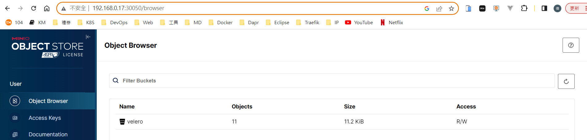

參考資料：
- Velero 初探與實踐 <https://kaichu.io/posts/velero-research-practice/>
- 官網 <https://velero.io/docs/v1.11/how-velero-works/>
- 使用 Velero 備份還原 Kubernetes 集羣 <https://www.readfog.com/a/1647215683490123776>
- Quick start evaluation install with Minio <https://velero.io/docs/main/contributions/minio>
- k8s1.24 使用Velero 備份還原Rancher Longhorn上volume資料 https://www.itnotetk.com/2022/11/28/k8s1-24-velero-%e5%82%99%e4%bb%bd%e9%82%84%e5%8e%9f-rancher-longhorn%e4%b8%8avolume%e8%b3%87%e6%96%99/
### 運作方式


1. Velero 的基本操作就是 CLI 會去操作 Kubernetes API 建立 Backup 物件
2. BackupController 偵測到新的 Backup 物件並檢查
3. 檢查通過後就會操作 Kubernetes API Server 進行資料的備份
4. BackupController 就會透過 Plugin 會操作對應用 Object Storage Service 上傳檔案
5. 如果 Provider 支援原生的快照操作, Plugin 就可以透過 API 備分永久磁碟區

### 安裝

下載及解壓縮
```

wget https://github.com/vmware-tanzu/velero/releases/download/v1.11.0/velero-v1.11.0-linux-amd64.tar.gz

tar -zxvf velero-v1.11.0-linux-amd64.tar.gz && cd velero-v1.11.0-linux-amd64

```
### 安裝MINIO

要將 examples/minio/00-minio-deployment.yaml 修改成以下
```
# Copyright 2017 the Velero contributors.
#
# Licensed under the Apache License, Version 2.0 (the "License");
# you may not use this file except in compliance with the License.
# You may obtain a copy of the License at
#
#     http://www.apache.org/licenses/LICENSE-2.0
#
# Unless required by applicable law or agreed to in writing, software
# distributed under the License is distributed on an "AS IS" BASIS,
# WITHOUT WARRANTIES OR CONDITIONS OF ANY KIND, either express or implied.
# See the License for the specific language governing permissions and
# limitations under the License.

---
apiVersion: v1
kind: Namespace
metadata:
  name: velero

---
apiVersion: apps/v1
kind: Deployment
metadata:
  namespace: velero
  name: minio
  labels:
    component: minio
spec:
  strategy:
    type: Recreate
  selector:
    matchLabels:
      component: minio
  template:
    metadata:
      labels:
        component: minio
    spec:
      volumes:
      - name: storage
        emptyDir: {}
      - name: config
        emptyDir: {}
      containers:
      - name: minio
        image: minio/minio:latest
        imagePullPolicy: IfNotPresent
        args:
        - server
        - /storage
        - --config-dir=/config
        - --console-address=:9001
        env:
        - name: MINIO_ACCESS_KEY
          value: "minio"
        - name: MINIO_SECRET_KEY
          value: "minio123"
        ports:
        - containerPort: 9000
        - containerPort: 9001
        volumeMounts:
        - name: storage
          mountPath: "/storage"
        - name: config
          mountPath: "/config"

---
apiVersion: v1
kind: Service
metadata:
  namespace: velero
  name: minio
  labels:
    component: minio
spec:
  type: NodePort
  ports:
    - name: api
      port: 9000
      targetPort: 9000
    - name: console
      port: 9001
      targetPort: 9001
  selector:
    component: minio

---
apiVersion: batch/v1
kind: Job
metadata:
  namespace: velero
  name: minio-setup
  labels:
    component: minio
spec:
  template:
    metadata:
      name: minio-setup
    spec:
      restartPolicy: OnFailure
      volumes:
      - name: config
        emptyDir: {}
      containers:
      - name: mc
        image: minio/mc:latest
        imagePullPolicy: IfNotPresent
        command:
        - /bin/sh
        - -c
        - "mc --config-dir=/config config host add velero http://minio:9000 minio minio123 && mc --config-dir=/config mb -p velero/velero"
        volumeMounts:
        - name: config
          mountPath: "/config"

```

kubectl apply -f examples/minio/00-minio-deployment.yaml

開啟 kubrnetes dashboard 看 velero minio 是哪個 Port，並開啟瀏覽器


http://192.168.0.17:32729/browser

帳號/密碼：minio/minio123


P.S.：

當然如果需要在不同 Kubernetes 和存儲池集羣備份與恢復數據，需要將 minio 服務端安裝在 Kubernetes 集羣外，保證在集羣發生災難性故障時，不會對備份數據產生影響，可以通過二進制的方式進行安裝。

(略) 請參考 <https://www.readfog.com/a/1647215683490123776> 安裝 MINIO

### 安裝 velero 服務端

nano credentials-velero
```
# 秘钥文件credentials-velero
[default]
aws_access_key_id = minio
aws_secret_access_key = minio123
```

velero install
```
velero install \
--provider aws \
--bucket velero \
--plugins velero/velero-plugin-for-aws:latest \
--plugins openebs/velero-plugin:ci \
--secret-file ./credentials-velero \
--use-volume-snapshots=false \
--backup-location-config region=minio,s3ForcePathStyle="true",s3Url=http://192.168.0.17:31883
```

PS：s3Url=http://192.168.0.17:31883 PROT 從哪裡取得？

minio.velero:30050 TCP  --> MiniO 的 URL


minio.velero:31883 TCP  --> MiniO 的 Dashboard URL

http://192.168.0.17:30050/




### Back up

先建立一個 Namespace / Development / Service
    
    cd ~/velero-v1.11.0-linux-amd64
    kubectl apply -f examples/nginx-app/base.yaml

Create a backup for any object that matches the app=nginx label selector:

    velero backup create nginx-backup --selector app=nginx


Run `velero backup describe nginx-backup` or `velero backup logs nginx-backup` for more details.


這時候去看 MiniO 的 Dashboard，會看到備份的檔案在這。


Simulate a disaster `kubectl delete namespace nginx-example`
To check that the nginx deployment and service are gone, run:
```
kubectl get deployments --namespace=nginx-example
kubectl get services --namespace=nginx-example
kubectl get namespace/nginx-example
```

### Restore

    velero restore create --from-backup nginx-backup

Restore request "nginx-backup-20230710100823" submitted successfully.
Run `velero restore describe nginx-backup-20230710100823` or `velero restore logs nginx-backup-20230710100823` for more details.

    # 看進度
    velero restore get


nginx-example 就回來了~

 

### Clean up

velero backup delete BACKUP_NAME

velero uninstall --> 全部移除

## With PV

    cd ~/velero-v1.11.0-linux-amd64
    kubectl apply -f examples/nginx-app/with-pv.yaml

    kubectl -n nginx-example annotate pod/nginx-deployment-78964c9995-cx4qs backup.velero.io/backup-volumes=nginx-logs

    velero backup create nginx-backup --include-namespaces nginx-example --default-volumes-to-fs-backup --snapshot-volumes --ttl 180h

    velero backup create nginx-backup --include-namespaces nginx-example --default-volumes-to-fs-backup